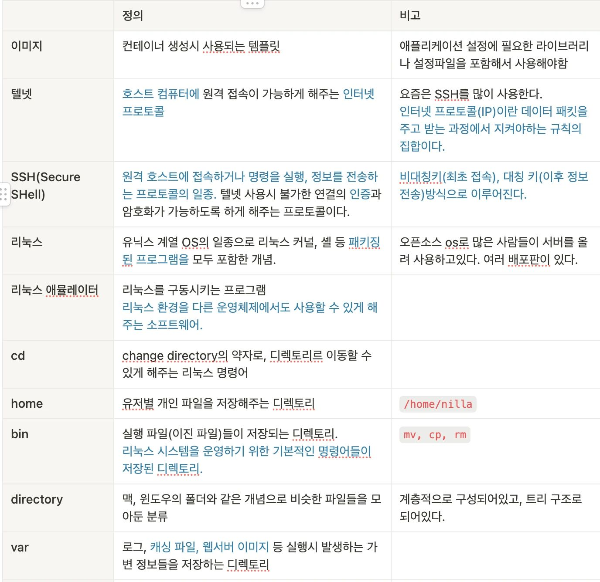
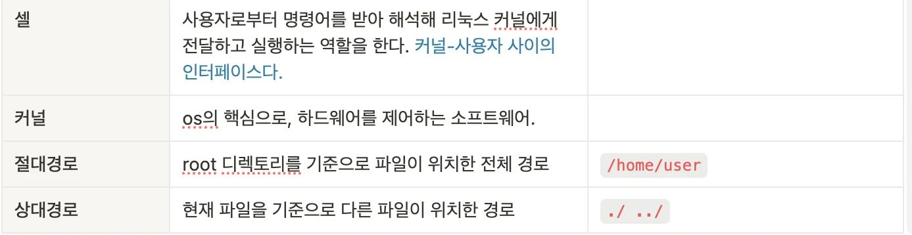

1. **프로그래밍 기초 (레벨 테스트)**
- **변수** : 하나의 값을 저장하는 **저장 공간.** 임의의 값을 저장함으로써 코드의 **유지보수성과 재사용성**을 높여준다.
- **조건문** : 참과 거짓에 따라 프로그램의 실행 흐름을 바꾸는 문법. 조건을 분기하기 위해 사용한다.
- **반복문** : 특정 구문이 특정 조건을 만족시키는 동안 반복되어 사용할 수 있게 하는 문법.
    
    1. 코드의 재사용성을 높여주고(최적화해주고), 2.반복 작업 속 사람의 실수를 줄여주며, 3. 많은 양의 데이터도 자동적으로 처리할 수 있도록 한다.
    
- **배열** : 여러개의 값을 연속적으로 저장할 수 있게 해주는 저장 공간.
    1. 하나의 변수에 여러 값을 담을 수 있게 해주며, 2. 연관 있는 데이터들을 모아서 저장해 둘 수 있다.
- **함수** : 어떠한 기능을 하는 코드 구문들을 모아놓은 것. 코드를 모듈화 할 수 있어 가독성, 유지보수성, 재사용성을 높이며, 코드의 구조를 명확히 할 수 있다!
- **자료형** : 저장되는 데이터의 종류.
- **주석** : 실제 컴파일 되지는 않으나 소스코드의 가독성을 위해 작성한 구문.
- **연산자** : 산술, 논리 연산 등의 식을 처리하기 위해 제공되는 기호. 연산자가 없다면 모든 연산을 함수로 구현해야 할 것이다.
- **순서도**: 코드의 논리적 흐름을 나타낸 그림. 전반적인 흐름을 파악하기 위해 사용된다.
- **Json** : 데이터를 알아보기 쉽게 저장해서, 쉽게 교환할 수 있도록 만든 데이터 전송 양식.
1. **리눅스 , SSH**

검은색은 첫 작성 내용, 파란색은 팀원들의 정리와 다른 추가 자료들을 검색해보며 보완한 내용.

추가 :

**터미널 - 쉘**의 차이

터미널을 실행시키면 그 위에 쉘이 구동된다.

쉘은 CLI 명령의 **해석기**라고 할 수 있다. (bash, dash...)

터미널은 사용자에게 텍스트를 받아 쉘에 전달하고, 쉘이 출력하는 결과를 사용자에게 보여주는 역할을 한다. (terminal, xterm...)