## 과제 결과

1. Virtual Machine으로 리눅스 환경 맞추기
    1. virtual box& ubuntu-24.04.1-live-server-arm64 로 설치를 완료했다.
    
2. 리눅스 기본 명령어 및 서비스 구축
    1. mac terminal <> virtual box ubuntu ssh 연결
        
        ssh 연결시 mac은 기본 ssh 서버 포트로 22번을 사용하고 있기 때문에, 똑같이 22번으로 사용해 우분투와 연결하려고 시도할 경우 에러가 났다. (operation timed out)
        
        사용하지 않는 다른 포트를 사용해야 정상 접근할 수 있으며, 2222번 포트를 사용하기로 했다.
        
        이후 터미널 사용해 리눅스 명령어 자율 실습을 진행했다. 
        
        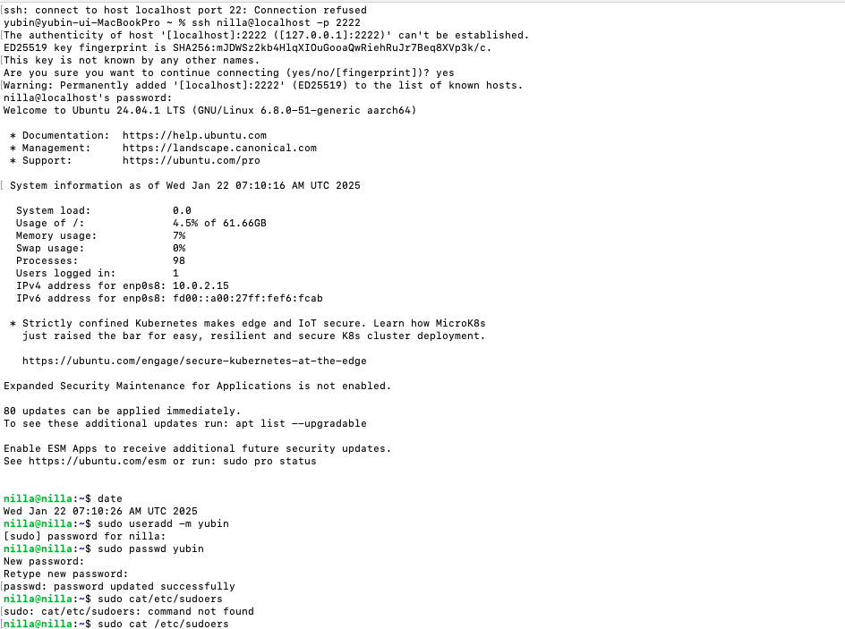
        
    2. nfs 서버 구축해보기
    NFS : 리눅스, 유닉스 계열 시스템으로 이루어진 로컬 네트워크상의 파일 공유 서비스
        
       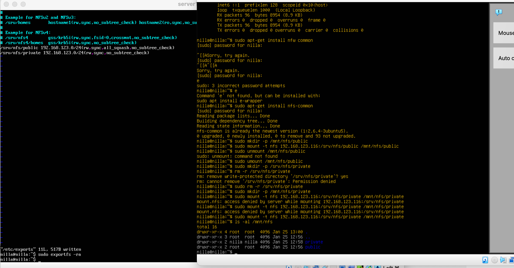

3. PM 활용한 워드 프레스 구축 및 이력서 
    1. 환경
        
        `Host : m2 pro silicon + terminal`
        
        `Server : virtual box& ubuntu-24.04.1-live-server-arm64
        PHP 8.3.6 / Mysql 8.0.4 / Apache 2.4.58 / wordpress 6.7.1`
        NAT 방식으로 8080 포트에 포트포워딩하여 호스트 컴퓨터에서 접속하는 방식으로 구현했으며, 도메인 등록은 구현하지 못했다. 
        
    2. 접속 영상 + 구현된 이력서 영상
        
        -> 노션 링크에서 확인
        
    3. 진행순서(+명령어, 코드) 
        
        설치 + apache2 실행 + 방화벽 개방
        
        ```jsx
        sudo apt-get update
        sudo apt-get install apache2
        sudo apt-get install php php-mysql
        sudo apt-get install mysql-server
        sudo apt-get install libapache2-mod-php
        sudo a2enmod php8.3
        sudo systemctl start apache2
        sudo ufw alllow 80
        ```
        
        포트포워딩(호스트에서 접속 가능하도록)
        
        

        [localhost:8080](http://localhost:8080) 으로 접속
        
        도메인 추가 - 제대로 적용되지 않음.
        
        ```jsx
        sudo vi /etc/apache2/conf-available/servername.conf
        ServerName www.nilla.com
        sudo a2encof=nf servername
        sudo systemctl restart apache2
        sudo vi etc/hosts
        10.0.2.15 www nilla.com
        ```
        
        ```jsx
        //한글 문자셋 제공
        sudo vi /etc/apache2/conf-avaliable/charset.conf
        sudo systemctl restart apache2
        ```
        
        ```jsx
        //mysql 비번 설정 및 계정 설정
        mysql -u root -p
        create database wordpress;
        update mysql.user set Host='%' where User='root' and Host='localhost';
        flush privileges;
        alter user 'root'@'%' identified by '비번';
        grant all privileges on *.* to 'root'@'%' with grant option;
        flush privileges;
        
        create user 'wordpress'@'localhost' identified by '비번';
        grant all privileges on wordpress.* to 'wordpress'@'localhost';
        exit;
        ```
        
        ```jsx
        //php 파일 설정
        apache2/mods-enabled/dir.conf 파일에서 index.php가 우선순위에 오도록 변경
        /var/www/info.php 생성
        sudo systemctl restart apache2
        ```
        
        ```jsx
        //wordpress 올리기
        wget https://ko.wordpress.org/latest-ko_KR.tar.gz
        tar xfz late*
        sudo mv wordpress /var/www/html/
        chmod 707 /var/www/html/wordpress
        sudo chown -R www-data:www-data /var/www/html/wordpress //웹서버 프로세스가 디렉토리의 소유권을 가져감. 서버가 파일을 읽고 쓸 수 있음. 
        cd /var/www/html/wordpress/
        cp wp-config-sample.php wp-config.php
        ```
        
        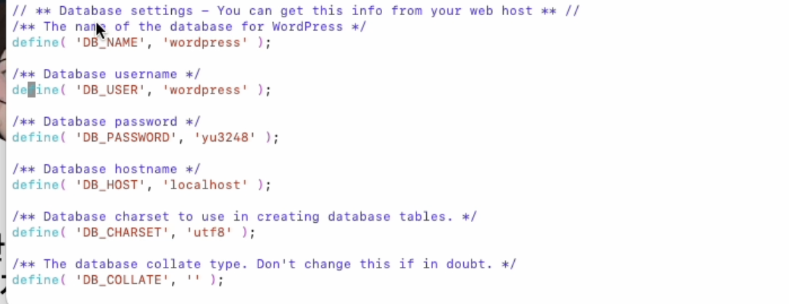
        
        설정파일을 수정한다. 
        
        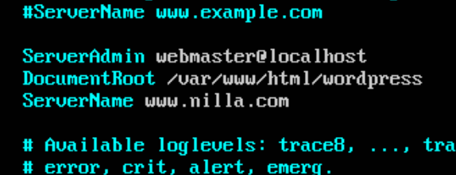
        
        +또한 000-default.conf를 수정하면 따로 주소창에 추가 경로를 입력하지 않고도 바로 연결 가능하다.
        
    4. 트러블 슈팅
        1. sysv-rc-config는 최근 배포판에서 삭제된 명령어다. 
        
        런레벨 편집으로 아파치를 실행시키기 위해서는 
        
        `sudo systemctl start apache2 (지금 당장 실행)`
        
        `sudo systemctl enable apache2 (부팅 시 자동 실행)`
        
        `sudo systemctl disable apache2 (실행 해제)`
        
        `systemctl status apache2 (실행 확인)`
        
        의 명령어를 사용해야 한다. mysql도 동일. 
        
        2. 웹브라우저 연결
        
        현재 서버(버추얼 박스) <> 호스트(mac) 간 통신이 불가하므로 크롬에 ip를 입력한다고 아파치 페이지에 접속되진 않는다.
        
        호스트의 8080 포트 <> 서버의 80 포트를 포트포워딩하여, [localhost:8080](http://localhost:8080) 에 apache 서버가 뜨도록 만들었다. bridge 방식도 고려해볼것! 
        
        3. 도메인 연결
        
        해결하지 못했다. 현재 Nat을 사용하는데, 로컬 서버 내에선 제대로 맵핑된 것 같지만 호스트에서는 그냥 상용 도메인으로 연결되어버린다. 
        
        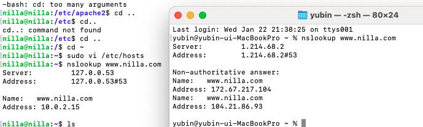
        
        4. index.html 올리기
        
        ~$ mkdir public_html
        ~$ vi public_html/index.html
        
        이렇게 하면 /home/nilla에 폴더가 만들어지는데, public_html 뿐만 아라 /home 과  /home/nilla 에게도 각각 +x를 해줘야 접근이 가능해진다. 
        
        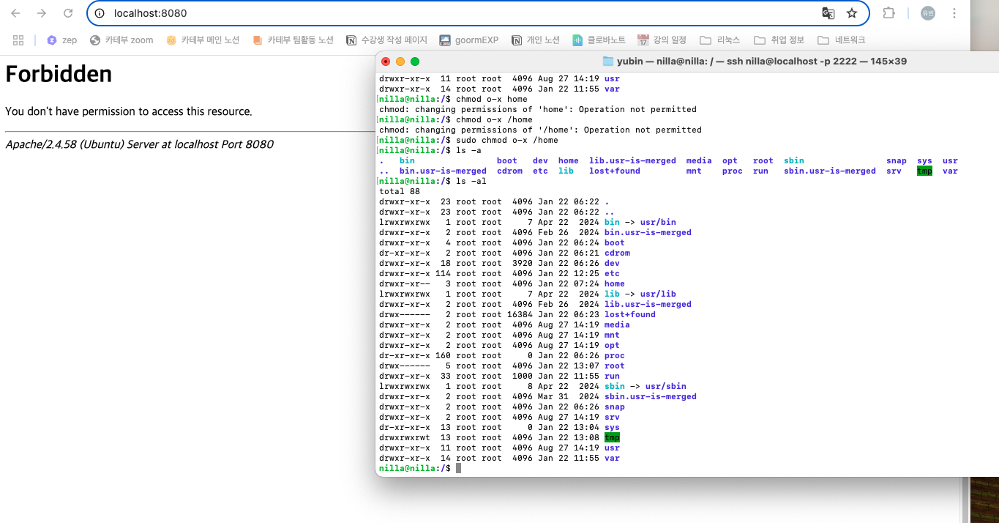
        
        /home 의 권한을 빼앗자 바로 접근 안되는 모습 (+ 실습 트러블 슈팅중에 000-default.conf의 경로를 수정했기 때문에 사용자 계정이 아닌 메인에서도 index.html에 연결되고 있는 모습이다.)
        
        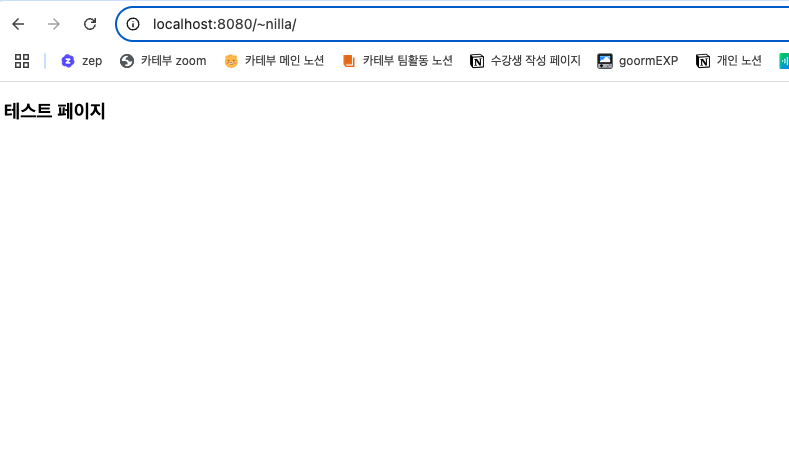
        
        권한을 주면 정상 접근된다. 
        
        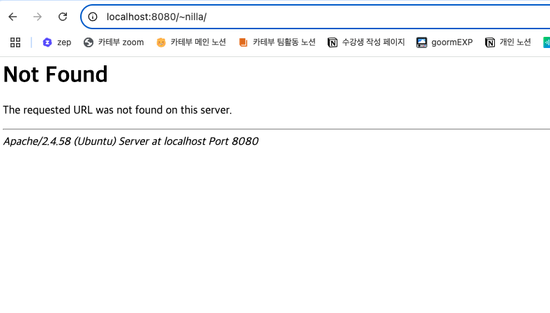

        다시 사용자 계정 웹서비스를 중단시킨 모습 (sudo a2dismod userdir)
        
        5. php 버전 문제
        
        최신 배포판을 사용하고 있기에 php와 mysql의 버전이 맞지 않았다. 최신 우분투의 PHP 버전은 2021년에 출시된 **PHP 8.1이기 때문.** 
        
        ```bash
        sudo apt-get update
        sudo apt-get install php php-mysql
        sudo apt-get install mysql-server
        sudo apt-get install libapache2-mod-php
        sudo a2enmod php8.3
        sudo systemctl restart apache2
        ```
        
        다음과 같이 설치했다.
        
        sudo vi /etc/apache2/mods-enabled/dir.conf < 웹서버 설정 파일. mods-enable안에 여러 모드들이 존재한다. php관련 모드도 여기서 설정하지만, php 버전을 뒤에 붙여줘야한다. 
        
        참고 사이트 : https://crown28.tistory.com/33
        
        linux 기준이지 ubuntu 기준이 아니기 때문에, httpd → apache2로 생각해야하는 것 같다. 
        
        또한 조금씩 버전이 다른 명령어와 파일 이름들이 존재했기 때문에 확인해가며 설치를 진행했다. 
        
        6. 권한 문제
        
        var, etc같은 폴더들은 함부로 수정하거나 파일을 추가할 수 없으므로, sudo를 사용하는 것이 필수적이다.
        
4. 칼리 리눅스를 활용한 SQL Injection 공격 및 방어 방안
    1. 칼리 리눅스 설치
        
        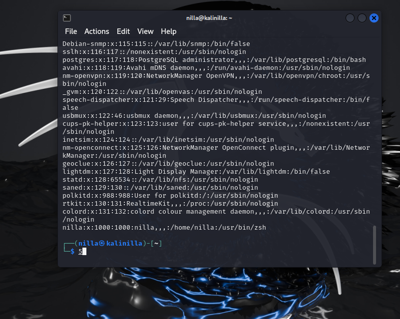
        
    2. Brute force 공격
        
        Brute force 공격이란? : 암호화를 풀기 위해 무차별 적으로 대입해가며 맞춰보는 공격을 뜻한다. 
        
        모의 공격을 위해 칼리리눅스 & hydra를 사용했다.
        
        ```bash
        #vsftpd : ftp 서버 프로그램의 일종.
        write_enable = yes #ftp 서버 사용시 write 명령어를 허용시킨다.
        #또한 vsftlog에 접속한 사용자의 로그가 남게된다. 
        ```
        
        ```bash
        #hydra : 지속적인 로그인 시도 공격을 하게 해주는 자동화 도구. 칼리 리눅스에 내장되어 있다.
        hydra –t 64 –w 1 –l root –V –f –x 4:6:a ftp://ip
        #-t : 스레드 개수를 지정한다. 이 경우 64개를 지정했다.
        #-w : response를 시다리는 시간 지정. 최대 1초를 기다린다. 
        #-l : 단일 아이디 'root'로만 로그인을 시도한다.
        #-V : 로그인 시도 계정과 비밀번호를 화면에 보여준다. 
        #-f : 로그인을 성공하면 작업 수행 종료
        #-x : MIN:MAX:CHARSET 비밀번호 생성에 무엇을 쓸 건지 결정하는 옵션.
        # 최소 글자수 : 최대 글자수 : 사용할 문자 집합 을 작성한다. 현재 옵션이 a이므로 영문 소문자만 사용한다!
        hydra –l root –V –f –P pass.lst ftp://ip
        #-P : 시도해볼 패스워드를 파일에서 불러오는 옵션.
        ```
        
        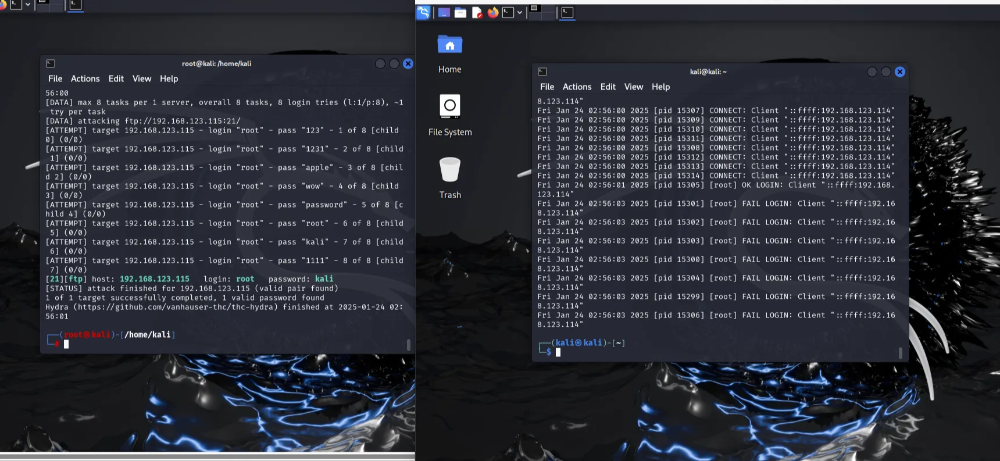
        
    3. SQL injection
        
        SQL injection이란? : sql문에 특정 문자열을 넣어 예상과는 다른 동작을 하게 하는 공격. 
        예를 들어 다음과 같은 경우를 보자. 
        
        ```php
        /* login.php */
        <?php
        session_start();
        
        if(isset($_POST['login'])){
        	$username = $_POST['username'];
        	$password = $_POST['password'];
        	$con = mysqli_connect('localhost','root','toor','sample');
        
        	if(!$con){
        		die("Database connection failed: " . mysqli_connect_error());	
        	}
        
        	$result = mysqli_query($con,"SELECT * FROM users WHERE username='$username' AND password='$password'");
        //일반적인 경우 이 쿼리는 문제가 되지 않는다.
        //그런데 만약, 비밀번호에 1'or'1 이 들어가버린다면?
        //SELECT * FROM users WHERE username='humanist' AND password='1'or'1'
        //위와 같은 문자열로 연결되어 쿼리가 날아간다. 
        //뒤쪽 조건(or '1')이 무조건 참이 되어버리므로, 무조건 로그인을 성공할 수 있게 되어버린다!
        
        	if(mysqli_num_rows($result)==0){
        		echo "<script>alert('Invalid username or password');</script>";
        		echo "<meta http-equiv='refresh' content='0; url=index.php'>";
        	}else{
        		$_SESSION['username']= $username;
        		echo "<meta http-equiv='refresh' content='0; url=index.php'>";
        		
        	}
        	mysqli_close($con);
        }
        ?>
        ```
        
        위와 같이 쿼리를 매개변수화해서 쓰는 것이 아닌, 문자열에 넣어서 쓴다면 문제가 될 수 있다.
        
        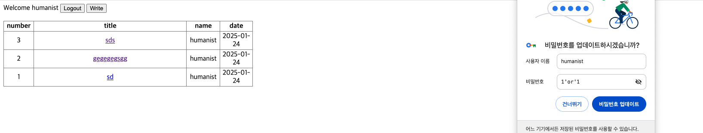
        1’or’1로 로그인에 성공한 모습
        
        이러한 sql 인젝션은 위험 문자열을 탐지해 막거나, **쿼리의 매개변수화**를 이용해 막을 수 있다.
        
        ```php
        	/*$result = mysqli_query($con,"SELECT * FROM users WHERE username='$username' AND password='$password'");*/
        	/*매개변수화된 쿼리 준비*/
        	$stmt = $con->prepare("SELECT * FROM users WHERE username=? AND password=?");
        	/*플레이스 홀더에 값을 바인딩*/
        	$stmt ->bind_param("ss",$username,$password);
        	/*쿼리를 날리고*/
        	$stmt ->execute();
        	/*결과를 받아온다.*/
        	$result = $stmt->get_result(); 
        ```
        
        위와 같이 매개변수화된 쿼리로 변경하면 간단하게 막을 수 있다!
        
        