## 날짜: 2024-02-04

### 스크럼
- 학습 목표 1 : 위클리 챌린지

### 새로 배운 내용
#### 위클리 챌린지 - 실습 자료 따라하며 개념 정리
- 실습 자료 따라하기
    1. 네트워크 토폴로지
        1. 버스형
            - 하나의 긴 케이블이 네트워크 상의 모든 장치를 연결하는 중추 네트워크의 역할을 한다.
            - 장점: 케이블 수가 적으므로 설치가 쉽고 비용이 저렴하며 개별 호스트의 고장이 영향을 주지 않는다. 관리 및 확장이 쉽다.
            - 단점: 케이블에 문제가 생기면 모든 네트워크가 영향을 받으며, 거리 제한이 있다(연결 단말기가 늘어나면 신호 감쇠 및 충돌로 인해 느려지기 때문). 동시 통신이 불가하고, 문제 발생한 위치를 찾기가 어려우며, 스푸핑 공격을 받을 수도 있다. (브로드 캐스팅 방식으로 모든 단말기가 데이터를 받기 때문.)
            - Copper Straight-Through(실선): 서로 다른 종류의 장치를 연결할 때 사용한다.
            - Copper Cross-Over(점선) : 같은 종류의 장치를 연결할 때 사용한다.
            - 서브넷 마스크 : 필요한 네트워크 주소만 호스트 IP로 할당할 수 있게 만드는 방식.
            - 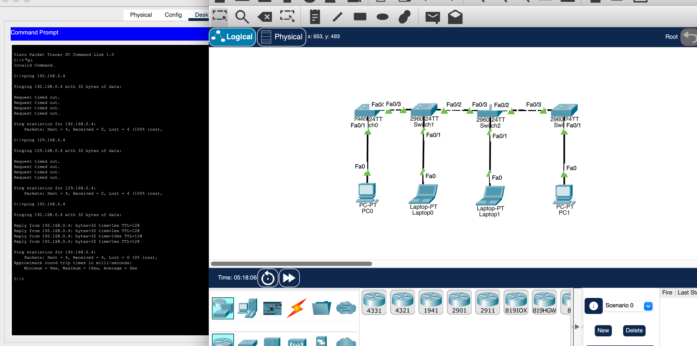
                
            - ping(packet internet groper) 명령어 : 대상 컴퓨터를 향해 일정 크기의 패킷을 보내고, 응답 메세지를 수신해 상태를 파악하는 명령어
        2. 링형
            - 토큰링(token ring): 이더넷과 다른 방식의 네트워크 형태. 이더넷은 데이터를 전송하고자 하면 아무때나 보낼 수 있지만(물론 CSMA/CD를 사용해 충돌을 방지한다.), 토큰 링의 경우 해당 네트워크에서 토큰을 가진 PC만이 네트워크를 통해 데이터를 전송 할 수 있다. 데이터 전송이 완료되면 옆의 pc로 토큰을 넘긴다.
            - 장점 : 설치와 재구성이 쉽고, 장애 발생한 호스트를 쉽게 찾을 수 있다. 수가 늘어나도 괜찮다(버스형과 달리 공유 매체가 아님.) star형보다 케이블링에 드는 비용도 적다.
            - 단점 : 토큰 등 링을 제어하기 위한 절차가 있어서 지연이 존재하고, 단방향 전송임. 닫힌 루프 형태이므로 하나를 추가하고 싶다면 물리적으로 링을 절단하고 추가해야한다.
                
               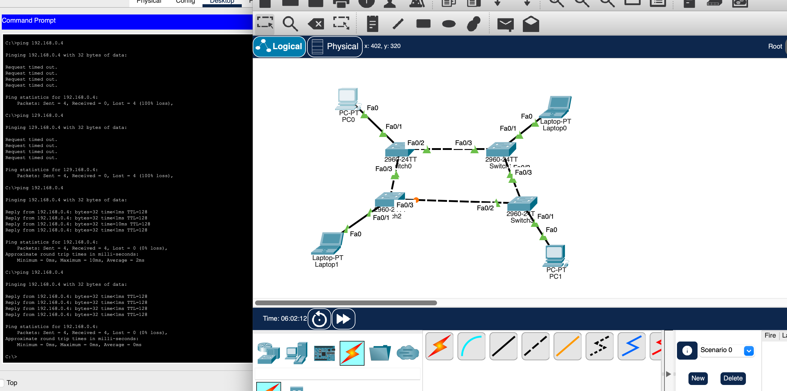
                
        3. 성(star)형
            - 각 호스트가 허브(중앙 전송 제어 장치)와 점대점 링크로 접속된 형태
            - 장점 : 고장 발견 및 유지보수 쉬움. 한 호스트가 고장나거나 링크가 제거되어도 다른 네트워크엔 영향x. 확장 용이
            - 단점 : 중앙 전송 제어 장치가 고장나면 네트워크 동작x, 설치 시에 케이블링에 비용 많이 듦. 통신량 많으면 전송 지연 발생.
            - QNA 성형에서 허브를 스위치로 대체할 수 있는 이유?:
                
                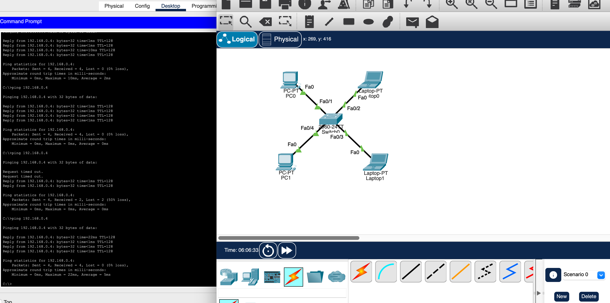
                
        4. 그물(mesh)형
            - 네트워크상의 모든 노드를 상호 연결한 형태. 완전연결형과 부분연결형으로 나뉜다. (홉 수가 적고 바로바로 연결할 수 있는 회선이 존재해) 많은 장치와의 통신양이 많을때 유리하며, 신뢰도가 높다.
            - 장점 : 여러 회선이 존재하므로 장애에 강하고 안전하다. 여러가지 경로중 가장 빠른 경로를 이용해 효율적 통신이 가능하다.
            - 단점 : 설치 비용이 비싸고, 네트워크 관리가 힘들다.
                
                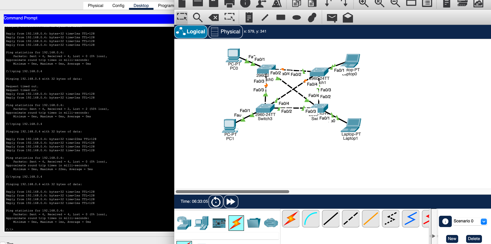
                
        5. 트리(tree)형
            - 중앙 컴퓨터 - 일정 지역 범위까지는 하나의 통신 회선으로 연결. 이후 이웃하는 단말 장치를 중간 단말장치에 연결한다. 분산처리시스템을 구성하는 방식으로, 데이터가 양방향으로 모든 노드에 전송된다.
            - 장점 : 통신 회선수를 절약하고, 확장이 쉽다. 계층적으로 원하는 환경을 각각 구성하는 것도 가능하다.
            - 단점 : 상위 노드에 문제가 생기면 하위 노드에도 영향을 미친다. 중앙 지점 고장 시 네트워크가 마비되며, 병목 현상이 발생할 수 있다.
                
                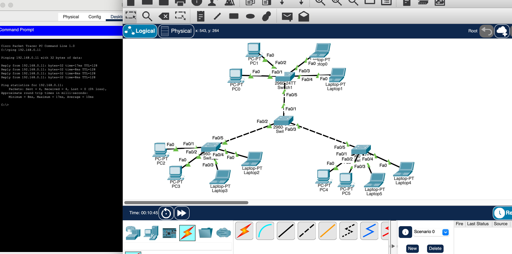
                
    2. VLAN (Virtual LAN)
        1. VLAN이란? : 가상의 랜으로, 하나의 물리스위치에서 여러 네트워크를 사용할 수 있게 하는 기술. 물리적 배치와 상관 없이 논리적으로 lan을 분할한다. 논리적으로 분할되었기 때문에, 분할된 기기간 통신은 3계층(네트워크) 장비를 통해 통신해야만 한다.
        2. 분할하여 구현
        
        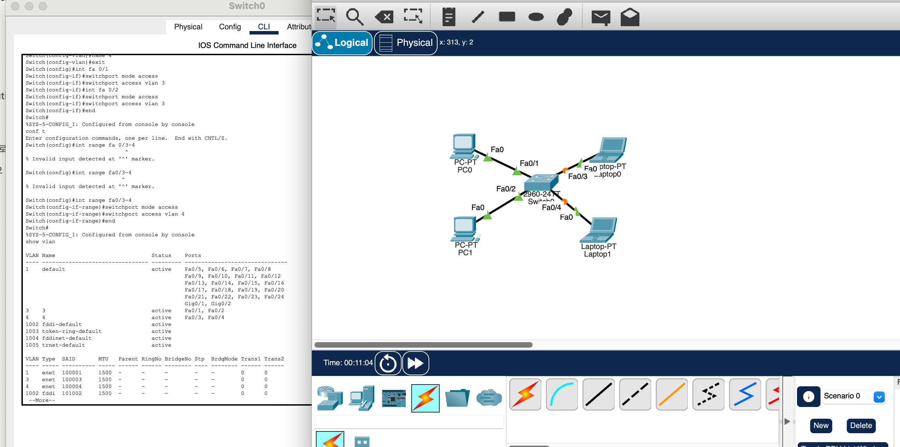
        
        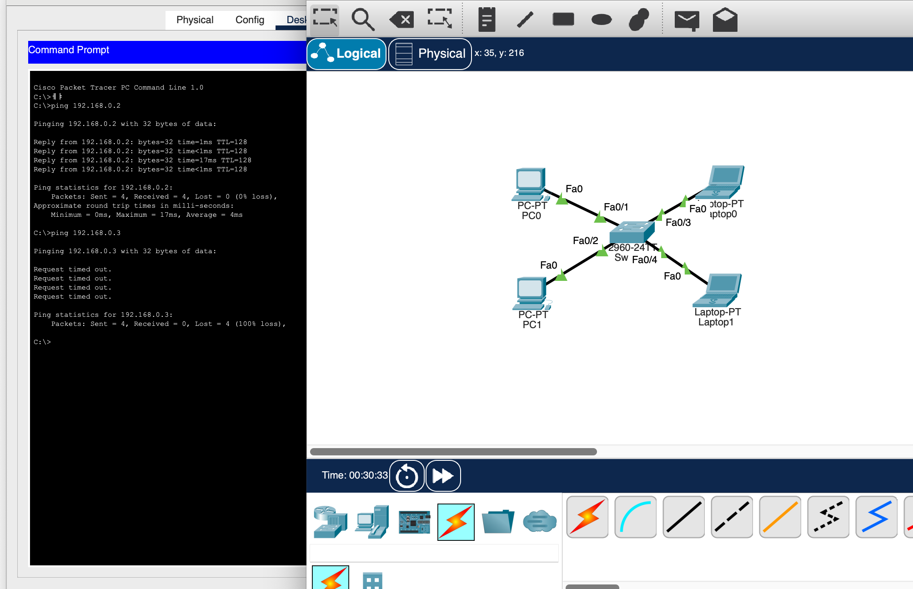
        
    3. 트렁크(Trunk)
        1. 하나의 물리적 링크를 통해 여러 VLAN의 트래픽을 전송할 수 있도록 하는 네트워크 연결 방식 또는 포트. 보통 스위치-스위치간 연결이나, 스위치-라우터간 연결에서 사용된다.
        2. 구현 과정
        
        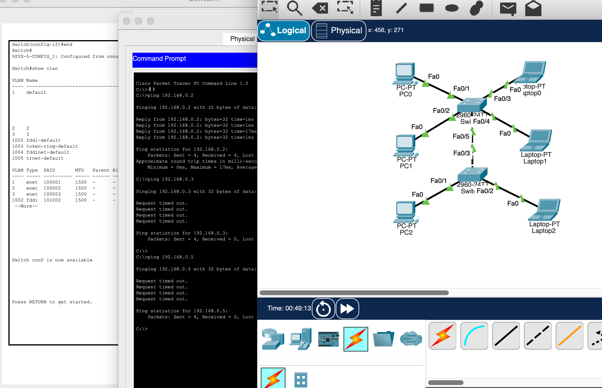
        
        새로운 스위치를 추가하고 vlan을 설정했다.
        
        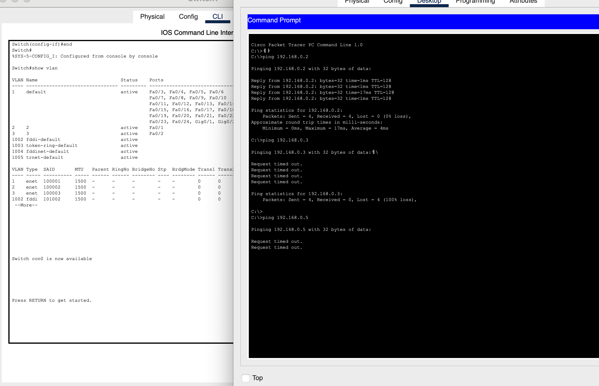
        
        같은 vlan이어도 통신이 안되는 모습. 물론 다음과 같이 통신 라인 추가를 하면 트렁크를 안쓰고 해결할 수도 있다. 하지만 이런 경우 vlan이 100개라면 통신 라인도 100개가 될 것이다. 
        
        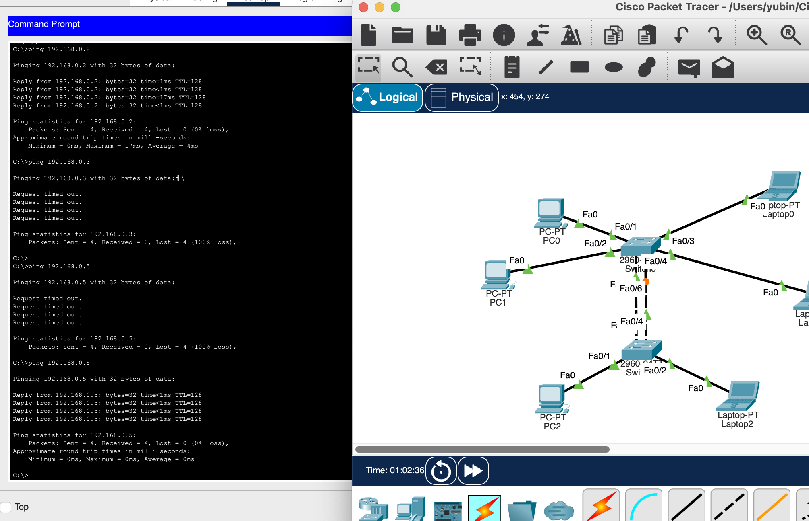
        
        대신 trunk 모드를 활성화하면 아래와 같이 통신 라인을 하나만 두고도 통신이 잘 된다.
        
        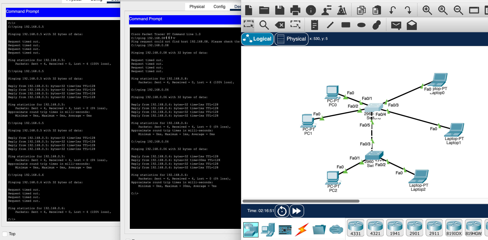
    4. inter-VLAN
        - VLAN간의 통신을 위한 라우터(게이트웨이)를 추가한다. 라우터를 경유해, 마치 다른 LAN 통신하는 것처럼 동작하게 한다.
        - 구현
            - 라우터에 가상 인터페이스를 생성해 각각 게이트웨이 ip를 할당하고, 나머지 장치들에도 각자 vlan에 맞는 게이트웨이 ip를 할당했다.
            - 이후 다음과 같이 다른 vlan간 통신이 가능해진 것을 볼 수 있다.
        
        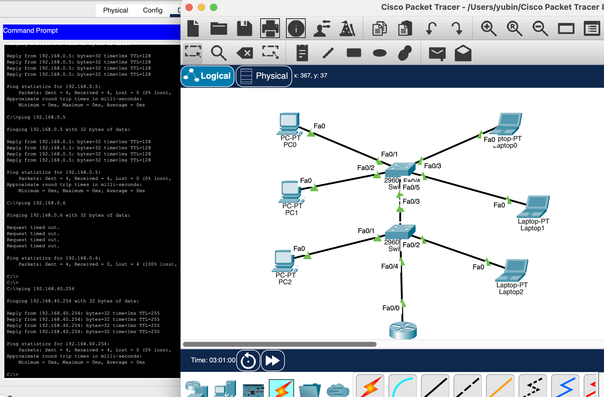
#### 주제 2: 주제에 대한 설명
- 상세 내용 1
- 상세 내용 2

### 오늘의 도전 과제와 해결 방법
- 아직 진행중이나 패킷 트레이서로 네트워크의 구조를 이해하기 위해 모르는 개념은 정리하고, 방화벽을 포함한 네트워크 구성도를 만들어보려고 했다. 아직 방화벽-라우터 설정법을 잘 모르겠어 공부중이다. 
  
### 오늘의 회고
- 개념 정리를 열심히 하느라 실습 진행이 조금 더뎠는데, 내일은 방화벽 포함 구성도를 완성시켜보고 싶다. 설정 방법 자체는 찾았는데, 왜 이렇게 되는 건지를 하나하나 따져가며 진행해보려고 한다. 이외로 아직 계층간 관계가 헷갈려 추가 공부가 필요할 것 같다. 

### 참고 자료 및 링크
- [토폴로지 - Star형, Bus형, Tree형, Ring형](https://itdexter.tistory.com/153)

- [**네트워크의 기초와 토폴로지**]([https://velog.io/@chlwogur2/네트워크의-기초](https://velog.io/@chlwogur2/%EB%84%A4%ED%8A%B8%EC%9B%8C%ED%81%AC%EC%9D%98-%EA%B8%B0%EC%B4%88))

- [네트워크 토폴로지(Network Topology)](https://epcic.tistory.com/236)

- [[네트워크] ping 명령어 - 네트워크 상태 점검, 도메인 IP 확인](https://extbrain.tistory.com/100)

- [**토큰링(TokenRing)**](https://velog.io/@chiwoosong/TokenRing)

- [**VLAN 개념에 대해 쉽게 정리해서 알려드려요**](https://m.blog.naver.com/robotncom/222611768364)
- [**패킷 트레이서로 VLAN(Virtual LAN) 설정해보기**](https://gwnuysw.github.io/jekyll/update/2019/01/08/ciscoNetwork.html)
- [**네트워크 구성도? 네트워크 Topology?**](https://velog.io/@shkim0730/what-is-network-topology)