## 날짜: 2025-02-05

### 스크럼
- 학습 목표 1 : WAN의 흐름을 이해해보자

### 새로 배운 내용
#### 위클리 챌린지 - WAN
- 
    1. ARP
        - **네트워크 상에서 IP 주소를 물리적 네트워크 주소로 대응(bind)시키기 위해 사용되는 프로토콜**
        - arp 프로토콜은 짧은 시간 간격으로 반복 실행한다. 이 경우 통신량이 늘어나 부하가 가중된다.
        - 악의적인 공격자가 mac 주소를 다른걸로 실어서 응답 패킷을 보낸다면 공격자에게 패킷이 오도록 하는 보안 문제가 발생할 수도 있다.
        - VLAN으로 이러한 문제를 해결할 수 있다. 동일한 네트워크 내에서 MAC주소를 이용한 라우팅을 하면 된다. ARP 패킷은 하나의 네트워크에서만 송수신 되고, 내부망은 분리되어 보호된다.
    2. 라우터 설정
        - 라우터는 FastEthernet 이 아니라 시리얼 인터페이스를 사용해야함. 시리얼 인터페이스가 WAN 전용 프로토콜을 지원하고 있기 때문이다. **DCE/DTE 구성 및 클럭 설정**이 필요하다.
            
            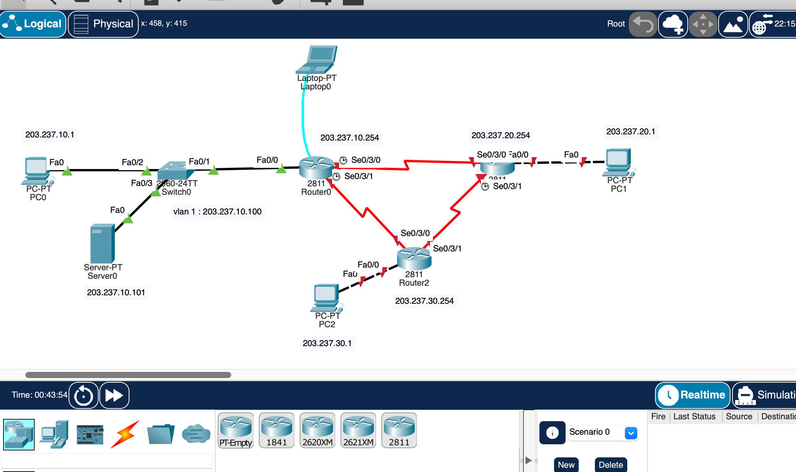
            
            위 사진은 라우터와 광역 LAN을 포함한 네트워크 구성도 예시다. 컴퓨터-스위치 / 스위치-라우터는 이더넷 케이블(lan망)을 이용하고, 노트북-라우터 / 라우터-라우터는 시리얼 케이블(wan망)을 이용한다. 예외적으로 랩탑0은 통신용 단말이 아니라 라우터0을 설정하기 위한 콘솔 역할이므로 콘솔로 직접 연결해준다. (console-RS232) 
            
        - 세 라우터 모두 시리얼 인터페이스 모듈인 HWIC-2T(시리얼 인터페이스 카드)를 추가해 재부팅했다. (physical에서 전원 끈 후 0번 슬롯에 장착, 재부팅하면 된다.)
            
            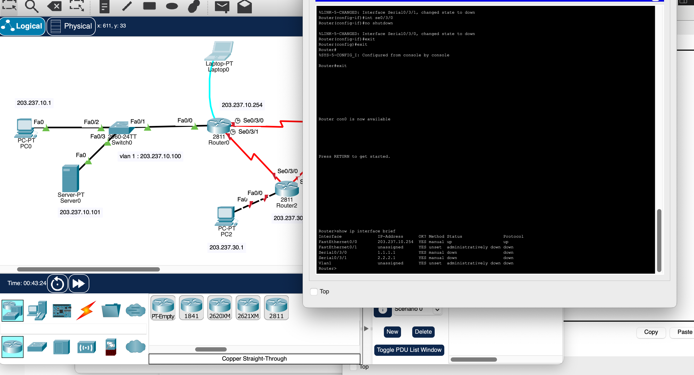
            
            라우터0에게 콘솔을 이용해 ip를 설정한다. ip address 및 마스크를 적용한뒤, 시계 모양이 위치한 DCE(시간 동기화를 주도하는 노드)에 해당하는 포트에는 클럭 설정도 걸어준다. 
            
            ```bash
            enable 
            conf t
            int fa0/0
            ip address 203.237.10.254 255.255.255.0
            int se0/3/0
            ip address 1.1.1.1 255.255.255.252
            clock rate 64000 #dce(시계 아이콘이 있는 쪽)만 클럭 속도 설정을 해준다.
            int se0/3/1
            ip address 2.2.2.1 255.255.255.252
            clock rate 64000
            
            show ip interface brief #해당 명령어를 사용하면 인터페이스 활성화 상태를 확인 가능하다.
            ```
            
        - 다른 라우터들도 똑같은 작업을 통해 ip 설정을 한다.
            
            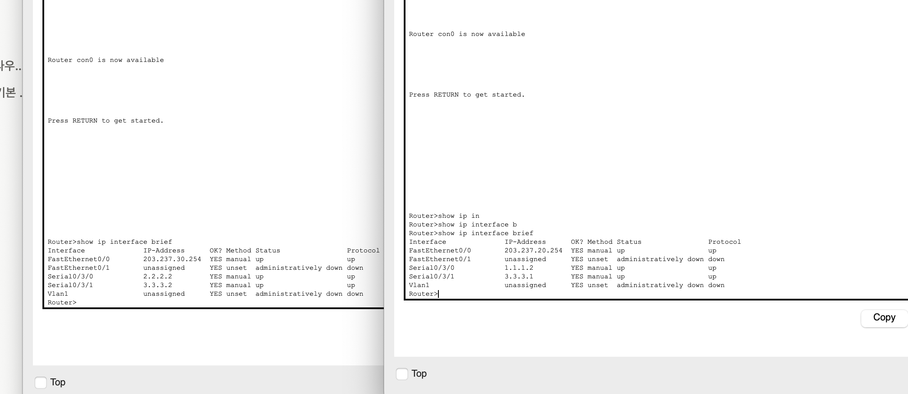
            
            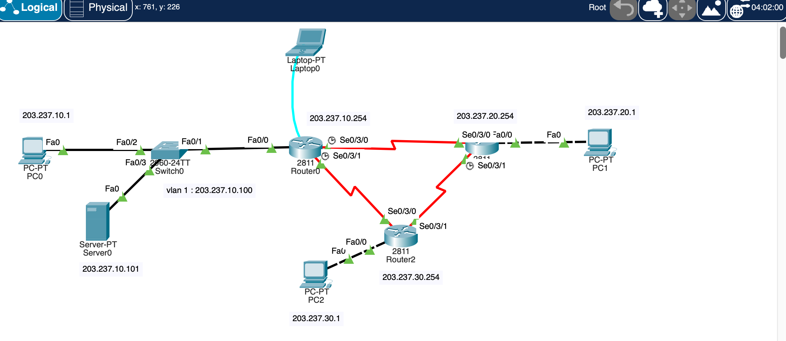
            
            잘 활성화되어 초록색 삼각형으로 변경되었다.
            
            이후 스위치의 인터페이스들을 활성화시킨다.
            
            ```bash
            int vlan 1
            ip address 203.237.10.100 255.255.255.0
            no shut
            
            int fa0/1
            no shut
            int fa0/2
            no shut
            int fa0/3
            no shut
            ```
            
            <aside>
            💡
            
            🤔 왜 vlan에 ip를 할당할까? : 
            
            - Layer 2에 속해있는 스위치는 물리 포트에 직접 IP 주소를 할당할 수 없으므로, 관리용 가상 인터페이스(SVI)를 사용한다.
            - SVI는 특정 VLAN(일반적으로 기본 관리 VLAN인 VLAN 1)에 속하며, 이 VLAN에 IP 주소를 할당하여 스위치의 원격 관리가 가능해진다.
            </aside>
            
            역시 `show ip interface brief`를 통해 확인이 가능하다.
            
        
        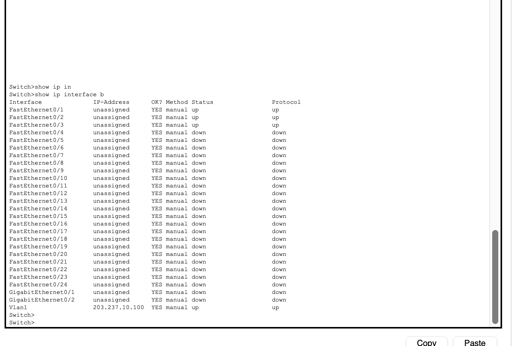
        
        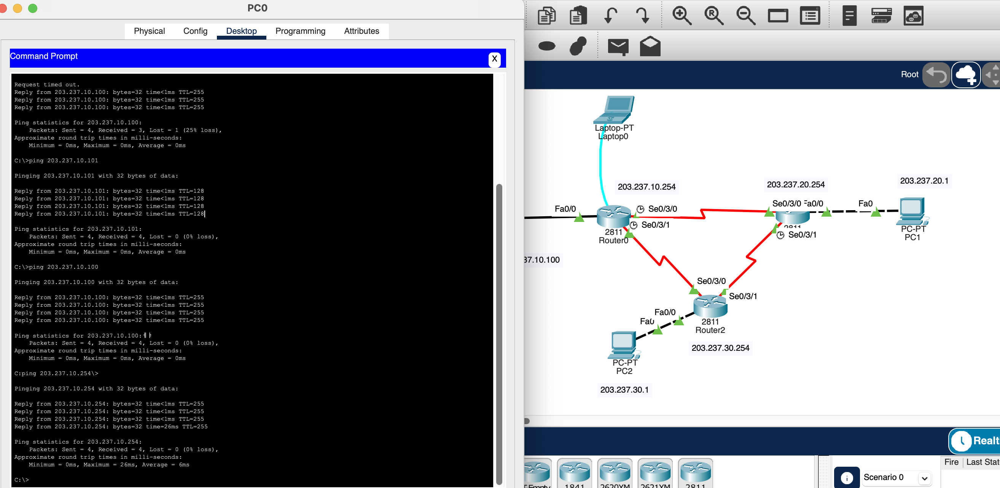
        
        pc0에서 각각 자기 자신, 스위치, 서버, 라우터0까지 ping을 전송해 테스트한다. 
        
        <aside>
        💡
        
        🤔 스위치 최초 연결을 제외하고는 모두 제대로 패킷이 돌아오고 있는 걸 확인할 수 있는데, 아마도 최초 연결시에는 arp 프로토콜 지연 때문일 것 같다.
        
        </aside>
        
    3. 라우팅 테이블 설정
        
        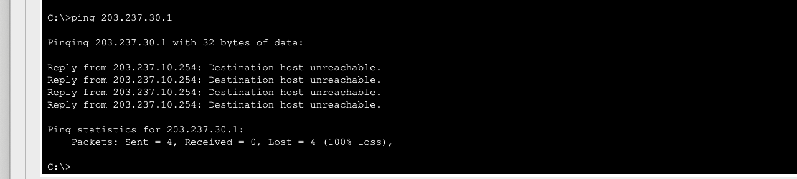
        
        - 아직 라우팅 테이블이 존재하지 않기 때문에, pc2로 보낸 ping은 unreachable이 된다.
        - 라우팅 : 출발-목적지까지 패킷을 전달하기 위해 전달 경로를 선택하는 과정. 정적으로 수동 설정을 할 수도 있고, 동적 라우팅을 사용할 수도 있다.
        - 라우팅 테이블: 이정표의 역할이라고 할 수 있다.
        
        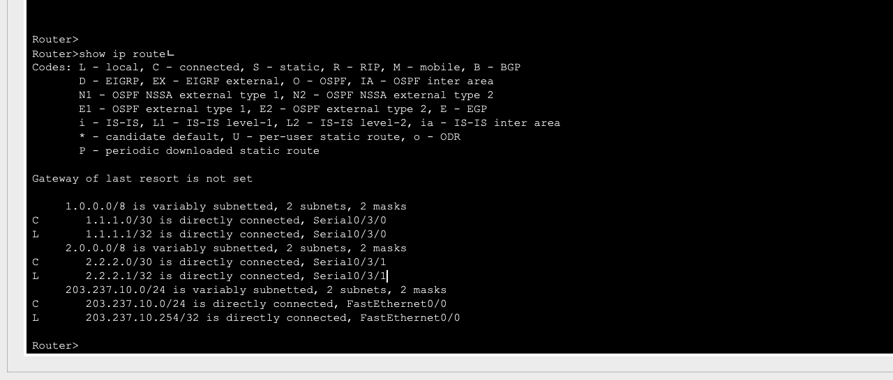
        
        `show ip route`를 입력하면 나오는 초기 라우팅 테이블의 모습으로, 멀리 떨어져 있는 pc1,2의 ip 정보는 있지 않다.  203.237.10.0 (바로 연결된 스위치의 ip대역)과, 각각 인접한 라우터에 지정한 ip인 1.1.1.n과 2.2.2.n, 즉 서브넷팅 정보만 존재한다. 
        
        - 정적 라우팅 설정을 해보자. 
        → 라우팅 설정은 출력 인터페이스나 상대 IP 주소를 설정하는 것으로 간단하게 가능하다.
        
        ```bash
        Router(config)#ip route 203.237.30.0 255.255.255.0 2.2.2.2
        Router(config)#ip route 203.237.20.0 255.255.255.0 se0/3/0
        %Default route without gateway, if not a point-to-point interface, may impact performance
        #어라? 이상한 오류가 뜬다. 
        Router(config)#ip route 3.3.3.0 255.255.255.252 1.1.1.2
        ```
        
        <aside>
        💡
        
        🤔 `%Default route without gateway, if not a point-to-point interface, may impact performance`  
        → 라우터가 특정 네트워크로 가는 경로를 설정할 때, 다음 홉(즉, 패킷을 어디로 보내야 하는지에 대한 IP 주소) 대신에 단지 인터페이스(se0/3/0)만 지정했다는 뜻.
        
        지금 상황에서는 0/3/0가 다른 라우터 하나와만 연결되어 있으므로 문제는 없지만, 0/3/1을 지정할 때처럼 **ip로 지정하는 것이 바람직해보였다.** 
        또한 0번 ip는 네트워크 주소(특정 서브넷에 속하는 모든 장비(호스트)들이 공유하는 공통 주소)이다.
        
        </aside>
        
        설정을 마치면 아래와 같이 route0의 라우팅 테이블을 확인할 수 있다.
        
        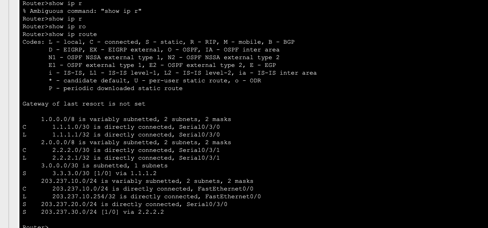
        
        - 다른 라우터들도 정적 라우팅 설정을 하자.
        → 다음과 같이 동일한 방식으로 설정이 가능했다.
        
        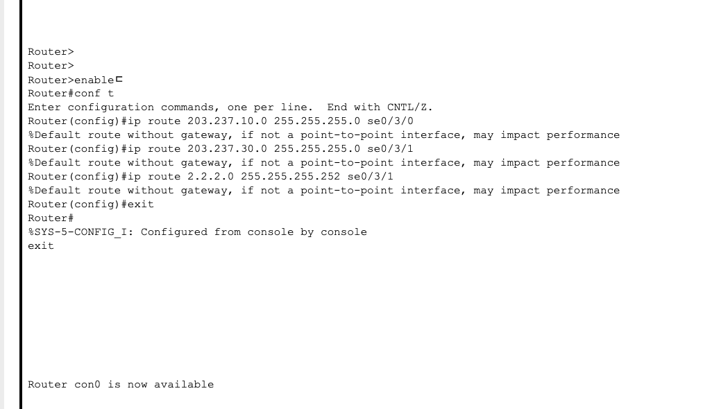
        
        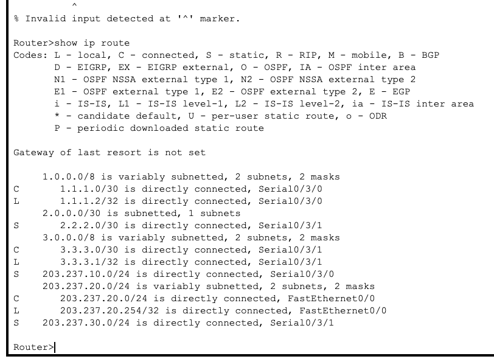
        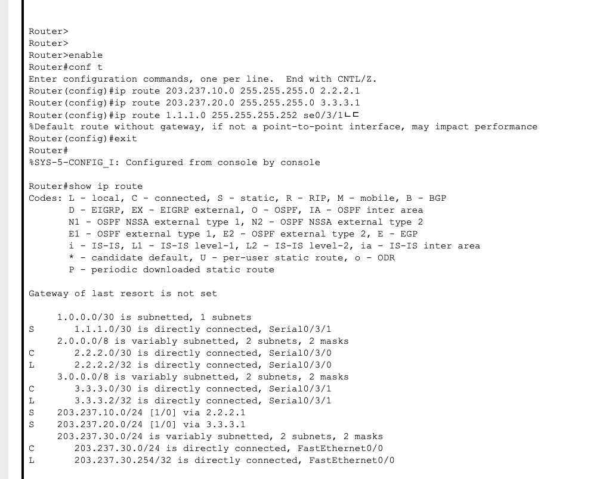
        - 다시 핑 테스트 보내기
            
        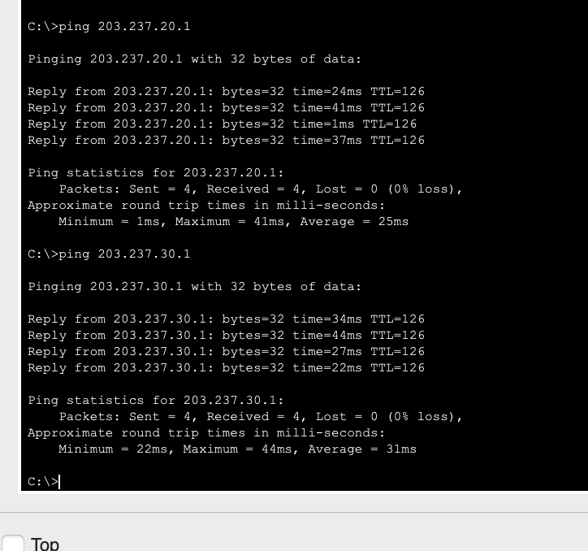
            
        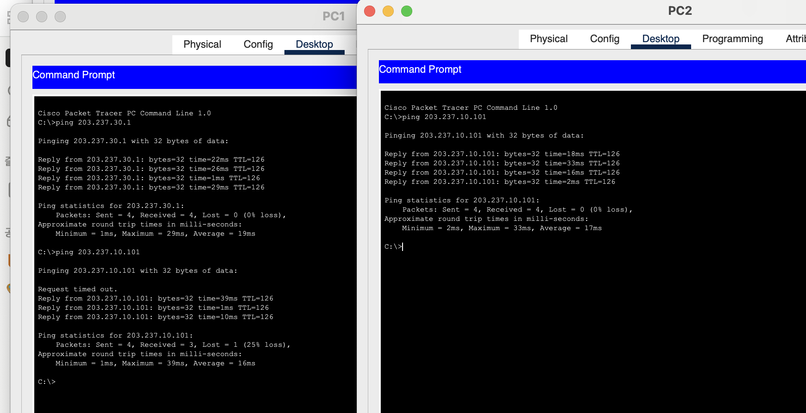
            
        모두 정상적으로 ping이 보내진다.
            
        - 시뮬레이션
            
            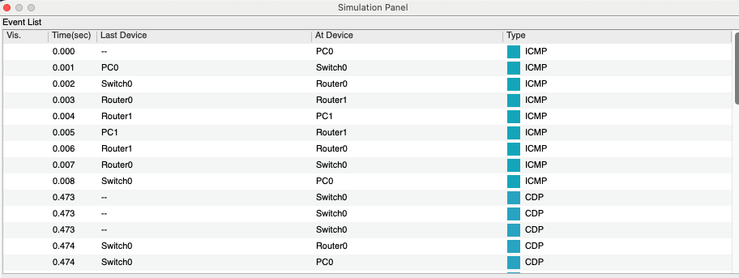
            
            제대로 라우팅 되어 통신되고 있다.

### 오늘의 도전 과제와 해결 방법
- osi 계층과 네트워크의 흐름을 이해해보고자 시뮬레이션 기능을 적극적으로 사용하고,처음 보는 cli 명령어는 명확히 이해하고 넘어가도록 했다. 
- 허브와 스위치의 개념이 헷갈려 추가 질문하였다. 계층의 차이는 있으나 스위치가 허브와 리피터의 역할을 대신할 수 있음을 알게 되었다. 

### 오늘의 회고
- 아직 복잡한 네트워크 구조를 구현한 것도 아닌데 굉장히 흐름이 헷갈렸다. 큰 그림을 보려고 노력해야 할 것 같다. 또한 여기에 클라우드가 추가되면 어떤 식으로 변경되는지도 궁금해졌다. 

### 참고 자료 및 링크
- x