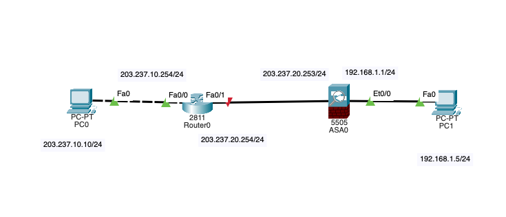
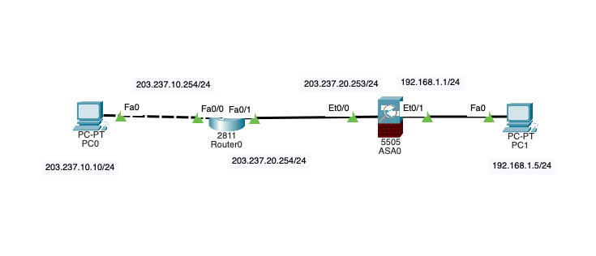
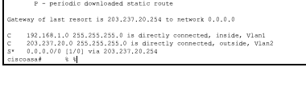
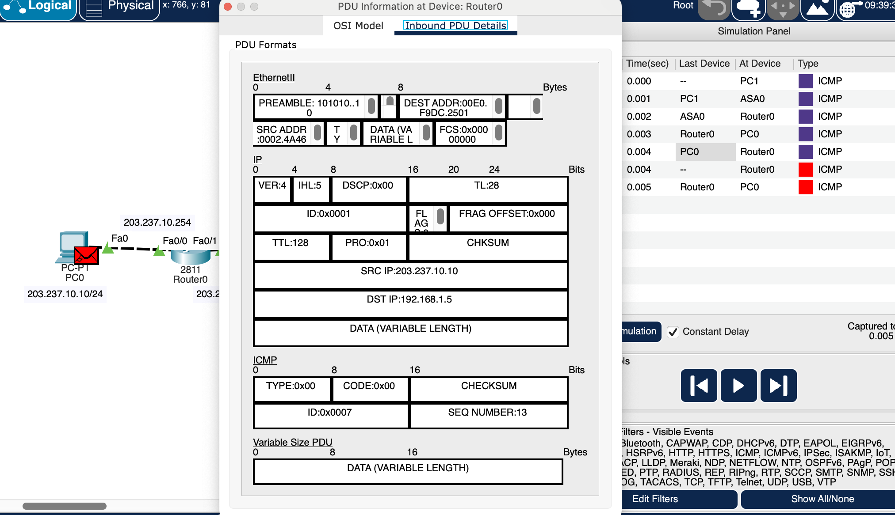
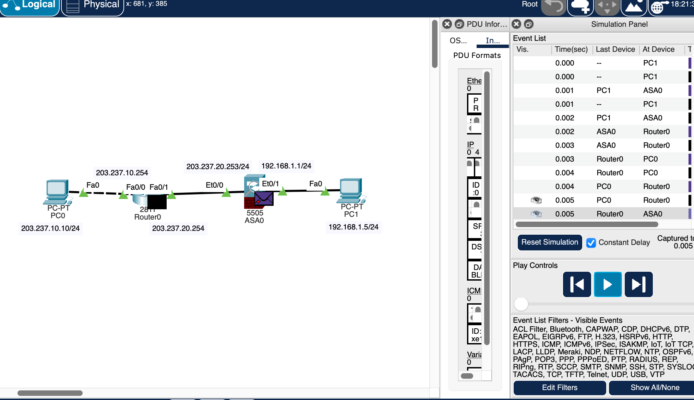
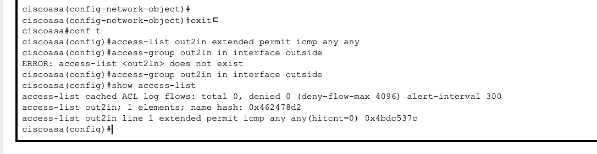
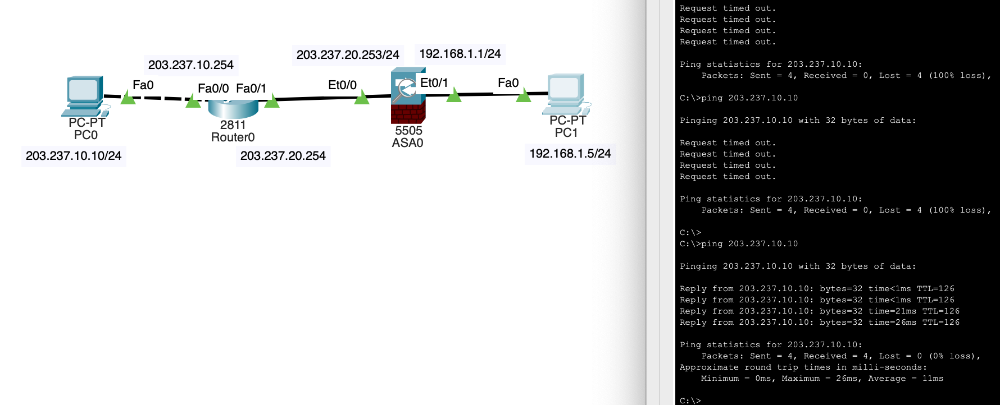

## 날짜: 2025-02-06

### 스크럼
- 목표 1 : 방화벽 & DMZ 이해
- 목표 2 : 과제 보고서 보완


### 새로 배운 내용
#### 방화벽 실습
- 네트워크 방화벽 : 외부로부터 발생하는 불법적, 위협적 행위로부터 내부의 정보나 시설 같은 자원을 보호하기 위해 설치하는 장치.
- ASA(Adaptive Security Appliance) : 시스코 보안 장비
- 관련 지식으로 RNA(Routing+NAT+ACL)이 존재한다. 보안 장비는 불필요하거나 위험요소가 있는 서비스, 패킷의 출입을 막기 위한 것이므로 RNA를 올바르게 설정해야 ASA 기능이 동작할 수 있다.
    - Routing : 라우터에서 패킷을 전달하기 위한 경로 설정
    - NAT : 사설 IP주소를 공인 IP로 변경해서 통신할 수 있게 한다.
    - ACL : 자원(내부망)에 대한 외부 트래픽 접근 허용 여부를 제어하는 규칙

1. 기본 구조 만들기
    
    
    
    실습 진행중 위의 구조에서 잘못된 부분들을 발견해 아래로 변경하였다. (ip 설정의 트러블 슈팅에 상세 작성)
    
    
    
2. ip 설정
    
    ```bash
    # PC ip 설정
    외부망(pc0)은 203.237.10.10 255.255.255.0, 게이트웨이 203.237.10.254
    (게이트웨이는 router의 fa0/0 ip 주소라고 생각했는데, 교안에는 asa outside라고 써있고 질문 필요) 
    내부망(pc1)은 192.168.1.5 255.255.255.0, 게이트웨이 192.168.1.1 
    (게이트웨이는 asa inside의 ip주소)
    
    #또한, pc1은 dhcp를 활용해 ip를 설정해야함.
    show running-config로 확인 가능.
    ciscoasa(config)#int vlan 1
    ciscoasa(config-if)#nameif inside
    ciscoasa(config-if)#security-level 100
    ciscoasa(config-if)#ip address 192.168.1.1 255.255.255.0
    ciscoasa(config-if)#int vlan 2
    ciscoasa(config-if)#nameif outside
    ciscoasa(config-if)#security-level 0
    ciscoasa(config-if)#ip address 203.237.20.253 255.255.255.0
    ciscoasa(config-if)#dhcpd address 192.168.1.5-192.168.1.36 inside
    ciscoasa(config)#dhcpd enable inside
    
    이후 ip conf의 dhcp를 선택하면 자동 할당해준다. 
    
    # 트러블 슈팅
    "DHCP failed.  Apipa is being used" 이 뜨는 오류가 발생.
    알고보니 pc1쪽에 et0/1을, 라우터0쪽에 et0/0을 연결해야했는데 반대로 연결하여 dhcp 서버
    설정이 반대로 되었던 이슈였음.
    ```
    
    - ASA가 DHCP 설정을 겸하는 이유
        
        ### 1) ASA는 기본 게이트웨이 역할을 겸함
        
        - ASA는 **내부 네트워크(Inside)와 외부 네트워크(Outside, 인터넷) 사이에서 패킷을 라우팅하고 보호하는 역할**을 수행함.
        - PC가 IP를 할당받을 때, 기본 게이트웨이(인터넷으로 나가는 출구)를 지정해야 하는데, **ASA가 기본 게이트웨이이므로 DHCP 서버를 운영하면 IP 할당과 함께 게이트웨이 정보도 자동으로 설정**됨.
        
        ### 2) 보안 정책 적용을 위해 ASA가 네트워크를 제어해야 함
        
        - 내부 네트워크에서 **어떤 장치들이 어떤 IP를 사용하는지 ASA가 파악하고 있어야 보안 정책(Firewall, NAT, ACL 등)을 제대로 적용할 수 있음**.
        - ASA가 DHCP 서버 역할을 하면 내부망 장치들의 IP를 관리하면서 **필요한 보안 설정을 연동할 수 있음**.
        
        ### 3) 외부 DHCP 서버를 사용하지 않아도 됨
        
        - 일반적으로 기업 네트워크에서는 **별도의 DHCP 서버(예: Windows Server, Linux DHCP 서버)를 운영**하지만,**소규모 네트워크에서는 ASA가 직접 DHCP 서버 역할을 하는 것이 더 간단하고 효율적**임.
        - **라우터 대신 ASA를 사용하면 DHCP와 보안 기능을 한 곳에서 관리 가능**하여 설정이 단순해짐.
    
    ```bash
    # 라우터 ip 설정
    # 각 라우터 fast ethernet 인터페이스 활성화 & ip와 서브넷 마스크를 할당한다.
    
    int fa0/0
    ip address 203.237.10.254 255.255.255.0
    no shut
    
    int fa0/1
    ip address 203.237.20.254 255.255.255.0
    no shut
    ```
    
    ```bash
    #ASA0 방화벽 ip 설정
    기본 설정은 
    show ip
    Vlan1                 inside               192.168.1.1     255.255.255.0   CONFIG
    Vlan2                 outside              unassigned      unassigned      DHCP
    vlan 1(inside)는 정상적으로 192.168.1.1로 설정이 되어있으니 괜찮음. 
    그러나 outside는 설정을 해줘야 한다.
    
    int vlan 2
    ip address 203.237.20.253 255.255.255.0
    no shut
    
    명령어로 수행이 가능했다.
    
    #트러블 슈팅 1
    - ASA의 config에 VLAN database 존재하지 않음. 그러나 기본적으로 inside, outside 
    vlan이 존재하는 것을 확인했기에 사용에는 문제 없는 것 같음. 
    Cisco ASA 장비는 일반적인 스위치와 달리 Layer 3 방화벽 기능을 수행하므로, 
    VLAN을 직접 생성하는 vlan database 명령어를 지원하지 않는다는 정보를 찾을 수 있었는데,
    실습 교안의 asa와 다른 것인지는 질문이 필요한 것 같다.
    
    #트러블 슈팅 2
    show switch vlan 명령어 입력시
    1    inside                           down      Et0/1, Et0/2, Et0/3, Et0/4
                                                    Et0/5, Et0/6, Et0/7
    가 계속 뜨는 현상이 발생해 인터페이스에 들어가 no shutdown을 작성했으나 계속 down으로 표기되었음.
    알고보니 포트 연결이 잘못되어 et0/1이 인식되고 있지 않던 것이었고, 정상적으로 재연결하니 
    초록색 삼각형으로 바뀌며 해결 되었다.         
    ```
    
3. 라우팅 설정
    
    ```bash
    #라우터의 정적 라우팅은 다음과 같았다.
    ip route 목적지_네트워크_주소 목적지_서브넷_마스크 출력_인터페이스
    ip route 목적지_네트워크_주소 목적지_서브넷_마스크 상대_IP_주소
    
    #그러나 방화벽의 라우팅은 다음과 같다.
    route VLAN명 외부망_네트워크_주소 외부망_서브넷_마스크 상대_IP_주소
    예) route outside 0.0.0.0 0.0.0.0 203.237.20.254
    
    이후 show route 명령어로 확인 가능하다.
    
    참고 :
    outside는 출력 인터페이스의 VLAN 이름을,  
    0.0.0.0 0.0.0.0은 모든 네트워크를 대상으로 한다는 걸 뜻한다.
    즉, 어떤 목적지 주소를 갖는 패킷이든 외부망의 Router0인 203.237.20.254로 전송하라는 뜻.
    
    ```
    
    
    
4. ping, 시뮬레이션 테스트
    
    ```bash
    ping 192.168.1.1 (in pc <> asa0)
    ping 203.237.10.10 (in pc <> out pc)<이건 타임아웃이 뜬다.
    ```
    
    시뮬레이션을 돌리면 다음과 같이 문제가 되는 부분을 찾을 수 있는데, 
    
    pc0 > pc 1까지는 문제가 되지 않지만 / 응답 패킷이 전달되는건 router0 > asa0으로 전달 되지 않음.
    
    
    
    왜 그럴까? : 현재 응답 패킷에 적혀있는 목적지 주소는 **192.168.1.5**인데, 이건 **사설 IP 주소**다!
    
    나올 때는 **asa0이 사설 ip를 공인 ip로 변경하여 내보내야만 한다. 즉, nat 기능도 수행해줘야한다.**
    
5. ASA NAT 설정
    
    ```bash
    ciscoasa(config)#object network in2out
    #객체_생성_명령어 객체_종류(network) 객체명 (in2out 객체 생성)
    ciscoasa(config-network-object)#subnet 192.168.1.0 255.255.255.0
    #대상_서브_네트워크_설정_키워드 내부_사설_IP_주소_대역(네트워크 주소) 서브넷_마스크
    #(사설 ip 주소를 가지는 내부망 주소 지정)
    ciscoasa(config-network-object)#nat (inside,outside) dynamic interface
    #NAT_설정_키워드 내/외부망이_연결된_인터페이스_이름_쌍 동적으로_매핑 인터페이스_주소를_매핑된_ip_주소로_사용
    #(내외부망 연결하는(inside,outside)동적 매핑)
    #매핑시키는 공인 IP 주소는 인터페이스에 할당된 IP 주소 사용
    
    #show nat
    Auto NAT Policies (Section 2)
    1 (inside) to (outside) source dynamic in2out interface
        translate_hits = 0, untranslate_hits = 0
    ```
    
    🤔 nat (outside,inside) dynamic interface 이렇게 쓰면 문제가 될까? : 아마도 그렇다. 순서를 지키도록 하자.
    
    
    
    이제 매핑한대로 203.237.20.253으로 표기된다.
    
6. ACL 설정
    
    
    
    그러나 이번에는 방화벽에서 막힌다. 이것은 asa의 기본 기능으로, 외부망→내부망으로 들어오는 패킷은 차단하기 때문! 
    
    - **ACL(Access Control List)**: 인터페이스마다 출발지/목적지를 가지는 어떠한 트래픽을 허용하거나 거부할지 정의하는 접근 제어 목록
    - acl 정의: `access-list out2in extended permit icmp any any`
        
        
        | 항목 | 설정 가능한 값 |
        | --- | --- |
        | ACL 정의 명령어 | access-list |
        | ACL 이름 | 식별가능한 이름, 대소문자 구분 |
        | ACL 정책과 옵션 | extended |
        | 적용할 동작 | permit(트래픽 허용), deny(트래픽 거부) |
        | 대상 프로토콜 | icmp,icmp6,tcp,udp,ip |
        | 출발지 IP 주소 | any:모든 아이피 주소
        host nnn.nnn.nnn.nnn: 특정 호스트의 IP 주소
        nnn.nnn.nnn.nnn nnn.nnn.nnn.nnn: IP 주소와 와일드카드 |
        | 목적지 IP 주소 | any:모든 아이피 주소
        host nnn.nnn.nnn.nnn: 특정 호스트의 IP 주소
        nnn.nnn.nnn.nnn nnn.nnn.nnn.nnn: IP 주소와 와일드카드 |
    - acl 적용: `access-group out2in in interface outside`
        
        
        | 항목 | 설정 가능한 값 |
        | --- | --- |
        | acl 적용 명령어 | access-group |
        | 적용할 acl 이름 | 정의된 acl 이름 |
        | acl을 적용할 트래픽 | in: 들어오는 트래픽에 대해 out: 나가는 트래픽에 대해 |
        | 적용할 인터페이스(vlan)을
        지정하기 위한 키워드 | interface |
        | acl을 적용할 vlan 이름 | inside:내부망 인터페이스 outside:외부망 인터페이스 |
        
        `show access-list`로 확인도 가능하다.
        
        
        
7. 완성
    
    
    
    이제 정상적으로 PC1 ↔ PC0간 통신이 가능해졌다!

### 오늘의 도전 과제와 해결 방법
- 중간중간 교안과 실제가 다른 부분들이 트러블 슈팅으로 존재했는데, 교안에서 해당 과정을 수행한 이유와 원리를 파악한 후 비슷한 다른 기능으로 대체하여 해결할 수 있었다.

### 오늘의 회고
- port를 잘못 연결해 헤매는 이슈가 있었는데 덕분에 방향을 잘 확인하면서 연결할 수 있었다. 좀더 복잡한 구조를 그리게 된다면 더 신경써야 할 부분인 것 같다. 
- 실습 외에도 추가 공부를 하고 싶었는데 진행하지 못해 아쉽다. 

### 참고 자료 및 링크
- [**[패켓트레이서] 방화벽이 있는 네트워크**](https://yon2ive.tistory.com/13)

- [서브넷,서브넷마스크,서브넷팅에 대해서!]([https://louis-j.tistory.com/entry/Subnet-mask-서브넷-서브넷마스크-서브넷팅에-대해서](https://louis-j.tistory.com/entry/Subnet-mask-%EC%84%9C%EB%B8%8C%EB%84%B7-%EC%84%9C%EB%B8%8C%EB%84%B7%EB%A7%88%EC%8A%A4%ED%81%AC-%EC%84%9C%EB%B8%8C%EB%84%B7%ED%8C%85%EC%97%90-%EB%8C%80%ED%95%B4%EC%84%9C))

- [패킷트레이서 라우터 게이트웨이 설정](https://secretpoten.tistory.com/115)

- [통신에서의 DTE와 DCE](https://blog.naver.com/ad1628/40166943471)