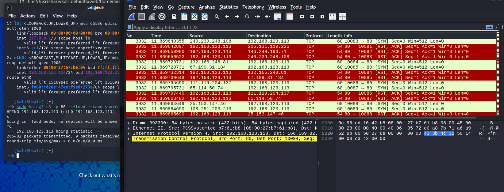
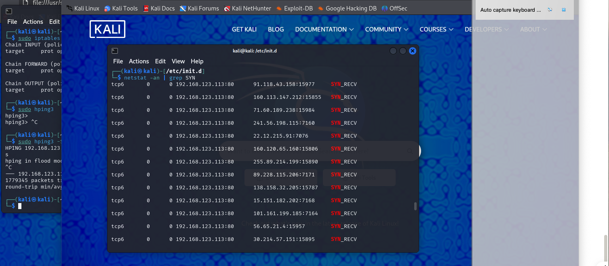
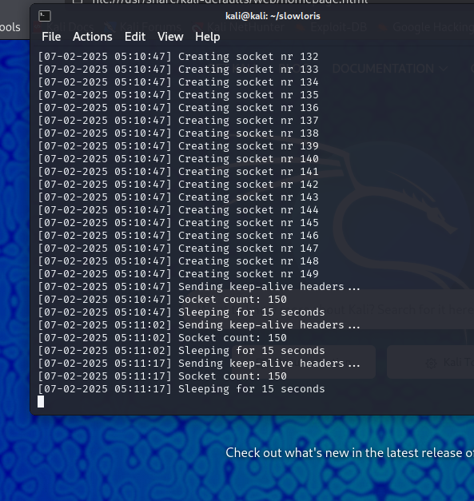
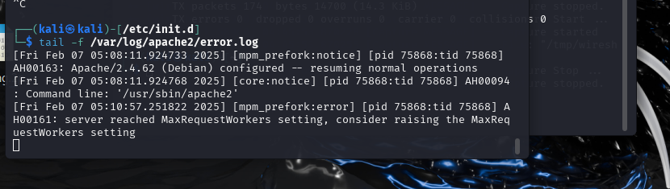
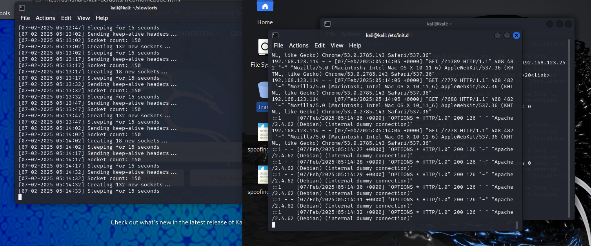
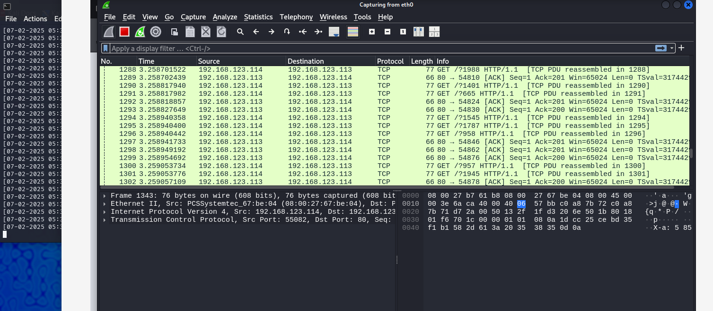
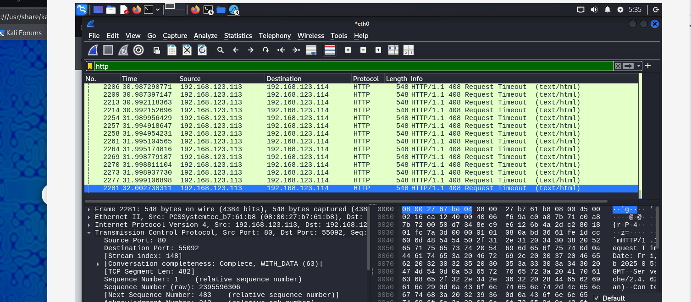

## 날짜: 2025-02-07

### 스크럼
- 학습 목표 1 : HTTPS 학습
- 학습 목표 2 : 네트워크 보안 실습

### 새로 배운 내용
#### - HTTP & HTTPS
- [HTTP.md](https://github.com/yubin425/TIL/blob/main/Network/HTTP.md)

#### - TCP SYN Flooding

##### TCP(Transmission Control Protocol) `L4 전송 계층`
두 개의 호스트를 연결, 데이터 스트림을 교환하게 하는 네트워크 프로토콜

- 연결과정: 3-way handshake
    1. SYN: 클라이언트가 초기 시퀀스 번호(난수)와 함께 연결 요청을 보낸다.
    2. SYN-ACK: 서버는 요청을 수락, 클라이언트의 시퀀스 번호 +1 과 본인의 초기 시퀀스 번호를 포함한 패킷을 보낸다.
    3. ACK: 클라이언트는 서버의 시퀀스 번호 +1 값을 응답으로 보낸다. 

> 🤔 **시퀀스 번호(**ISN**)는 왜 0부터 시작하지 않을까?** : 예측하기 쉬워지면 IP address spoofing 이나 session hijacking에 당할 수 있다. 

- 데이터 전송
    - 데이터는 세그먼트 형태로 나누어 순차 전송하고, 각각 시퀀스 번호를 부여해 재조합할 수 있도록 한다.
    - 수신자는 데이터를 받을 때 ACK를 보내 도착을 알린다. 일정 시간 내에 ACK가 도착하지 않으면 데이터를 재전송한다.
    - 네트워크의 혼잡 상황이나, 처리 능력을 고려해 전송 속도를 조절한다. 데이터 손실을 최소화하고 전송 효율을 최대화하기 위한 흐름&혼잡 제어다.
- 연결종료: 4-way handshake
    1. FIN: 클라이언트가 종료 플래그를 전송한다.
    2. ACK: 서버는 확인 메시지를 보내고, 본인의 통신이 끝날 때까지 기다린다. 
    3. FIN: 서버가 종료 플래그를 전송한다.
    4. ACK: 클라이언트는 응답을 보내고 잠시동안 TIME_WAIT 상태가 된다. (fin 패킷을 보내기 전 전송한 패킷이 있을 수 있기 때문.) 서버는 응답을 받으면 CLOSED가 되고, 클라이언트도 잠시 기다린 후 CLOSED가 된다.

- 실습 - **TCP SYN Flooding**
    TCP SYN Flodding Attack
    
    - 개념
        - 최초 연결 과정 3-way handshake에서 일어나는 공격.
        - 클라이언트(공격자)가 보낸 SYN 요청은 서버가 SYN-ACK를 보내며 SYN Queue에 저장된다.
        - SYN은 ACK를 받으면 Accept Queue로 이동되고 TCP 통신이 연결되면 삭제 된다.
        - 그런데 클라이언트가 ACK는 보내주지 않고 SYN만 계속 보내면 어떻게 될까? 서버의 **SYN Queue는 가득 차게 되고, 새로운 요청을 받을 수 없게 될 것이다**!
    - 공격 원리
        - 클라이언트는 ACK 응답이 발생하면 안된다. 이를 위해 **출발지 IP를 존재하지 않는 IP로 위조해 전송한다.** 서버가 아무리 SYN-ACK를 전송하더라도 이상한 곳으로 향하기 때문에 ACK는 발생할 수 없다.
    - 대응책
        - 방화벽, DDos 장비에서 같은 IP 주소의 SYN요청에 임계치를 둔다.
        - Backlog Queue(SYN Queue+Accept Queue)의 크기를 늘린다.
        - SYN-ACK 전송시 ISN(Initial Sequence Number)에 **SYN Cookie**값을 넣어 전송한다. 나중에 이 쿠키값을 검증해 연결을 형성하므로 syn을 저장해두지 않아도 된다.
        - **First SYN Drop**. 첫번째로 들어오는 syn 요청은 drop 시켜버리고, 재요청 패킷이 도착하는지 확인한다. 재전송되지 않으면 위조(spoofing)되었다고 판단한다.
    </aside>
    
    1. victim pc에서 syn cookie를 끈다.
        
        `sudo sysctl -w net.ipv4.tcp_syncookies=0` 처럼 끄면 된다.
        
    - 다만 끄기 전과 후 둘다 제대로 막고 있는 걸 확인했다. 이유는 더 찾아봐야할 것 같다…
    - 다시 키고 싶다면 `sudo sysctl -w net.ipv4.tcp_syncookies=1` 처럼 사용한다.
    
    1. 공격자 pc에서 hping을 이용해 공격한다.
        
        ```bash
        sudo hping3 -S -p 80 --flood --rand-source <IP> 방식으로 공격 가능. 
        #-S: SYN 플래그 설정
        #-p 80: 포트 80 (웹 서버의 기본 포트)
        #--flood: 패킷을 빠르게 보냄
        #--rand-source: 임의의 소스 IP를 사용하여 스푸핑
        ```
        
    2. 와이어샤크로 패킷을 캡쳐해 확인한다.
        
        
        
        위와 같이 수많은 syn 공격을 보내고 있고, 피해자는 rst,ack 패킷을 통해 막고 있는 모습을 볼 수 있다.
        
        또한 아래와 같이 Backlog queue를 직접 확인해볼 수도 있다.
        
        ```bash
        netstat -an | grep SYN
        # -i syn_recv (이러면 안됨. 대소문자를 잘 구별하자.)
        ```
        
        

#### - Slowloris DDOS
공격자가 공격자와 대상 간에 많은 HTTP 연결을 동시에 열고 유지함으로써 대상 서버를 무력화하는 서비스 거부(DDOS) 공격 프로그램. 

빠른 요청이나 큰 볼륨을 가진 요청을 보내는 건 아니지만, 수많은 **클라이언트(공격자)가 긴 연결을 유지하여 공격**한다. 낮은 복잡성으로 웹 서버를 중단시킬 수 있는 방법이다. 

- 공격 방법
    1. 다수의 부분 HTTP 요청 헤더를 전송하여 대상 서버에 대한 여러 연결을 연다. 그러나 부분적인 HTTP 요청이므로 서버는 요청을 완전히 받지는 못한 상태가 된다.
    2. 요청을 다 받지 못한 상태로 연결 유지가 되면, 서버의 연결 자원이 점차 소모된다.
    3. 결국 다른 요청을 처리할 수 없게 된다.
    
- 방어 방법
    1. HTTP 연결의 최대 대기 시간을 설정한다. 그러나 공격자가 중간중간 요청을 보내는 것으로 방어할 수도 있다.
    2. 웹 방화벽을 사용한다.
    3. 웹 서버 리소스를 제한한다. 
    4. 단일 IP 주소가 열 수 있는 연결 수를 제한한다. 
    5. 서버의 허용 클라이언트 수를 늘린다.
   
> 🤔 부분 HTTP 헤더란?

예를 들자면 정상적인 HTTP 헤더는 다음과 같은 모습이다.

```bash
GET /index.html HTTP/1.1
Host: example.com
User-Agent: Mozilla/5.0 (Windows NT 10.0; Win64; x64) AppleWebKit/537.36 (KHTML, like Gecko) Chrome/58.0.3029.110 Safari/537.36
Accept: text/html,application/xhtml+xml,application/xml;q=0.9,image/webp,*/*;q=0.8
Connection: keep-alive
```

그리고 부분 HTTP헤더란 다음과 같은 불완전한 헤더를 말한다.

```bash
GET /index.html HTTP/1.1
Host: example.com
```

> 그렇다면 왜 불완전한 헤더가 왔음에도 기다려 주는걸까?
<br>→ 정상적인 요청임에도 헤더가 끊기거나 전달을 기다려야하는 경우가 존재하기 때문이다. HTTP 요청은 여러 개의 **헤더 필드**로 구성되며, **헤더의 끝을 표시하는 특수한 문자열**(`\r\n\r\n`)이 있어야 서버가 요청을 **완전히 받았다고 판단한다.** 이는 정상적인 동작이다.

1. slowloris 설치
    
    `git clone https://github.com/gkbrk/slowloris.git` 을 사용한다.
    
2. victim에서 apache2 서버 열기
    
    `sudo systemctl start apache2`
    
3. 공격 실행
    
    `python [slowloris.py](http://slowloris.py/) <IP> -p 80 -v`
    
    
    
    수많은 소켓을 열고, 15초 쉬기 → keep-alive(아직 요청 살아있음) 헤더 보내기를 반복해 자원을 소모시킨다.
    
4. 공격 로그 확인
    
    `tail -f /var/log/apache2/error.log` 를 통해서 error를 볼 수 있다.
    
    
    
    AH00161: server reached MaxRequestWorkers setting, consider raising the MaxRequestWorkers setting → **서버의 최대 요청 처리 한계**(`MaxRequestWorkers`)에 도달했음을 보여주는 로그. 
    
     `tail -f /var/log/apache2/access.log` 를 확인하면 **지속적으로 열리는 연결**이나 **완전하지 않은 요청을 모니터링 할 수 있다.**
    
    
    
    확인해보면 `GET /xxxx HTTP/1.1 408`와 같은 로그를 확인할 수 있다. `408` 상태 코드는 **Request Timeout**을 나타내며, 서버가 요청을 처리하지 못하고 연결이 타임아웃되었음을 알 수 있다.
    
    
    
    
    
    wireshark로도 물론 확인 가능하다. 


### 오늘의 도전 과제와 해결 방법
- 이론적으로만 학습했던 해킹 방법과 그 예방 방안에 대해 실습하였다. 작동원리를 확실히 이해하고 실습하고자 노력했다.
  
### 오늘의 회고
- 다른 분들의 실습 주제인 ARP Spoofing 공격 및 방어, ICMP Redirect 공격 실습, DNS Spoofing, SSLStrip + ICMP Tunneling 공격 및 방어도 함께 학습하였다. 관련해 네트워크 계층 부분에서 헷갈리는 부분이 있어 토의를 했는데, 네트워크의 흐름은 정말 배우면 배울 수록 헷갈리는 부분이라는 생각이 들었다. 계층간 차이를 명확히 하기 보다는 유기적으로 연결해서 보려는 노력이 더 필요할 것 같다.

### 참고 자료 및 링크
- [**[Network] TCP 프로토콜 연결/종료 과정**]([https://velog.io/@ragnarok_code/Network-TCP-프로토콜-연결종료-과정](https://velog.io/@ragnarok_code/Network-TCP-%ED%94%84%EB%A1%9C%ED%86%A0%EC%BD%9C-%EC%97%B0%EA%B2%B0%EC%A2%85%EB%A3%8C-%EA%B3%BC%EC%A0%95))
- [**[network] tcp 연결 & 연결 종료**](http://hanaldo.tistory.com/50)
- [**TCP SYN Flooding(DDoS) 공격**]([https://sysadmin.tistory.com/entry/정보보안기사실기-TCP-SYN-FloodingDDoS-공격](https://sysadmin.tistory.com/entry/%EC%A0%95%EB%B3%B4%EB%B3%B4%EC%95%88%EA%B8%B0%EC%82%AC%EC%8B%A4%EA%B8%B0-TCP-SYN-FloodingDDoS-%EA%B3%B5%EA%B2%A9))
- [**[Network] TCP 3-way handshake & 4-way handshake**](https://velog.io/@nhj2927/Network-TCP-3-way-handshake-4-way-handshake)
- [TCP SYN Flooding, 신 플러딩 공격이란 무엇인가](https://m.blog.naver.com/on21life/221338120815)
- [**TCP Syn Flooding 실습**](https://blog.naver.com/gkdisakdmaqk/221227587580)
- [**Slowloris DDoS 공격이란?**](https://www.cloudflare.com/ko-kr/learning/ddos/ddos-attack-tools/slowloris/)
- [**Slowloris DDoS 공격이란?2**](https://www.akamai.com/ko/glossary/what-is-a-slowloris-ddos-attack)
- [**TCP SYN Flooding 실습과 대응**](https://techbrad.tistory.com/39)