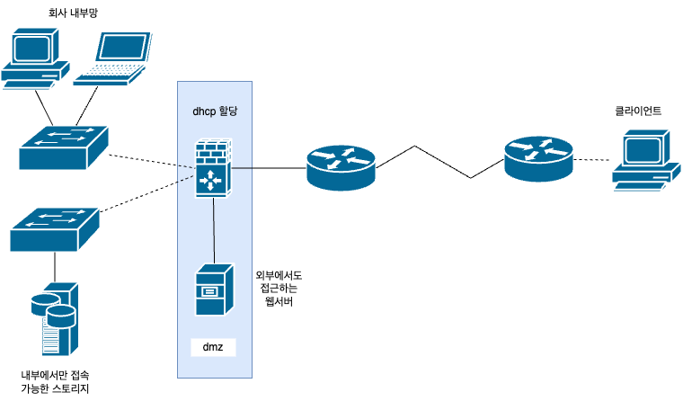
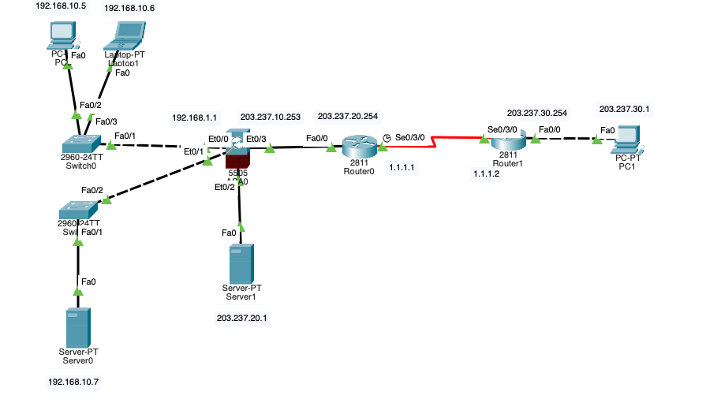
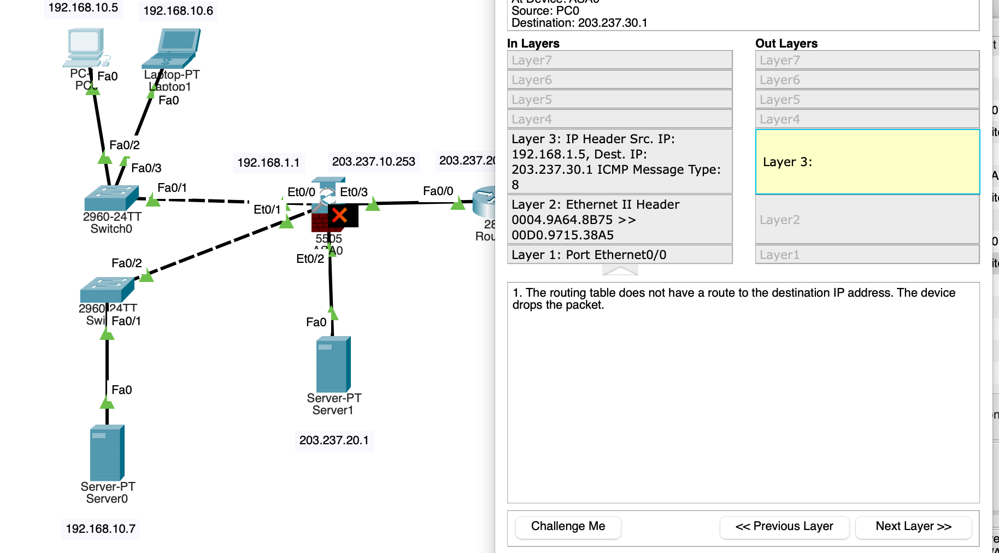
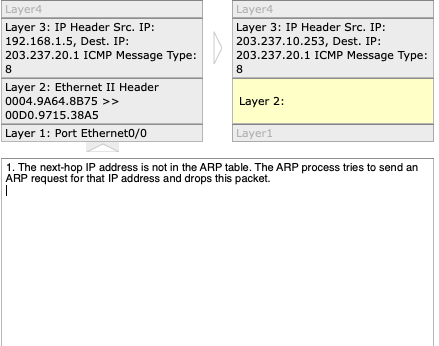
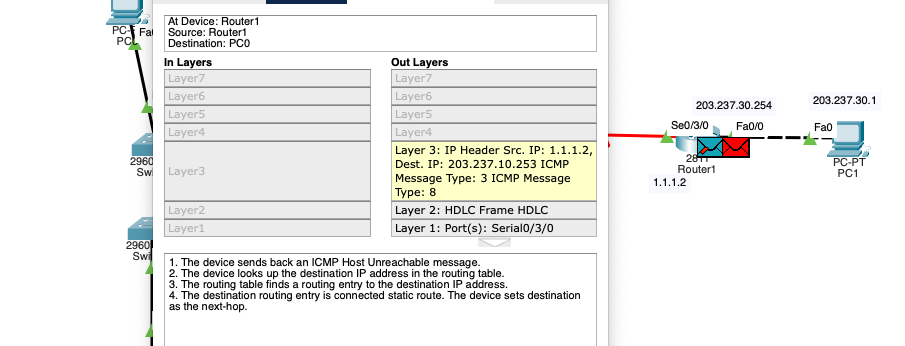
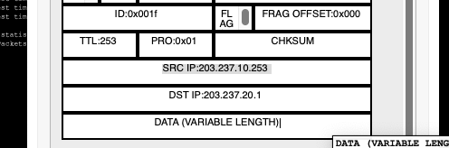
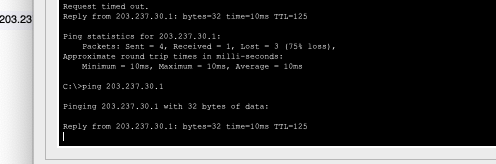

## 날짜: 2025-02-08

### 스크럼
- 학습 목표 1 : 네트워크 구성도 그리고 패킷트레이서로 만들어보기

### 새로 배운 내용
#### 네트워크 구성도 실습
1. 개요, 시나리오 설정
    - 네트워크 구성도 : 네트워크 구성도는 스위치, 라우터, 방화벽 등 네트워크를 이루고 있는 다양한 네트워크 장비들의 물리적/논리적 구성을 가시화하여 그려낸 것을 뜻한다.
    - 실습을 위해 라우터, 방화벽, 스위치, 서브넷 마스크를 모두 포함한 LAN 구성도를 구성해보고 싶다.
        
        → 수업시간에 나왔던 DMZ를 간단하게 구성해보기로 했다. 
        
    - DMZ : 내부 네트워크에 존재하지만, 외부에서 접근할 수 있는 특수한 네트워크 영역.
    - 2,3일차 실습을 섞어서 소규모 기업의 네트워크를 구성해보려고 한다. 내부망이 간단한 tree형으로 존재하고, DMZ 구간이 있어 간단한 웹 서비스를 외부에 제공하는 업체라는 시나리오를 정했다.
2. 네트워크 구성도 그리기
    
    
    
    주요 목표는 외부 클라이언트 ↔ dmz간 연결은 가능하지만, 외부 클라이언트→내부망은 연결 불가, 내부→외부로 나가는 패킷은 괜찮은 네트워크를 구성하는 것이다. 
    
3. 패킷트레이서로 구현해보기
    
    
    
    ip, dhcp 설정 및 방화벽 nat 설정, 라우터 설정 등을 해줬다. 
    
    **#문제 1 :** 
    
    pc0(내부망) → pc1(외부 클라이언트) 테스트를 위해 `ping 203.237.30.1` 을 시도했으나, 방화벽에서 막혀버렸다. 시뮬레이션의 패킷을 확인했더니 Layer3: 에 라우팅 테이블이 없어 갈 길을 찾지 못하고 있다는 사실을 알 수 있었다.
    
    
    
    🤔 엥? 분명 `route outside 0.0.0.0 0.0.0.0 203.237.20.254` 로 라우팅 설정을 했었는데..?
    
    → 확인해보니 interface vlan 2(outside interface)에 ip설정하는 걸 까먹었기 때문이었다. ip 설정을 까먹지 말자. 다음과 같이 설정하자 정상적으로 라우팅 설정이 되는 걸 확인할 수 있었다. 
    
    ```bash
    ciscoasa(config)#interface Vlan2
    ciscoasa(config-if)#
    ciscoasa(config-if)#ip address 203.237.10.253 255.255.255.0
    ciscoasa(config-if)#no shut
    ciscoasa(config-if)#exit
    ciscoasa(config)#show route
    Codes: C - connected, S - static, I - IGRP, R - RIP, M - mobile, B - BGP
           D - EIGRP, EX - EIGRP external, O - OSPF, IA - OSPF inter area
           N1 - OSPF NSSA external type 1, N2 - OSPF NSSA external type 2
           E1 - OSPF external type 1, E2 - OSPF external type 2, E - EGP
           i - IS-IS, L1 - IS-IS level-1, L2 - IS-IS level-2, ia - IS-IS inter area
           * - candidate default, U - per-user static route, o - ODR
           P - periodic downloaded static route
    
    Gateway of last resort is 203.237.20.254 to network 0.0.0.0
    
    C    192.168.1.0 255.255.255.0 is directly connected, inside, Vlan1
    C    203.237.10.0 255.255.255.0 is directly connected, outside, Vlan2
    S*   0.0.0.0/0 [1/0] via 203.237.20.254
    ```
    
    **#문제 2:**
    
    
    
    이번엔 또 layer 2에서 arp가 제대로 안되고 있다는 걸 발견할 수 있었다. 엥? 
    
    > 원인은 현재 방화벽 ↔ 라우터0간 인터페이스의 서브넷이 상이하기 때문이었다. ARP는 네트워크 내에서 같은 서브넷에 있는 장비들끼리만 MAC주소를 주고받을 수 있는, 즉 **로컬 네트워크 내에서 동작**하는 방식이다. 그런데 10과 20으로 네트워크가 달랐으니 arp 테이블을 채우지 못했던 것이다. 
    
    ip를 203.237.10.254로 변경하고, 라우팅도 `route outside 0.0.0.0 0.0.0.0 203.237.10.254` 로 다시 해줬다. 
    
    **#문제 3:**
    
    
    
    이번엔 라우터1까진 도착했으나, pc1에는 도달을 못했다. 원인을 찾고자 라우터1→pc1 ping을 날려보았는데 이것도 되지 않아 라우팅에 뭔가 문제가 있다는 걸 알게 되었다. 
    
    ```bash
    #router0의 라우팅 테이블. 30 서브넷이 없고, 20으로 잘못 등록이 되어 있다.
         1.0.0.0/8 is variably subnetted, 2 subnets, 2 masks
    C       1.1.1.0/30 is directly connected, Serial0/3/0
    L       1.1.1.1/32 is directly connected, Serial0/3/0
         3.0.0.0/30 is subnetted, 1 subnets
    S       3.3.3.0/30 [1/0] via 1.1.1.2
         203.237.10.0/24 is variably subnetted, 2 subnets, 2 masks
    C       203.237.10.0/24 is directly connected, FastEthernet0/0
    L       203.237.10.254/32 is directly connected, FastEthernet0/0
    S    203.237.20.0/24 is directly connected, Serial0/3/0
    ```
    
    ```bash
    ip route 203.237.30.0 255.255.255.0 1.1.1.2
    ip route 203.237.30.0 255.255.255.0 se0/3/0 로 추가했다.
    no ip route 203.237.20.0 255.255.255.0 Serial0/3/0 삭제도 해준다.
    
         1.0.0.0/8 is variably subnetted, 2 subnets, 2 masks
    C       1.1.1.0/30 is directly connected, Serial0/3/0
    L       1.1.1.1/32 is directly connected, Serial0/3/0
         3.0.0.0/30 is subnetted, 1 subnets
    S       3.3.3.0/30 [1/0] via 1.1.1.2
         203.237.10.0/24 is variably subnetted, 2 subnets, 2 masks
    C       203.237.10.0/24 is directly connected, FastEthernet0/0
    L       203.237.10.254/32 is directly connected, FastEthernet0/0
    S    203.237.30.0/24 [1/0] via 1.1.1.2
                         is directly connected, Serial0/3/0
    ```
    
    
    
    이제보니 아예 dst ip부터 잘못되어 있었다. 
    
    사실 여기서 네트워크 리셋 버튼을 잘못 눌러서 라우터와 방화벽 설정을 처음부터 다시 했다. 과정은 동일하므로 적지는 않지만, 네트워크 리셋 버튼을 함부로 누르지 말자…
    
    
    아무튼 첫번째 목표를 달성했다.
    
    **#문제 4**: 
    
    외부 클라이언트(pc1)에서 dmz내부의 서버로 ping을 날리면, 라우터0 → asa → 서버1이 아닌 다시 라우터 0으로 되돌아오는 문제가 발생했다.
    
    아마도 서버가 asa의 outside interface에 등록이 되어있으므로 라우팅 테이블이 outside로 나가는 패킷이라 인식해 무조건 라우터0으로 되돌려보내는 문제가 있는 것 같다. 
    
    해결하기 위해 inside로 바꾸거나, 라우터를 추가 연결하거나, 라우팅 테이블을 추가하거나, 
    
    ```bash
    ciscoasa(config)# access-list outside_access_in extended permit ip any host 203.237.20.1
    ciscoasa(config)# access-group outside_access_in in interface outside
    ```
    
    이런 acl 조건을 추가해보는 등 여러 시도를 했으나 아직 해결이 되지 않았다.  
    
 

### 오늘의 도전 과제와 해결 방법    
- ip를 처음부터 정하고 연결하려니 굉장히 많은 오류들이 발생했다. 시뮬레이션 패킷을 분석해 해결해보는 방식을 선택했는데, 덕분에 라우팅 테이블이 통신에서 얼마나 중요한지 알 수 있었다. 흐름도 좀 더 이해할 수 있게 된 것 같다.
  
### 오늘의 회고
- 사실 오늘 개념 공부를 더 하고 싶었는데, 예상보다 실습 에러가 너무 많이 나서 시간을 할애할 수 없었다. 딥다이브도 중요하지만 분배도 역시 중요하므로, 내일은 실습보다는 개념 위주로 학습을 할 생각이다.

### 참고 자료 및 링크
- [**DMZ 네트워크를 이해하자**](https://brunch.co.kr/@sangjinkang/51)
- [**[패켓트레이서] 방화벽이 있는 네트워크**](https://yon2ive.tistory.com/13)