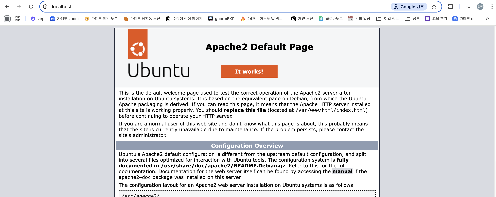
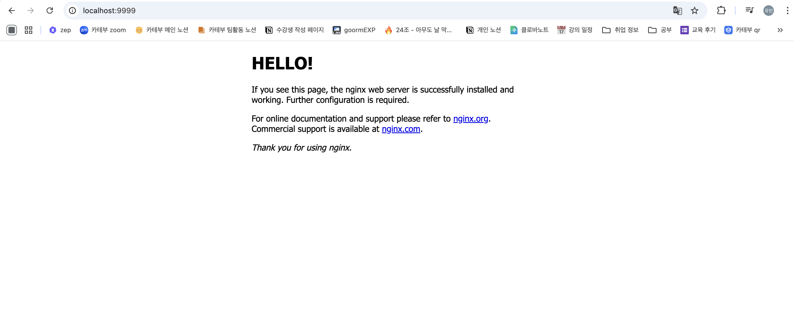
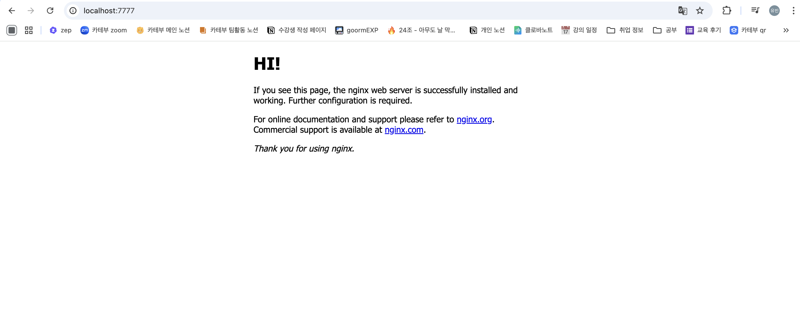

## 날짜: 2025-02-11

### 스크럼
- 학습 목표 1 : 도커 실습

### 새로 배운 내용
#### 4.  실전 - apache 웹서버를 구축해보자
```bash
yubin@yubin-ui-MacBookPro ~ % docker run -it -p 80:80 ubuntu
root@d562aa56ad8c:/# apt-get update

root@d562aa56ad8c:/# apt-get install apache2

root@d562aa56ad8c:/# apt-get install net-tools
root@d562aa56ad8c:/# service apache2 start                                  

root@d562aa56ad8c:/# netstat -ntlp
Active Internet connections (only servers)
Proto Recv-Q Send-Q Local Address           Foreign Address         State       PID/Program name    
tcp        0      0 0.0.0.0:80              0.0.0.0:*               LISTEN      3484/apache2        

```

```bash
 #참고사항
 AH00558: apache2: Could not reliably determine the server's 
 fully qualified domain name, using (ip) Set the 'ServerName' 
 directive globally to suppress this message
 * 
 
서버 네임이 설정 안되었다는 오류이므로 다음과 같은 설정을 따르면 해결 가능.
그러나 하지 않아도 로컬 호스트로 접속하는데엔 문제가 없는 것 같았다. 

#sudo nano /etc/apache2/apache2.conf
#ServerName localhost (위 파일에 추가)

#sudo nano /etc/hosts
#127.0.0.1   localhost
#127.0.1.1   your-server-name(호스트 이름 수정)

#sudo service apache2 restart

```



성공~! 🪇

#### 5. 도커 이미지 생성 방법
    
    (1) 현재 구동중인 container를 그대로 image로 만드는 방법
    
    - 기본 os 이미지로 컨테이너 생성 
    → 애플리케이션 설치 및 환경설정, 소스코드 복제
    → 컨테이너 이미지 커밋
    - 애플리케이션 설치, 환경 구성, 변경 등을 직접 수작업함
    - 애플리케이션 구동 이미지로 커밋하기 때문에, 이미지 동작을 보장함.
    
    (2) dockerfile을 이용해 생성을 선언
    
    - 매뉴얼 작업 기록한 dockerfile 생성 → 빌드 명령어가 dockerfile 읽어 이미지 생성
    - 이미지를 직접 생성, 커밋 하지 않아도 됨
    - 애플리케이션 빌드의 자동화, text 파일을 배포하므로 경량화
    - 도커 허브의 신뢰할 수 있는 이미지 바탕으로 쉽게 이미지 배포 가능

#### 6. nginx 이미지를 만들고 서버를 올려보자
    
    참고 :  `sudo usermod -aG docker $USER` → 우분투에선 매번 sudo를 붙이고 싶지 않다면 써야하지만, mac에서 바로 돌리면 상관 없는듯. 
    
    > Mac OS에서 Docker를 설치하면, 사용자가 `sudo` 없이 Docker 명령어를 실행할 수 있게 설정되어 있다. Docker를 실행할 때 특별한 권한 설정 없이 바로 사용할 수 있기 때문에, 리눅스와 같은 `docker` 그룹에 사용자를 추가할 필요가 없다.
    > 
    
    ```bash
    1. docker hub에서 이미지 불러와서 container로 동작
    docker run -it --name mynginx -p 9999:80 nginx
    #엥 위에 명령어로 하면 기본 프로세스가 실행되는 탓에 터미널이 상호작용이 안된다
    docker exec -it mynginx /bin/bash
    #그럼 얘는 똑같이 -it 옵션인데 왜 되는거지? : 실행 중인 컨테이너에 대해 새로운 프로세스를 실행하기
    #때문이라는데... 이해가 안되어서 질문해야할 것 같다. 아무튼 동작은 멀쩡히 된다. 
    2. index.html 수정
    apt-get update
    apt-get install findutils
    root@efa70ecc8412:/# find / -name index.html
    /usr/share/nginx/html/index.html
    apt-get install vim
    vim /usr/share/nginx/html/index.html
    
    3. commit 해서 mynginx_image:1.0 image로 만들기
    docker commit -a "user1" -m "my first commit"  mynginx mynginx_image:1.0
    yubin@yubin-ui-MacBookPro ~ % docker images
    REPOSITORY      TAG       IMAGE ID       CREATED          SIZE
    mynginx_image   1.0       e08ac4d92d34   11 seconds ago   376MB
    
    4. 3의 이미지로 container 띄우기
    docker run -d --name mynginx2 -p 8888:80 mynginx_image:1.0
    ef22d36cc1bb3cb1bd2ad7868471edb74603dde427bb03d4f14eb66ee0b49a61 #생성된 컨테이너의 id
    -d는 detached 모드를 의미하며, 컨테이너를 백그라운드에서 실행하도록 함.
    
    5. 새로운 index.html을 host에서 cp
    #이건 우분투 버전
    docker cp /home/ubuntu/index.html mynginx2:/usr/share/nginx/html/index.html
    #이건 맥 버전
    docker cp /Users/yubin/index.html mynginx2:/usr/share/nginx/html/index.html
    Successfully copied 2.05kB to mynginx2:/usr/share/nginx/html/index.html
    
    6. 5의 컨테이너를 다시 커밋해서 image로
    docker commit -a "user1" -m "my second commit" mynginx2 mynginx_image:2.0
    sha256:75de1bad52fdb7054c53c89a949525109774ce8f306d279d956b615ce9eded2c
    docker images        
    REPOSITORY      TAG       IMAGE ID       CREATED             SIZE
    mynginx_image   2.0       75de1bad52fd   5 minutes ago       376MB
    mynginx_image   1.0       e08ac4d92d34   About an hour ago   376MB
    
    다시 실행한다.
    docker run -d --name myngin3 -p 7777:80 mynginx_image:2.0
    31715264a12894ac08bbe0614d3c4b422bb43fd1074e2dba5b04e588c7c5a6ae
    
    ```
    
    
    
    1~2단계의 웹페이지
    
    
    
    마지막 웹페이지
    
    - docker inspect → 이미지 레이어 정보를 확인한다.
        
        ```bash
        docker inspect mynginx_image:2.0
        [
            {
                "Id": "sha256:75de1bad52fdb7054c53c89a949525109774ce8f306d279d956b615ce9eded2c",
                "RepoTags": [
                    "mynginx_image:2.0"
                ],
                "RepoDigests": [
                    "mynginx_image@sha256:75de1bad52fdb7054c53c89a949525109774ce8f306d279d956b615ce9eded2c"
                ],
                "Parent": "sha256:e08ac4d92d34089c4c922121aea11fc354ff1b4daec633cf6ac39ef52973c1d6",
                "Comment": "my second commit",
                "Created": "2025-02-11T07:07:51.70916088Z",
                "DockerVersion": "27.4.0",
                "Author": "user1",
                "Config": {
                    "Hostname": "",
                    "Domainname": "",
                    "User": "",
                    "AttachStdin": false,
                    "AttachStdout": false,
                    "AttachStderr": false,
                    "ExposedPorts": {
                        "80/tcp": {}
                    },
                    "Tty": false,
                    "OpenStdin": false,
                    "StdinOnce": false,
                    "Env": [
                        "PATH=/usr/local/sbin:/usr/local/bin:/usr/sbin:/usr/bin:/sbin:/bin",
                        "NGINX_VERSION=1.27.4",
                        "NJS_VERSION=0.8.9",
                        "NJS_RELEASE=1~bookworm",
                        "PKG_RELEASE=1~bookworm",
                        "DYNPKG_RELEASE=1~bookworm"
                    ],
                    "Cmd": [
                        "nginx",
                        "-g",
                        "daemon off;"
                    ],
                    "Image": "",
                    "Volumes": null,
                    "WorkingDir": "",
                    "Entrypoint": [
                        "/docker-entrypoint.sh"
                    ],
                    "OnBuild": null,
                    "Labels": {
                        "maintainer": "NGINX Docker Maintainers <docker-maint@nginx.com>"
                    },
                    "StopSignal": "SIGQUIT"
                },
                "Architecture": "arm64",
                "Os": "linux",
                "Size": 97412663,
                "GraphDriver": {
                    "Data": null,
                    "Name": "overlayfs"
                },
                "RootFS": {
                    "Type": "layers",
                    "Layers": [
                        "sha256:3ec51339a507de1c80397e41016d23da1e6fa610d7176da42ce5e46fb2ce4686",
                        "sha256:d500e333417b8296dc73115e76331a2c095d71d43895609a483118395b5e3ee7",
                        "sha256:6fd82164492eface4367df292fcfcae5308afe49cba479ffe7715517792ba264",
                        "sha256:c1604e936a3c9d0059666ff4044cc169cb493264ff4ad3317ac1e56e0314cd77",
                        "sha256:a1aaa7caa044d8fd9ed7752afc58ce0f6b71a15ebf4fc186eb730bb29deec5ce",
                        "sha256:f112647043d126c60a9fc909e62b38c147ca8acdc10b58ce7db47ea558943262",
                        "sha256:b5919a2bf9d424d722d63698629267036df0c6101a5c58579e898f8a928a10ea",
                        "sha256:db2815ec8089419ece569ec73116c44e9a58c3b4ebd17955ce024ed84b8e514c",
                        "sha256:0baa1335ed738c29faae95f1b564c655db12e1eebb7042a5e7e89c03e951ef98"
                    ]
                },
                "Metadata": {
                    "LastTagTime": "2025-02-11T07:07:51.734247922Z"
                }
            }
        ]
        ```
        
    - 컨테이너, 네트워크, 볼륨, 이미지 등 정보를 얻을 때 사용한다.
    - commit 실행으로 새로운 이미지를 생성할 때마다 레이어 값이 추가된다.
    
    ```bash
    #이미지 생성 히스토리를 출력한다
    docker history mynginx_image:2.0
    IMAGE          CREATED             CREATED BY                                       SIZE      COMMENT
    75de1bad52fd   22 minutes ago      nginx -g daemon off;                             49.2kB    my second commit
    e08ac4d92d34   About an hour ago   nginx -g daemon off;                             66.3MB    my first commit
    91734281c0eb   5 days ago          CMD ["nginx" "-g" "daemon off;"]                 0B        buildkit.dockerfile.v0
    
    ```
    
#### 7. 이미지 삭제
    
    ```bash
    #자꾸 실수해서 똑같은 이미지를 만들다보니 이런 일도 생긴다
    yubin@yubin-ui-MacBookPro ~ % docker commit -a "user1" -m "my second commit" mynginx2 mynginx_image:2.0
    sha256:1029c2a8a277ee553a64b83dd0aee75777aa0ff43ab38d8ea9abfa4419354184
    yubin@yubin-ui-MacBookPro ~ % docker images
    REPOSITORY      TAG       IMAGE ID       CREATED          SIZE
    mynginx_image   2.0       1029c2a8a277   2 seconds ago    376MB
    <none>          <none>    57b2627613b4   4 minutes ago    376MB
    commit_test     2.0       65da1d6b0a85   4 minutes ago    376MB
    <none>          <none>    9ef35a75d4c8   6 minutes ago    376MB
    <none>          <none>    373a708c24ac   6 minutes ago    376MB
    mynginx_image   1.0       e08ac4d92d34   40 minutes ago   376MB
    
    #해결 방법을 알아보자
    1. 이미지 삭제 : docker rmi (고유번호) 로 삭제 가능하다.
    컨테이너가 사용중인 이미지라면 컨테이너 삭제 후 삭제해야마 한다.
    또한,untagged라고 뜨는 경우엔 이미지 레이어에 부여된 이름만 삭제된다. 
    **mynginx_image:1.0**과 **mynginx_image:2.0**은 실제로 같은 이미지 레이어를 참조한다.
    mynginx_image:1.0 태그가 삭제되면, 그 레이어는 여전히 존재하지만 1.0이라는 이름은 삭제되고, 
    그 이미지는 untagged 상태로 바뀐다. 
    
    2. 이미지 재태깅 : docker tag 57b2627613b4 mynginx_image:2.0 
    3. 태그 안붙은 이미지 일괄 삭제 : docker image prune -a
    물론 마지막 3의 경우, 이미지 태그가 제대로 붙어 있더라도 컨테이너가 생성된게 없다면 삭제될지도 모르니
    조심해야한다!!!!!!
    ```
    
#### 8. 도커 이미지 배포
    
    (1) 파일 배포
    
    - save&load
    
    ```bash
    docker save -o mynginx_2.tar mynginx_image:2.0
    ls mynginx_2.tar 
    mynginx_2.tar
    
    docker load -i mynginx_2.tar
    Loaded image: mynginx_image:2.0
    docker images
    REPOSITORY                   TAG       IMAGE ID       CREATED       SIZE
    mynginx_image                2.0       75de1bad52fd   6 hours ago   376MB
    ```
    
    save : 컨테이너 커맨드, 이미지 이름과 태그, 메타데이터를 포함해 이미지를 추출
    
    -o: 추출되는 파일명을 지정
    
    load: 파일에서 이미지를 로드함. 기존 이미지정보를 모두 포함하므로 동일하게 이미지 생성
    
    - export&import
    
    ```bash
    docker export -o mynginx_3.tar mynginx          
    docker import mynginx_3.tar mynginx_image3:0.0
    sha256:f77d4ef80d9338c90ce3c6965eebdffa3ae35c019d7a0bcf0956c7674e18ab3c
    docker images
    REPOSITORY                   TAG       IMAGE ID       CREATED         SIZE
    mynginx_image3               0.0       f77d4ef80d93   8 seconds ago   374MB
    ```
    
    export: 컨테이너를 파일로 추출
    
    import: 파일에서 새로운 이미지로 저장함 (container→tar→image)
    
    > load 와 import의 다른점?
    > 
    
    load는 image에 컨테이너 정보들과 layer를 그대로 유지
    
    import는 container 정보x. layer도 없고 새로운 layer로 존재. command 등 설정해야 container 동작 가능(entrypoint ,env, cmd 등을 새로 지정해야함. /bin/bash 와 같이. 
    
    (2) Public registry
    
    ```bash
    % docker tag mynginx_image:2.0 mushr00mandu/mynginx_image:2.0
    docker images
    REPOSITORY                   TAG       IMAGE ID       CREATED       SIZE
    mynginx_image                2.0       75de1bad52fd   6 hours ago   376MB
    mushr00mandu/mynginx_image   2.0       75de1bad52fd   6 hours ago   376MB
    docker login
    docker push mushr00mandu/mynginx_image:2.0
    
    #rmi 하고 다시 pull받아보기
    docker pull mushr00mandu/mynginx_image:2.0
    2.0: Pulling from mushr00mandu/mynginx_image
    Digest: sha256:75de1bad52fdb7054c53c89a949525109774ce8f306d279d956b615ce9eded2c
    Status: Downloaded newer image for mushr00mandu/mynginx_image:2.0
    docker.io/mushr00mandu/mynginx_image:2.0
    yubin@yubin-ui-MacBookPro ~ % docker images
    REPOSITORY                   TAG       IMAGE ID       CREATED       SIZE
    mynginx_image                2.0       75de1bad52fd   6 hours ago   376MB
    mushr00mandu/mynginx_image   2.0       75de1bad52fd   6 hours ago   376MB
    ```
    


### 오늘의 회고
- 크램폴린 ide로 쿠버네티스를 처음으로 다루어봤다. 아쉽게도 kargo가 제대로 동작하지 않아 트래픽이 풀리면 내일 다시 도전해볼 생각이다
- 도커 실습을 절반정도 마쳤다. 내일 private registry 설치하고 배포하는 것부터 하기 위해 우분투 데스크탑을 utm에 다시 설치했다.

### 참고 자료 및 링크
- x