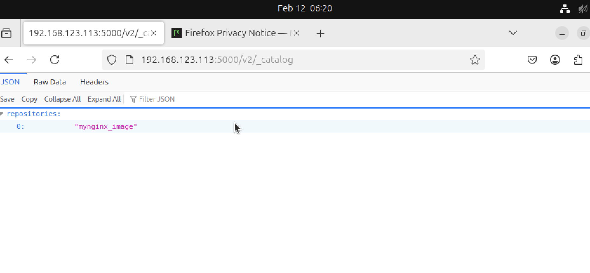
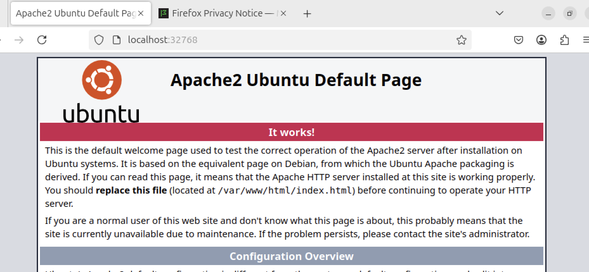
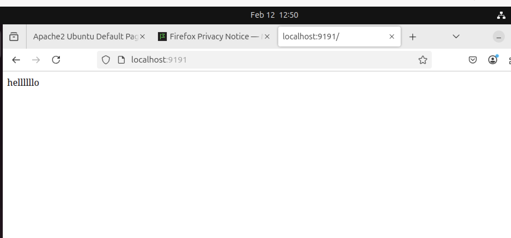

## 날짜: 2025-02-12

### 스크럼
- 학습 목표 1 : Docker 명령어 이해하기
- 학습 목표 2 : Docker compose

### 새로 배운 내용
#### 8. 도커 이미지 배포

    (1) 파일 배포
    
    - save&load
    
    ```bash
    docker save -o mynginx_2.tar mynginx_image:2.0
    ls mynginx_2.tar 
    mynginx_2.tar
    
    docker load -i mynginx_2.tar
    Loaded image: mynginx_image:2.0
    docker images
    REPOSITORY                   TAG       IMAGE ID       CREATED       SIZE
    mynginx_image                2.0       75de1bad52fd   6 hours ago   376MB
    ```
    
    save : 컨테이너 커맨드, 이미지 이름과 태그, 메타데이터를 포함해 이미지를 추출
    
    -o: 추출되는 파일명을 지정
    
    load: 파일에서 이미지를 로드함. 기존 이미지정보를 모두 포함하므로 동일하게 이미지 생성
    
    - export&import
    
    ```bash
    docker export -o mynginx_3.tar mynginx          
    docker import mynginx_3.tar mynginx_image3:0.0
    sha256:f77d4ef80d9338c90ce3c6965eebdffa3ae35c019d7a0bcf0956c7674e18ab3c
    docker images
    REPOSITORY                   TAG       IMAGE ID       CREATED         SIZE
    mynginx_image3               0.0       f77d4ef80d93   8 seconds ago   374MB
    ```
    
    export: 컨테이너를 파일로 추출
    
    import: 파일에서 새로운 이미지로 저장함 (container→tar→image)
    
    > load 와 import의 다른점?
    > 
    
    load는 image에 컨테이너 정보들과 layer를 그대로 유지
    
    import는 container 정보x. layer도 없고 새로운 layer로 존재. command 등 설정해야 container 동작 가능(entrypoint ,env, cmd 등을 새로 지정해야함. /bin/bash 와 같이. 
    
    (2) Public registry
    
    ```bash
    % docker tag mynginx_image:2.0 mushr00mandu/mynginx_image:2.0
    docker images
    REPOSITORY                   TAG       IMAGE ID       CREATED       SIZE
    mynginx_image                2.0       75de1bad52fd   6 hours ago   376MB
    mushr00mandu/mynginx_image   2.0       75de1bad52fd   6 hours ago   376MB
    docker login
    docker push mushr00mandu/mynginx_image:2.0
    
    #rmi 하고 다시 pull받아보기
    docker pull mushr00mandu/mynginx_image:2.0
    2.0: Pulling from mushr00mandu/mynginx_image
    Digest: sha256:75de1bad52fdb7054c53c89a949525109774ce8f306d279d956b615ce9eded2c
    Status: Downloaded newer image for mushr00mandu/mynginx_image:2.0
    docker.io/mushr00mandu/mynginx_image:2.0
    yubin@yubin-ui-MacBookPro ~ % docker images
    REPOSITORY                   TAG       IMAGE ID       CREATED       SIZE
    mynginx_image                2.0       75de1bad52fd   6 hours ago   376MB
    mushr00mandu/mynginx_image   2.0       75de1bad52fd   6 hours ago   376MB
    ```
    
    (3) Private registry
    
    ```bash
    1. Ubuntu 설치 
    2. docker 설치
    
    3. docker hub에서 registry image 받아와 설치
    docker run -d --name myregistry -p 5000:5000 --restart=always registry
    --restart = always : 컨테이너가 정지되면 다시 시작. 도커 엔진 재시작시 컨테이너도 재시작
    --restart = on-falinare: 컨테이너 종료코드가 0이 아니면 5번까지 재시작 시도
    #컨테이너 종료 코드 0은 정상 종료를 뜻함. 
    --restart = unless-stoppped: 컨테이너를 stop정지하면 도커 엔진을 재시작해도 컨테이너 재시작x
    
    #5000번 보트 제대로 열려있는것 확인
    netstat -ntlp
    (Not all processes could be identified, non-owned process info
     will not be shown, you would have to be root to see it all.)
    Active Internet connections (only servers)
    Proto Recv-Q Send-Q Local Address           Foreign Address         State       PID/Program name    
    tcp        0      0 0.0.0.0:5000            0.0.0.0:*               LISTEN    
    
    #접속 확인
    curl 192.168.123.113:5000/v2/
    docker tag mynginx_image:1.0 192.168.123.113:5000/mynginx_image:1.0
    docker images 
    192.168.123.113:5000/mynginx_image   1.0       e08ac4d92d34   23 hours ago   376MB
    
    4. image를 push/pull하는 client에 private registry가 안전하다 설정
    
    yubin@yubin-ui-MacBookPro ~ % docker login 192.168.123.113:5000
    Username: nilla
    Password: 
    Error response from daemon: Get "https://192.168.123.113:5000/v2/": http: server gave HTTP response to HTTPS client
    #엥 왜이러지 > local registry는 http쓰는데 우리는 https쓰려고 해서 이럼
    sudo nano /etc/docker/daemon.json
    
    {
      "insecure-registries": ["192.168.123.113:5000"]
    }
    이렇게 수정해준다.(근데도 안돼서 그냥 utm으로 갈아탐.)
    이후
    systemctl restart docker
    
    5. image push/pull
    
    #push 드디어 성공
    docker push 192.168.123.113:5000/mynginx_image:1.0
    The push refers to repository [192.168.123.113:5000/mynginx_image]
    e01515a2e1c5: Pushed 
    b5919a2bf9d4: Pushed 
    f112647043d1: Pushed 
    a1aaa7caa044: Pushed 
    c1604e936a3c: Pushed 
    6fd82164492e: Pushed 
    d500e333417b: Pushed 
    3ec51339a507: Pushed 
    1.0: digest: sha256:a3623450ac82ba92fd6b1dc3fb9e6e03e8c551cbf3af9405c0f7807a5716a151 size: 1990
    
    ```
    

    
#### 9. 도커 볼륨

(1) host volume

```bash
docker run -d --name host_v -p 8001:80 -v /home/nilla/vol:/myvol/1 nginx
0e36ed02b64529af9e34ac7d00216818b787afd5c6974a7221f6870b1c71c1fd

-v : 호스트의 디렉토리 및 파일을 컨테이너의 디렉토리 및 파일과 공유
파일 및 디렉토리를 마운트하는 구조라고 볼 수 있음
생성된 컨테이너 host_v의 공유 볼륨 /myvol/1
nilla@nilla:/$ docker exec -it host_v /bin/bash
root@0e36ed02b645:/# ls /myvol/1

안쪽에 들어가서 봐야한다.

nilla@nilla:~$ sudo vi /home/nilla/vol/index2.html
nilla@nilla:~$ docker exec -it hostv2 /bin/bash
root@48728cc0909b:/# ls myvol/1
index2.html

```

(2) volume container
-v 옵션을 사용해 사용하는 컨테이너를 다른 컨테이너와 공유함

```bash
docker run -d --name Container1 --volumes-from host_v -p 8002:80 nginx
61cb78b1f2a895c50b2f7d0010ea278916e7c1c1a8709f378d55e5b69711b821
docker exec -it Container1 /bin/bash 
root@61cb78b1f2a8:/# ls /myvol/1
index2.html

```

(3) docker volume

컨테이너 내의 데이터를 **영구적으로 저장**할 수 있는 위치를 제공

볼륨은 **Docker 엔진에 의해 관리**되며, `docker volume` 명령어를 사용하여 생성, 삭제, 확인 등이 가능

Docker 볼륨은 호스트 파일 시스템에 저장되어 있기 때문에, 다른 시스템으로 **백업**하거나 **복원**하는 것이 쉬움

container끼리 종속적이지 않으며, host에서의 저장 위치를 몰라도 된다. 도커가관리하기 때문

```bash
#도커 볼륨 생성
docker volume create --name myvol
myvol

#새로 생성된 볼륨 확인
docker volume ls
DRIVER    VOLUME NAME
local     ef8dba9c8cf6a6d238f0aaa1ae4031ccb0b174d026a1cae99d74c8f8554c0665
local     myvol

#n1_v 볼륨 컨테이너 생성 후 파일 생성
docker run -d --name n1_v -v myvol:/n1_myvol/vol -p 9001:80 nginx
ebdf793b6e151a1cd2a8e7baf27ed65313edfd49d64bf82e6dd4ab5d6dd5b419
docker exec -it n1_v /bin/bash
root@ebdf793b6e15:/# cd /n1_myvol/vol
root@ebdf793b6e15:/n1_myvol/vol# echo "hello" >> hellofromn1
root@ebdf793b6e15:/n1_myvol/vol# ls
hellofromn1
exit

#볼륨 정보 확인
docker volume inspect myvol
[
    {
        "CreatedAt": "2025-02-12T07:19:46Z",
        "Driver": "local",
        "Labels": null,
        "Mountpoint": "/var/lib/docker/volumes/myvol/_data",
        "Name": "myvol",
        "Options": null,
        "Scope": "local"
    }
]

#마운트포인트 확인
sudo ls /var/lib/docker/volumes/myvol/_data
hellofromn1

```

**마운트 포인트** : 호스트 시스템의 디렉토리를 컨테이너 내의 디렉토리에 연결하는 개념. 볼륨을 사용하거나 `-v` 옵션을 사용할 때, 호스트 시스템과 컨테이너 간에 파일 시스템이 연결 되며 이 연결된 위치를 마운트 포인트라고 부름

- 각 컨테이너 공유 공간에 file을 생성하고, n1에서 생성한 hellofrom1을 n2_v에서도 확인해보자.

```bash
#새로운 n2_v 생성
docker run -d --name n2_v -v myvol:/n2_myvol/vol -p 9002:80 nginx
487537df167df09303a432afb2aa46c2e61f3b8fd7fd32017175729c088ca126

docker exec -it n2_v /bin/bash
root@487537df167d:/# cd /n2_myvol/vol
root@487537df167d:/n2_myvol/vol# echo "hi" >> hifromn2
root@487537df167d:/n2_myvol/vol# ls
hellofromn1  hifromn2
exit

sudo ls /var/lib/docker/volumes/myvol/_data 
hellofromn1  hifromn2

```

또한 볼륨 자동 생성도 가능하다.

```bash
# -v 옵션을 줘서 도커 볼륨을 이름 안주고 생성 가능
docker run -d --name volume_auto -v/con_vol nginx
6de340ad68abbfac2cb70bbf26185aa108ef2e4610a9888946d961c1e40b1ad1

#볼륨 정보 확인시 id로만 나오게 된다!
docker volume ls
DRIVER    VOLUME NAME
local     beed738849cdb0ffa852810d0ca20ac5410253377067e4c2a2fc5f69709c2465
local     ef8dba9c8cf6a6d238f0aaa1ae4031ccb0b174d026a1cae99d74c8f8554c0665
local     myvol

#container 정보 확인시 확인 정상적으로 가능하다
docker container inspect volume_auto | grep volume
        "Name": "/volume_auto",
                "Type": "volume",
                "Source": "/var/lib/docker/volumes/beed738849cdb0ffa852810d0ca20ac5410253377067e4c2a2fc5f69709c2465/_data",
```

볼륨 삭제는 `docker volume rm 볼륨이름` 으로 가능하다.

그러나 컨테이너가 삭제되더라도 볼륨은 삭제되지 않으니 주의. 또한 컨테이너가 사용중인 볼륨은 삭제 불가하다.

```bash
#볼륨 확인 후 컨테이너 삭제
docker volume ls
DRIVER    VOLUME NAME
local     beed738849cdb0ffa852810d0ca20ac5410253377067e4c2a2fc5f69709c2465
local     ef8dba9c8cf6a6d238f0aaa1ae4031ccb0b174d026a1cae99d74c8f8554c0665
local     myvol
docker stop volume_auto
docker rm volume_auto

#다시 확인해보면 안지워져있다. 
docker volume ls
DRIVER    VOLUME NAME
local     beed738849cdb0ffa852810d0ca20ac5410253377067e4c2a2fc5f69709c2465
local     ef8dba9c8cf6a6d238f0aaa1ae4031ccb0b174d026a1cae99d74c8f8554c0665
local     myvol

#셀프로 지우면 지워진다. 
docker volume rm beed738849cdb0ffa852810d0ca20ac5410253377067e4c2a2fc5f69709c2465
docker volume ls
DRIVER    VOLUME NAME
local     ef8dba9c8cf6a6d238f0aaa1ae4031ccb0b174d026a1cae99d74c8f8554c0665
local     myvol

```

#### 10. Dockerfile

```bash
#빌드 명령어
#dockerfile이 위치한 directory에서 docker build 실행
docker build -t 이미지이름:0.0 ./
```

```bash
#Dockerfile
FROM : 베이스가 될 이미지 정의

LABEL : 이미지에 메타데이터 추가, "키:값" 형태로 정의
dockei inspect 명령어로 메타데이터 정보 확인 가능

RUN : 이미지를 만들기 위해 컨테이너 내부에서 명령어 실행
dockeifile 명령어는 쉘을 사용하지 않기 때문에 쉘을 정의해야함
예) RUN ["sh","-c","echo $MY_ENV"]

ADD : dockeifile이 위치한 디렉토리의 파일 -> 이미지의 추가
로컬파일, url, tar 파일 등도 복사가 가능. tar은 자동 압축 해제해줌.

COPY : add와 같으나 파일만 이미지에 복사 가능

WORKDIR : 명령어를 실행할 디렉토리 정의, cd 명령과 같은 기능

EXPOSE : 생성한 이미지에서 노출할 포트

#밑의 둘중 하나는 반드시 설정
CMD: 컨테이너가 시작될 때 실행되는 명령 설정
ENTRYPONT : cmd와 동일하지만, 덮어씌울 수가 없다. 
커맨드를 인자로 사용하는 스크립트의 역할을 함
```

```bash
echo test >> test.html

#도커 파일 작성해준다.
vi Dockerfile
FROM ubuntu:14.04
LABEL "purpose" = "practice"
RUN apt-get update
RUN apt-get install apache2 -y
ADD test.html /var/www/html
WORKDIR /var/www/html
RUN ["/bin/bash", "-c", "echo hello >> test2.html"]
EXPOSE 80
CMD apachectl -DFOREGROUND

#이미지로 빌드
docker build -t myapache:0.0 ./
docker images
REPOSITORY                           TAG       IMAGE ID       CREATED         SIZE
myapache                             0.0       83c35378ae0b   9 seconds ago   210MB

#-P 옵션을 주면 expose로 노출된 포트를 호스트에서 사용가능한 포트에 차례로 연결한다.
docker run -d -P --name myapache_server myapache:0.0
42c3a140abd44c1783a3a6c6831ba10faeb3d07bcb41a05f2083fd4b05d452f3

#컨테이너 포트와 호스트 포트의 연결 정보를 확인한다. 
docker port myapache_server
80/tcp -> 0.0.0.0:32768
80/tcp -> [::]:32768

일반 형식 : 명령 실행시 /bin/sh -c가 기본값으로 실행됨
배열 형식 : 배열로 선언된 실제 명령만 실행

```



잘 뜬다.

> 이런 워닝이 떴었다.
> 
> 
> 2 warnings found (use docker --debug to expand):
> 
> - LegacyKeyValueFormat: "LABEL key=value" should be used instead of legacy "LABEL key value" format (line 2)
> - JSONArgsRecommended: JSON arguments recommended for CMD to prevent unintended behavior related to OS signals (line 9)
1. `LABEL` 명령어에서 **올드 포맷**(`LABEL key value`)을 사용하고 있다는 의미
    
    ex) LABEL key="value”
    
2. `CMD` 명령어에서 **JSON 형식**이 권장된다는 의미. `CMD` 명령어에서 쉘 형식(`CMD <command> <arg1> <arg2>`)을 사용하는 것보다는 **JSON 배열 형식**을 사용하는 것이 더 안전
    
    ex) `CMD ["nginx", "-g", "daemon off;"]`
    

#### 11. dockerfile - 이미지 레이어 줄이기
    - dockerfile은 만드는 과정에서 add,run 등 명령어가 실행될 때마다 새로운 컨테이너 레이어를 생성하고, 컨테이너는 삭제한다.
    - 이미지 레이어를 줄이면 용량도 확보할 수 있을 것이다.
    - 설치/삭제를 따로하면 각자 용량을 차지하지만, 설치&삭제를 같이하면 사이즈를 반으로도 줄일 수가 있다.
    
    ```bash
    #따로 하는 경우
    RUN mkdir /test
    RUN fallocate -l 100m /test/dummy
    RUN rm /test/dummy
    ```
    
    ```bash
    #같이 하는 경우에는 이렇게
    RUN mkdir /test && \
    RUN fallocate -l 100m /test/dummy && \
    RUN rm /test/dummy
    ```
    
    이전에 빌드했던 dockerfile과 같은 내용이 있다면 캐시를 사용해서 빌드하기도 한다. 
    
    ```bash
    #vi Dockerfile2
    FROM ubuntu:14.04
    LABEL "purpose"="practice"
    RUN apt-get update
    
    #-f 옵션은 docker bulid에 사용하는 파일을 지정하는 용도
    docker build -f Dockerfile2 -t mycache:0.0 ./
    
    [+] Building 1.9s (6/6) FINISHED                                                 docker:default
     => [internal] load build definition from Dockerfile2                                      0.0s
     => => transferring dockerfile: 102B                                                       0.0s
     => [internal] load metadata for docker.io/library/ubuntu:14.04                            1.8s
     => [internal] load .dockerignore                                                          0.0s
     => => transferring context: 2B                                                            0.0s
     => [1/2] FROM docker.io/library/ubuntu:14.04@sha256:64483f3496c1373bfd55348e88694d1c4d0c  0.0s
     #캐시를 쓰는 모습을 확인 가능
     => CACHED [2/2] RUN apt-get update                                                        0.0s
     => exporting to image                                                                     0.0s
     => => exporting layers                                                                    0.0s
     => => writing image sha256:dbb477eeda5fcd40199f7bda043f93802aa4d7620d1fbd01c0532ab24d73d  0.0s
     => => naming to docker.io/library/mycache:0.0      
    ```
    
    이외에도 다음과 같은 옵션이 있다. 
    
    - `--cache-from (image)` : 이미지의 캐시 이용
    - `--no-cache` : 기존 빌드에 사용된 캐시를 사용 x, 처음부터 다시 이미지 레이어 생성
#### 12. 기타 dockerfile 명령어

```bash
ENV : 도커에서 사용할 환경 변수 설정
ENV test /home
echo $test로 확인해볼 수 있다.

docker ...생략\
-e test=myvalue \
생략

이런식으로 -e 옵션을 주면 설정값 변경도 가능하다
```

```bash
VOLUME : 호스트와 공유할 컨테이너 내부의 디렉토리를 설정

vi Dockerfile
FROM ubuntu:14.04
ENV my_env my_value
RUN mkdir /home/volume
RUN echo test >> /home/volume/testfile
VOLUME /home/volume

docker inspect volume_t
          "Volumes": {
                "/home/volume": {}
            },
        "Mounts": [
            {
                "Type": "volume",
                "Name": "3b0b2803979b65cc65c4eb4d34d726517c04d5f2056e67cc5df05630fb51aaeb",
                "Source": "/var/lib/docker/volumes/3b0b2803979b65cc65c4eb4d34d726517c04d5f2056e67cc5df05630fb51aaeb/_data",
                "Destination": "/home/volume",
                "Driver": "local",
                "Mode": "",
                "RW": true,
                "Propagation": ""
            }
        ],

sudo ls /var/lib/docker/volumes/3b0b2803979b65cc65c4eb4d34d726517c04d5f2056e67cc5df05630fb51aaeb/_data
testfile
잘 들어가 있다. 

```

```bash
ARG : Dockerfile 내 사용될 변수값을 설정

ARG my_arg
ARG my_arg_2 = value2
RUN touch ${my_arg}/mytouch

docker build --build-arg my_arg=/home 이렇게 빌드에 옵션 줘서 명령 실행시 입력 가능
```

```bash
USER : 사용자 계정을 설정,그 아래 명령은 해당 사용자 권한으로 실행
root는 위험하니깐 일반 사용자를 생성해 권한을 제한하자~
> container 동작시에도 user1 계정으로 실행된다.

USER user1
WORKDIR /home/user1
RUN touch abc
```

#### 13. Multistage dockerfile build
- 여러 단계로 나눠서 작업, 나중에 합칠 수 있음
- 목적에 맞춰서 image 분리 / 필요한 것 활용

```bash
FROM golang
ADD main.go /root
WORKDIR /root
RUN go build -o /root/mainApp /root/main.go

FROM alpine:latest
WORKDIR /root
COPY --from=0 /root/mainApp
CMD ['./mainApp']
```

컴파일 환경과 운영 환경을 분리해서 용량을 대폭 낮춘다.

golang→ 컴파일 환경. 컴파일러, 라이브러리 등등 사이즈가 큼

alpine → 운영 환경. → 컴파일러 필요 없이 운영만 하면 되며 사이즈가 작음

최종 필요 : 운영 환경

```bash
docker build -t go_helloworld2 ./
docker run -it go_helloworld2
hello world
docker images
REPOSITORY                           TAG       IMAGE ID       CREATED             SIZE
go_helloworld2                       latest    93f524a35893   11 seconds ago      10.3MB

```

확실히 용량이 작은걸 볼 수 있다.

```bash
ONBUILD : 빌드된 이미지를 기반으로 하는 다른 이미지가 
dockerfile로 실행될 때 실행할 명령어를 추가한다. 
```

```bash
HEALTHCHECK: 이미지로부터 생성된 컨테이너의 애플리케이션 상태 체크 설정
애플리케이션 프로세스가 종료되지 않았으나 동작하지 않는 상태를 방지한다.
HEALTHCHECK --interval=1m --timeout=3s --retries=3
--interval : 컨테이너 상태 체크 주기
--timeout : 설정한 시간을 초과하면 상태 체크 실패 간주
--retries : 설정 횟수만큼 상태 체크에 실패시 unhealth 상태가 됨
```

#### 14. 실습 - dockerfile 작성하기
- nginx:lastest image로부터 시작
- 현재 dockerfile directory에 수정한 index.html을 하나 생성
- nginx의 index.html이 위치한 장소로 workdirectory 변경
- index.html을 변경한 workdirectory의 index.html로 copy

```bash
FROM nginx:latest
WORKDIR /usr/share/nginx/html
COPY index.html /usr/share/nginx/html
CMD ["nginx","-g","daemon off;"]
docker build -t nginx_docker ./
docker run -d --name nnginx -p 9191:80 nginx_docker
```



#### 15. docker compose

여러 컨테이너가 하나의 애플리케이션으로 동작할 때 서로 연관된 여러 컨테이너를 한꺼번에 생성시키기 위함이다

여러 컨테이너를 하나의 서비스로 정의해 컨테이너 묶음으로 관리

```bash
docker compose up -d
docker compose down
docker compose start
이런식으로 한번에 실행 종료 가능

또한 프로젝트 이름(docker-compose.yml이 위치한 directory명)을 활용해 서로 격리 가능
#-p 옵션을 주면 프로젝트명 별도 지정도 가능
docker compose -p project1 up -d
docker compose -p project2 up -d

#-f 옵션을 주면 Docker-compose.yml이 아닌 다른 file에서 실행
docker compose -f newcomposefile up -d
```

예제 - wordpress 실행하기

```bash
mkdir my_wordpress
cd my_wordpress/
vi docker-compose.yml
docker compose up -d

docker ps -a
CONTAINER ID   IMAGE                  COMMAND                  CREATED          STATUS                        PORTS                               NAMES
e7b1fffc08b6   mariadb:10.6.4-focal   "docker-entrypoint.s\u2026"   7 seconds ago    Up 7 seconds                  3306/tcp, 33060/tcp                 my_wordpress-db-1
36282b3b8ffe   wordpress:latest       "docker-entrypoint.s\u2026"   7 seconds ago    Up 7 seconds                  0.0.0.0:80->80/tcp, :::80->80/tcp   my_wordpress-wordpress-1

docker volume ls
DRIVER    VOLUME NAME
local     my_wordpress_db_data

```


잘 실행된다.


### 오늘의 회고
- 도커 명령어들에 익숙해지고자 노력하며 여러 경우의 수를 진행해보았다. 처음 볼 때는 정말 막연히 어려워만 보였는데, 막상 또 해보니 이해가 더 잘 되어서 다행이었다. 여전히 내용이 많아서 시간 들여 익숙해지는 것이 좋을 것 같다.
