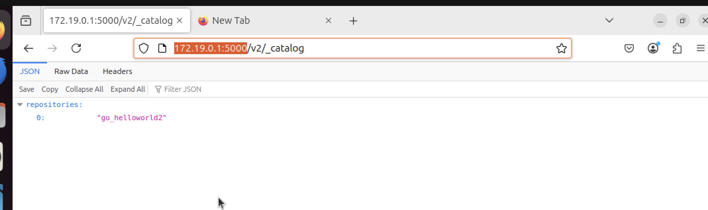
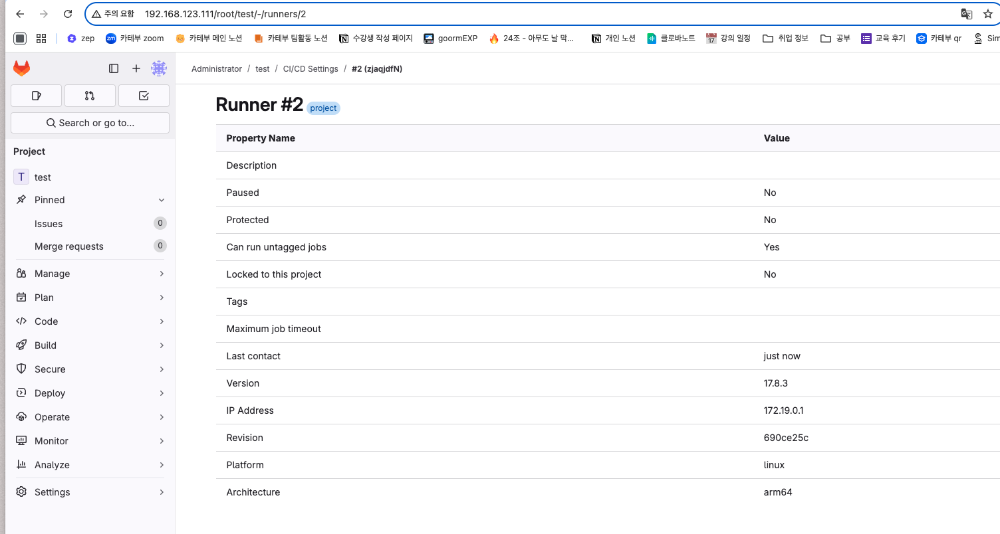
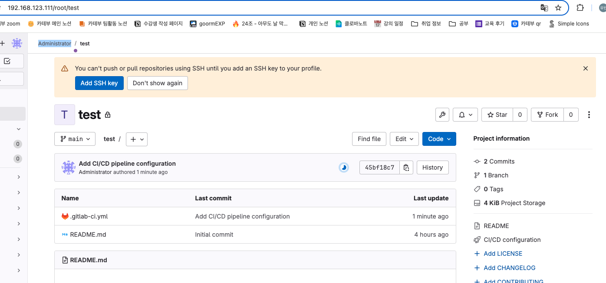

## 날짜: 2025-02-13

### 스크럼
- Docker Private Registry & Git lab 구축

### 새로 배운 내용
#### 1: Docker Private Registry 기본 구축**

• registry:2 공식 이미지를 활용하여 로컬 Private Registry 컨테이너 실행
• docker tag 및 docker push 명령어를 사용하여 이미지를 Private Registry에 업로드
• docker pull을 통해 저장된 이미지 정상 다운로드 확인

여기까지는 기초 실습때 했던 내용과 같다.

```bash
1. Ubuntu 설치 
2. docker 설치

3. docker hub에서 registry image 받아와 설치
docker run -d --name myregistry -p 5000:5000 --restart=always registry
--restart = always : 컨테이너가 정지되면 다시 시작. 도커 엔진 재시작시 컨테이너도 재시작
--restart = on-falinare: 컨테이너 종료코드가 0이 아니면 5번까지 재시작 시도
#컨테이너 종료 코드 0은 정상 종료를 뜻함. 
--restart = unless-stoppped: 컨테이너를 stop정지하면 도커 엔진을 재시작해도 컨테이너 재시작x

#5000번 보트 제대로 열려있는것 확인
netstat -ntlp
(Not all processes could be identified, non-owned process info
 will not be shown, you would have to be root to see it all.)
Active Internet connections (only servers)
Proto Recv-Q Send-Q Local Address           Foreign Address         State       PID/Program name    
tcp        0      0 0.0.0.0:5000            0.0.0.0:*               LISTEN    

#접속 확인
curl 172.19.0.1:5000/v2/
docker tag go_helloworld2 172.19.0.1:5000/go_helloworld2
docker images 
172.19.0.1:5000/go_helloworld2       latest         93f524a35893   16 hours ago    10.3MB

4. image를 push/pull하는 client에 private registry가 안전하다 설정
docker login 172.19.0.1:5000
Username: nilla
Password: 
Error response from daemon: Get "https://172.19.0.1:5000/v2/": http: server gave HTTP response to HTTPS client
#엥 왜이러지 > local registry는 http쓰는데 우리는 https쓰려고 해서 이럼
sudo nano /etc/docker/daemon.json

{
  "insecure-registries": ["172.19.0.1:5000:5000"]
}
이렇게 수정해준다.(근데도 안돼서 그냥 utm으로 갈아탐.)
이후
systemctl restart docker

5. image push/pull

#push 드디어 성공
docker push 172.19.0.1:5000/go_helloworld
The push refers to repository [ip:5000/mynginx_image]
The push refers to repository [172.19.0.1:5000/go_helloworld2]
419e3d815682: Pushed 
5f70bf18a086: Pushed 
89b59b1b7cb3: Pushed 
latest: digest: sha256:94f69cb1ca03d24aaa21ff5c07cc66fe7cf34dbac00b54ea8c22d4cf37ded1b5 size: 945

nilla@nilla:/data/gitlab$ docker pull 172.19.0.1:5000/go_helloworld2
Using default tag: latest
latest: Pulling from go_helloworld2
Digest: sha256:94f69cb1ca03d24aaa21ff5c07cc66fe7cf34dbac00b54ea8c22d4cf37ded1b5
Status: Image is up to date for 172.19.0.1:5000/go_helloworld2:latest
172.19.0.1:5000/go_helloworld2:latest

```



#### 2: Registry 보안 설정 (TLS/SSL 인증 적용)**

• OpenSSL을 사용하여 자체 서명된 SSL 인증서 생성
• 생성한 인증서를 Registry에 적용하여 HTTPS 기반 통신 구성
• curl을 활용하여 TLS 적용 여부 확인

인증서 생성 및 적용은 해당 페이지를 참고했다 :

https://dongle94.github.io/docker/docker-remote-private-registry/#google_vignette

```bash
#인증서 생성후 Docker Registry에 HTTPS 적용
docker run -d -p 5000:5000 --restart=always --name myregistry -v /home/nilla/docker-registry/volume/:/data -v /home/nilla/docker-registry/certs/:/certs -e REGISTRY_HTTP_ADDR=0.0.0.0:5000 -e REGISTRY_HTTP_TLS_CERTIFICATE=/certs/server.crt -e REGISTRY_HTTP_TLS_KEY=/certs/server.key registry
9d20bf44b536ceb7341b75fe711f69ca626f60237d55bcc9a45cd1d8894aee6c
nilla@nilla:~/docker-registry/certs$ docker push 172.19.0.1:5000/go_helloworld2
Using default tag: latest
The push refers to repository [172.19.0.1:5000/go_helloworld2]
419e3d815682: Pushed 
5f70bf18a086: Pushed 
89b59b1b7cb3: Pushed 
latest: digest: sha256:94f69cb1ca03d24aaa21ff5c07cc66fe7cf34dbac00b54ea8c22d4cf37ded1b5 size: 945

nilla@nilla:~/docker-registry/certs$ curl https://172.19.0.1:5000/v2/_catalog
{"repositories":["go_helloworld2"]}

```

```bash
#검증
nilla@nilla:~/docker-registry/certs$ curl -v https://172.19.0.1:5000/v2/
*   Trying 172.19.0.1:5000...
* Connected to 172.19.0.1 (172.19.0.1) port 5000
* ALPN: curl offers h2,http/1.1
* TLSv1.3 (OUT), TLS handshake, Client hello (1):
*  CAfile: /etc/ssl/certs/ca-certificates.crt
*  CApath: /etc/ssl/certs
* TLSv1.3 (IN), TLS handshake, Server hello (2):
* TLSv1.3 (IN), TLS handshake, Encrypted Extensions (8):
* TLSv1.3 (IN), TLS handshake, Certificate (11):
* TLSv1.3 (IN), TLS handshake, CERT verify (15):
* TLSv1.3 (IN), TLS handshake, Finished (20):
* TLSv1.3 (OUT), TLS change cipher, Change cipher spec (1):
* TLSv1.3 (OUT), TLS handshake, Finished (20):
* SSL connection using TLSv1.3 / TLS_AES_128_GCM_SHA256 / X25519 / RSASSA-PSS
* ALPN: server accepted h2
* Server certificate:
*  subject: C=yu; ST=yu; L=yu; O=yu; OU=yu; CN=172.19.0.1
*  start date: Feb 13 05:07:08 2025 GMT
*  expire date: Jul  1 05:07:08 2052 GMT
*  subjectAltName: host "172.19.0.1" matched cert's IP address!
*  issuer: C=yu; ST=yu; L=yu; O=yu; OU=yu; CN=172.19.0.1
*  SSL certificate verify ok.
*   Certificate level 0: Public key type RSA (2048/112 Bits/secBits), signed using sha256WithRSAEncryption
* TLSv1.3 (IN), TLS handshake, Newsession Ticket (4):
* using HTTP/2
* [HTTP/2] [1] OPENED stream for https://172.19.0.1:5000/v2/
* [HTTP/2] [1] [:method: GET]
* [HTTP/2] [1] [:scheme: https]
* [HTTP/2] [1] [:authority: 172.19.0.1:5000]
* [HTTP/2] [1] [:path: /v2/]
* [HTTP/2] [1] [user-agent: curl/8.5.0]
* [HTTP/2] [1] [accept: */*]
> GET /v2/ HTTP/2
> Host: 172.19.0.1:5000
> User-Agent: curl/8.5.0
> Accept: */*
> 
< HTTP/2 200 
< content-type: application/json; charset=utf-8
< docker-distribution-api-version: registry/2.0
< x-content-type-options: nosniff
< content-length: 2
< date: Thu, 13 Feb 2025 05:19:22 GMT
< 
* Connection #0 to host 172.19.0.1 left intact

```

#### 3: 기본 인증(Basic Authentication) 설정**

• htpasswd를 사용하여 사용자 계정을 생성하고 인증 적용
• docker login 명령어를 활용하여 인증 확인
• 인증 없이 접근 시 차단되는지 테스트

```bash
sudo apt-get install apache2-utils

#htpasswd를 사용하여 사용자 계정을 생성. 
#-c 옵션을 사용하여 새로운 .htpasswd 파일을 생성하고, 사용자 이름과 비밀번호를 설정
htpasswd -c /home/nilla/docker-registry/htpasswd nilla

#레지스트리 다시 만들기
docker run -d -p 5000:5000 --restart=always --name myregistry \
-v /home/nilla/docker-registry/volume/:/data \
-v /home/nilla/docker-registry/certs/:/certs \
-v /home/nilla/docker-registry/:/docker-registry \
-e REGISTRY_HTTP_ADDR=0.0.0.0:5000 \
-e REGISTRY_HTTP_TLS_CERTIFICATE=/certs/server.crt \
-e REGISTRY_HTTP_TLS_KEY=/certs/server.key \
-e REGISTRY_AUTH=htpasswd \
-e REGISTRY_AUTH_HTPASSWD_PATH=/docker-registry/htpasswd \
-e REGISTRY_AUTH_HTPASSWD_REALM="Registry Realm" \
registry

nilla@nilla:~/docker-registry/certs$ docker login https://172.19.0.1:5000
Username: nilla
Password: 
Error response from daemon: login attempt to http://172.19.0.1:5000/v2/ failed with status: 400 Bad Request
자꾸 http로 이동하려고 하는 오류 발생..

해결이 안된다. ...
```

이 시점에서 오류 해결이 안되어서 아예 다른 글을 참고하여 진행했다.

https://cloudwithbass.tistory.com/31

```bash
#인증서와 접속 제한 추가
nilla@nilla:~/docker-registry/certs$ mkdir ~/certs
openssl req -newkey rsa:4096 -nodes -sha256 -keyout $HOME/certs/domain.key -x509 \
  -days 365 -out $HOME/certs/domain.crt

#2버전까지는 htpasswd를 image생성이 가능했다는데, 이 차이 때문인 것 같다.
nilla@nilla:~/docker-registry/certs$ mkdir ~/auth
docker run --entrypoint htpasswd httpd:2 -Bbn user 1 > /home/nilla/auth/passwords
Unable to find image 'httpd:2' locally
2: Pulling from library/httpd
4d2547c08499: Already exists 
9210228325db: Pull complete 
4f4fb700ef54: Pull complete 
5610b6395af5: Pull complete 
bef1a28bd6c5: Pull complete 
3ed6709e510f: Pull complete 
Digest: sha256:3195404327ecd95b2fa0a5d4eac1f2206bb12996fb2561393f91254759e422b9
Status: Downloaded newer image for httpd:2

#다시 이미지 만들어서 돌린다.
docker run -d -p 5000:5000 --restart=always --name myregistry2 \
  -v /home/nilla/auth:/auth \
  -e "REGISTRY_AUTH_HTPASSWD_REALM=Registry Realm" \
  -e REGISTRY_AUTH_HTPASSWD_PATH=/auth/passwords \
  -v /home/nilla/certs:/certs \
  -e REGISTRY_HTTP_ADDR=0.0.0.0:5000 \
  -e REGISTRY_HTTP_TLS_CERTIFICATE=/certs/domain.crt \
  -e REGISTRY_HTTP_TLS_KEY=/certs/domain.key \
  registry:2

44163cbdd6c6e96514aae8f00a6fec5ef28f2db62664ba77968d970f0eb51533

#접속 테스트
nilla@nilla:~/docker-registry/certs$ docker login https://172.19.0.1:5000
Username: user
Password: 
WARNING! Your password will be stored unencrypted in /home/nilla/.docker/config.json.
Configure a credential helper to remove this warning. See
https://docs.docker.com/engine/reference/commandline/login/#credential-stores

Login Succeeded #드디어 된다

```

```bash
#인증 없으면 차단 되는지 테스트
docker push 172.19.0.1:5000/go_helloworld2:latest
The push refers to repository [172.19.0.1:5000/go_helloworld2]
419e3d815682: Preparing 
5f70bf18a086: Preparing 
89b59b1b7cb3: Preparing 
no basic auth credentials

#로그인 하면
docker login https://172.19.0.1:5000
Username: user
Password: 
WARNING! Your password will be stored unencrypted in /home/nilla/.docker/config.json.
Configure a credential helper to remove this warning. See
https://docs.docker.com/engine/reference/commandline/login/#credential-stores

Login Succeeded
#잘 올라간다.
nilla@nilla:~/docker-registry/certs$ docker push 172.19.0.1:5000/go_helloworld2:latest
The push refers to repository [172.19.0.1:5000/go_helloworld2]
419e3d815682: Pushed 
5f70bf18a086: Pushed 
89b59b1b7cb3: Pushed 
latest: digest: sha256:94f69cb1ca03d24aaa21ff5c07cc66fe7cf34dbac00b54ea8c22d4cf37ded1b5 size: 945

#curl도 안되게 되었다.
curl -v https://172.19.0.1:5000/v2/
*   Trying 172.19.0.1:5000...
* Connected to 172.19.0.1 (172.19.0.1) port 5000
* ALPN: curl offers h2,http/1.1
* TLSv1.3 (OUT), TLS handshake, Client hello (1):
*  CAfile: /etc/ssl/certs/ca-certificates.crt
*  CApath: /etc/ssl/certs
* TLSv1.3 (IN), TLS handshake, Server hello (2):
* TLSv1.3 (IN), TLS handshake, Encrypted Extensions (8):
* TLSv1.3 (IN), TLS handshake, Certificate (11):
* TLSv1.3 (OUT), TLS alert, unknown CA (560):
* SSL certificate problem: self-signed certificate
* Closing connection
curl: (60) SSL certificate problem: self-signed certificate
More details here: https://curl.se/docs/sslcerts.html

curl failed to verify the legitimacy of the server and therefore could not
establish a secure connection to it. To learn more about this situation and
how to fix it, please visit the web page mentioned above.
```

#### 4: Docker 이미지 서명 및 무결성 검증**

• Docker Content Trust (DCT) 활성화 및 서명된 이미지 푸시
• 서명되지 않은 이미지 업로드 시도 및 차단 여부 확인

```bash
#이렇게 하면 된다던데
export DOCKER_CONTENT_TRUST=1

#안된다...
docker push 172.19.0.1:5000/go_helloworld2:latest
The push refers to repository [172.19.0.1:5000/go_helloworld2]
419e3d815682: Layer already exists
5f70bf18a086: Layer already exists
89b59b1b7cb3: Layer already exists
latest: digest: sha256:94f69cb1ca03d24aaa21ff5c07cc66fe7cf34dbac00b54ea8c22d4cf37ded1b5 size: 945
Signing and pushing trust metadata
Error: error contacting notary server: tls: failed to verify certificate: x509: certificate relies on legacy Common Name field, use SANs instead
```

#### 5: CI/CD 연동 및 자동화 테스트**

• GitLab CI/CD와 Private Registry 연동

```bash
#깃랩 올리기

#다운로드, 명령어 셋 변경, 실행 권한 부여, 심볼릭 링크 등록
sudo wget https://github.com/linuxserver/docker-docker-compose/releases/download/1.29.2-ls53/docker-compose-arm64
sudo mv docker-compose-arm64 docker-compose
sudo chmod +x docker-compose
sudo mv ./docker-compose /usr/local/bin

#깃랩 설치 디렉토리 구성
sudo mkdir -p /data/gitlab && cd /data/gitlab
sudo mkdir data logs config
sudo chown -R $USER:$USER /data/gitlab
sudo chmod -R 755 /data/gitlab

#docker-compose.yml
version: '3.3'
services:
  gitlab-ce-arm64v8:
    container_name: 'gitlab'
    image: 'yrzr/gitlab-ce-arm64v8:latest'
    ports:
      - '80:80'
      - '1022:22'
      - '443:443'
    volumes:
      - '/var/run/docker.sock:/tmp/docker.sock:ro'
      - './config:/etc/gitlab'
      - './logs:/var/log/gitlab'
      - './data:/var/opt/gitlab'
    restart: 'unless-stopped'
    logging:
      options:
        max-size: '1g'
        
#gitlab 컨테이너 접속 후 gitlab configure 변경

$ docker exec -it gitlab /bin/bash
$ vi /etc/gitlab/gitlab.rb
external_url ‘http://ip’
$ gitlab-ctl reconfigure

#구동 로그 확인
docker-compose logs -f
#비번 확인
**docker exec -it gitlab grep 'Password:' /etc/gitlab/initial_root_password**

```

```bash
#gitlab runner 설정
sudo mkdir -p /data/gitlab-runner/config && cd /data/gitlab-runner
sudo chown -R $USER:$USER /data/gitlab-runner

version: '3'
services:
  gitlab-runner:
    image: 'gitlab/gitlab-runner:latest'
    container_name: gitlab-runner
    restart: always
    platform: linux/arm64
    volumes:
      - './config:/etc/gitlab-runner'
      - '/var/run/docker.sock:/var/run/docker.sock'
      
#컨피그 파일 생성
docker exec -it gitlab-runner /bin/bash
gitlab-runner register --url (url) --token (token) 
```




• .gitlab-ci.yml을 활용하여 CI/CD 파이프라인에서 자동으로 이미지 빌드 및 푸시

```bash
#Variables 섹션을 찾아 Docker 레지스트리 인증 정보를 환경 변수로 추가

DOCKER_REGISTRY_URL: Docker Registry URL 
DOCKER_USERNAME: Docker 레지스트리 사용자 이름
DOCKER_PASSWORD: Docker 레지스트리 비밀번호

#gitlab-ci.yml
image: docker:latest

# Docker-in-Docker (dind) 서비스 사용
services:
  - name: docker:dind
    alias: docker

variables:
  DOCKER_DRIVER: overlay2
  DOCKER_TLS_CERTDIR: ""
  DOCKER_HOST: "tcp://docker:2375"  # Docker 호스트 설정
  IMAGE_NAME: "$CI_PROJECT_NAME"   # 이미지 이름은 CI_PROJECT_NAME 환경 변수로 설정
  DOCKER_HUB_USER: "이름"     # Docker Hub 사용자 이름
  DOCKER_HUB_PASSWORD: "$DOCKER_HUB_PASSWORD"  # Docker Hub 비밀번호 (CI/CD 변수로 설정)

stages:
  - build
  - deploy

# React 애플리케이션 빌드
build:
  stage: build
  image: node:14  # Node.js 이미지를 사용하여 애플리케이션 빌드
  script:
    - npm install   # 종속성 설치
    - npm run build  # 빌드 실행
  artifacts:
    paths:
      - build  # 빌드된 파일을 artifacts로 저장

# Docker 이미지 빌드 및 Docker Hub에 푸시
deploy:
  stage: deploy
  script:
    - sleep 20  # Docker 데몬이 준비될 때까지 대기
    - docker info  # Docker 데몬 정보 확인
    - docker login -u "$DOCKER_HUB_USER" -p "$DOCKER_HUB_PASSWORD"  # Docker Hub 로그인
    - docker build -t "$DOCKER_HUB_USER/$IMAGE_NAME:latest" .  # Docker 이미지 빌드
    - docker push "$DOCKER_HUB_USER/$IMAGE_NAME:latest"  # Docker Hub에 푸시
    - docker run -d --name "$IMAGE_NAME" -p 8080:80 "$DOCKER_HUB_USER/$IMAGE_NAME:latest"  # Docker 컨테이너 실행
  only:
    - main  # main 브랜치에서만 실행

```

```bash
sudo git sudo config --global user.name "Administrator"
sudo git add .gitlab-ci.yml
sudo git config --global user.email "gitlab_admin_18c9d2@example.com"
sudo git commit -m "Add CI/CD pipeline configuration"
sudo git push -u origin main
```



### 오늘의 도전 과제와 해결 방법
- arm 아키텍쳐 이슈 : 공식 gitlab image는 amd architecture만 제공해준다는 사실을 알게 되어, 다른 이미지를 찾아 해결했다.

### 오늘의 회고
- 도커파일 작성법을 더 공부해야할 것 같다. 명령어가 많고 아무래도 각 빌드마다 요구되는 사항이 다르다보니, 많이 작성하며 경험하는 방법이 가장 빠르겠다는 생각이 들었다. 

### 참고 자료 및 링크
- [[Docker] https와 인증서를 이용해서 사설 도커 레지스트리 사용하기](https://cloudwithbass.tistory.com/31)
- [[Docker] Docker 원격 사설 레지스트리(Private Registry) 구축 2](https://dongle94.github.io/docker/docker-remote-private-registry/#google_vignette)