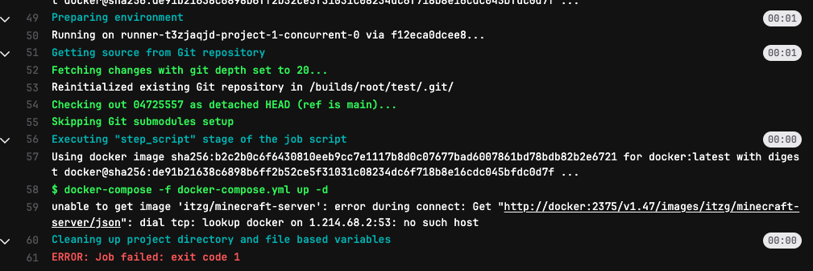

## 날짜: 2025-02-14

### 스크럼
- yaml 파일 구조 공부
- DCT 활성화 이미지 만들기

#### Docker 이미지 서명 및 무결성 검증 트러블 슈팅

• Docker Content Trust (DCT) 활성화 및 서명된 이미지 푸시
• 서명되지 않은 이미지 업로드 시도 및 차단 여부 확인

```bash
#이렇게 하면 된다던데
export DOCKER_CONTENT_TRUST=1

#안된다...
docker push 172.19.0.1:5000/go_helloworld2:latest
The push refers to repository [172.19.0.1:5000/go_helloworld2]
419e3d815682: Layer already exists
5f70bf18a086: Layer already exists
89b59b1b7cb3: Layer already exists
latest: digest: sha256:94f69cb1ca03d24aaa21ff5c07cc66fe7cf34dbac00b54ea8c22d4cf37ded1b5 size: 945
Signing and pushing trust metadata
Error: error contacting notary server: tls: failed to verify certificate: x509: certificate relies on legacy Common Name field, use SANs instead
```

🤔 서명된 이미지가 아닌가? 왜 안되는거지? 에러를 분석해보자. 

`Error: error contacting notary server: tls: failed to verify certificate: x509: certificate relies on legacy Common Name field, use SANs instead`

notary 서버와의 연결에서 발생한 문제로, 증서에 사용된 `Common Name`(CN) 필드가 더 이상 권장되지 않고 `Subject Alternative Names`(SANs)를 사용해야 한다고 한다. 

결국에는 인증서 문제인거라 `docker`의 `certs` 디렉토리에 인증서를 추가함으로써 해결이 될 수도 있다고 한다. 

→ 인증서 폴더를 확인해보니 ca.crt는 추가가 되어 있는데, server.crt는 추가가 안되어 있었다. 

```bash
#다시 옮겨보자

#만들어둔 server.crt를 복붙한다. 이 인증서는 단계2에서 만들어뒀던 인증서다.
nilla@nilla:~/docker-registry/certs$ ls
extfile.cnf  server.crt  server.csr  server.key  sudo
nilla@nilla:~/docker-registry/certs$ sudo cp server.crt /etc/docker/certs.d/172.19.0.1:5000/

```

→ 추가했지만 여전히 같은 오류 발생. 근데 생각해보니 이미지 서명 설정 같은 건 따로 한 적이 없는 것 같다.

`docker trust sign 172.19.0.1:5000/go_helloworld2:latest` 을 사용하면 서명할 수 있다고 한다!

```bash
#또 똑같은 오류와 마주쳤다. 
docker trust sign 172.19.0.1:5000/go_helloworld2:latest
Error: error contacting notary server: tls: failed to verify certificate: x509: certificate relies on legacy Common Name field, use SANs instead
```

찾아보니 san으로 인증서를 만드는 방법이 있다고 한다! https://ikcoo.tistory.com/143

```bash
sudo nano /etc/ssl/openssl.cnf #< 이 파일을 열어서 수정하자

[ v3_req ]
basicConstraints = CA:FALSE
keyUsage = nonRepudiation, digitalSignature, keyEncipherment
subjectAltName = @alt_names

[ alt_names ]
IP.1 = 서버의 IP 주소

#CSR 생성
openssl req -new -newkey rsa:2048 -nodes -keyout server.key -out server.csr -config /etc/ssl/openssl.cnf
#인증서 재발급
openssl x509 -req -in server.csr -signkey server.key -out server.crt -days 365 -extensions v3_req -extfile /etc/ssl/openssl.cnf

openssl x509 -in server.crt -noout -text
#이 밑에 있는 항목이 san이 등록된 항목이라고 한다.
 X509v3 Subject Alternative Name: 
 IP Address:172.19.0.1

```

→ 그러나 여전히 위와 같은 문제가 발생

#### GitLab & GitLab Runner를 활용한 CI/CD 구축
1. **.gitlab-ci.yml의 구조**
    
    ```yaml
    #stages: 수행할 작업의 시기를 정의함. 작성한 순서대로 실행된다. 
    stages: 
    	- build
    	- test
    	- deploy
    
    #job: 수행할 작업을 뜻함. 
    deploy: #이게 job이름
      image: docker:latest
      # 이건 job의 stage 설정
      stage: deploy
      
    #branch: 선택한 branch가 merge될때 해당 job이 실행된다. 
    only:
        - main  # main 브랜치에서만 실행
        
    #runner 선택
    #태그로 러너를 선택한다. 선택된 러너가 스크립트를 실행하게 된다.
    #여러개의 태그를 지정하면 태그를 모두 가지고 있는 runner가 선택된다.
    tags: 
    	- aws
    	- live
    	- logistics-jpc
    	
    #variables: job에서 사용할 변수
    variables:
      DOCKER_DRIVER: overlay2
      DOCKER_TLS_CERTDIR: ""
      DOCKER_HOST: "tcp://docker:2375"  # Docker 호스트 설정
      IMAGE_NAME: "$CI_PROJECT_NAME"   # 이미지 이름은 CI_PROJECT_NAME 환경 변수로 설정
      DOCKER_HUB_USER: "user"     # Docker Hub 사용자 이름
      DOCKER_HUB_PASSWORD: "$DOCKER_HUB_PASSWORD"  # Docker Hub 비밀번호 (CI/CD 변수로 설정)
      
    #script: runner가 수행하는 스크립트
    script:
        - sleep 20  # Docker 데몬이 준비될 때까지 대기
        - docker info  # Docker 데몬 정보 확인
        - docker login -u "$DOCKER_HUB_USER" -p "$DOCKER_HUB_PASSWORD"  # Docker Hub 로그인
        - docker build -t "$DOCKER_HUB_USER/$IMAGE_NAME:latest" .  # Docker 이미지 빌드
        - docker push "$DOCKER_HUB_USER/$IMAGE_NAME:latest"  # Docker Hub에 푸시
        - docker run -d --name "$IMAGE_NAME" -p 8080:80 "$DOCKER_HUB_USER/$IMAGE_NAME:latest"  # Docker 컨테이너 실행
    ```
    

2. 마인크래프트를 yml 파일로 돌려보자
- 사실 적절한 방법은 아니다. 마크 소스코드를 올리는 건 아니고, 그냥 awesome compose의 마크 파일을 사용하는 것이기 때문
- 그래도 제공된 docker-compose 파일을 자동화로 빌드해서 배포해주는걸 목표로 yml 파일을 작성해보자.

docker-compose 파일은 awesome compose가 배포해준 것을 사용했다. https://github.com/docker/awesome-compose/blob/master/minecraft/compose.yaml

```yaml
services:
 minecraft:
   image: itzg/minecraft-server
   ports:
     - "25565:25565"
   environment:
     EULA: "TRUE"
   deploy:
     resources:
       limits:
         memory: 1.5G
   volumes:
     - "~/minecraft_data:/data"
```

첫번째 시도

**.gitlab-ci.yml을 다음과 같이 작성했다.**

```yaml
#gitlab-ci.yml
image: docker:latest

# Docker-in-Docker (dind) 서비스 사용
services:
  - name: docker:dind
    alias: docker

stages: 
  - deploy

deploy: 
  stage: deploy
  script: 
    - docker-compose -f docker-compose.yml up -d 

```

🤔  Docker-in-Docker (dind) 서비스를 사용하는 이유? : 

GitLab CI/CD 파이프라인에서 **Docker 명령어를 실행**하려면 **Docker Daemon**이 필요하다. 하지만 GitLab Runner는 각 파이프라인을 **컨테이너 내에서 실행**하므로, 컨테이너 내에서 Docker를 실행하려면 **Docker-in-Docker**(DinD) 방식이 필요하다. 이를 통해 **Docker 이미지를 빌드하거나, 컨테이너를 실행**할 수 있게 된다.




오류가 발생했다. 오류를 살펴보자. 

```yaml
$ docker-compose -f docker-compose.yml up -d
unable to get image 'itzg/minecraft-server': error during connect: Get "http://docker:2375/v1.47/images/itzg/minecraft-server/json": dial tcp: lookup docker on 1.214.68.2:53: no such host
Cleaning up project directory and file based variables
00:00
ERROR: Job failed: exit code 1
```

도커라는 호스트를 찾을 수 없다는 뜻이라고 한다. docker host는 뭐지?

→ 도커가 띄운 컨테이너들을 관리하는 곳을 docker host라고 한다. 

`export DOCKER_HOST=tcp://docker:2375` 를 통해 docker host를 tcp 통신할 수 있게 해주어야 한다. 원래 docker daemon은 로컬 소켓을 사용해 클라이언트와 소통하는데, 이 경우엔 컨테이너 안에 있으므로 tcp 소켓 통신이 필요하다. 

→ 그러나 실패

1. 두번째 시도

docker exec -it f12eca0dcee8 cat /etc/gitlab-runner/config.toml 가 문제였다.

```yaml
[runners.docker]
  image = "docker:latest"
  privileged = true
  tls_verify = false
  disable_entrypoint_overwrite = false
  oom_kill_disable = false
  disable_cache = false
  volumes = ["/cache"]
  tls_verify = false  # <- 이 부분은 중복입니다.
```

`privileged = true` 로 바꿔야 한다.

**Privileged 모드**는 도커 컨테이너를 일반 컨테이너보다 더 높은 권한으로 실행하는 모드를 말한다.

- **기본 컨테이너와의 차이점:**
    
    일반 컨테이너는 호스트 시스템과 격리되어 제한된 권한만 가지지만, privileged 모드에서는 컨테이너가 호스트의 많은 리소스와 장치에 접근할 수 있. 즉, 마치 호스트에서 직접 실행하는 것과 비슷한 권한을 부여받게 된다.
    
- **주요 용도:**
    
    Docker‑in‑Docker(DinD) 환경이나, 커널 모듈 로딩, 저수준 시스템 호출 등이 필요한 작업을 수행할 때 사용된다. 예를 들어, GitLab CI에서 Docker 컨테이너 안에서 또 다른 Docker 컨테이너를 실행하려면 privileged 모드가 필요하다.
    

```yaml
# .gitlab-ci.yml
image: docker:latest

services:
  - docker:dind

variables:
  DOCKER_DRIVER: overlay2
  DOCKER_TLS_CERTDIR: ""
  DOCKER_HOST: "tcp://docker:2375"

stages:
  - deploy

deploy:
  stage: deploy
  script:
    - sleep 20  # Docker 데몬 준비 대기
    - docker info  # Docker 서비스 확인
    - docker-compose -f docker-compose.yml up -d
```


그렇지만 git runner에 올린 건 바로 삭제가 되어버린다. 
runner는 임시컨테이너라서 그렇다. 만약 계속 배포하고 싶다면
별도 서버를 구축해야할 것이다. 

### 오늘의 도전 과제와 해결 방법
- 상단에 작성한 것처럼 다양한 트러블슈팅이 존재했다. 그 과정에서 리눅스 경로 개념이나,
인증서 사용 개념, git lab runner의 작동법을 알 수 있어 성장할 수 있었다.

### 오늘의 회고
- 사실 ci/cd를 적용한 프로젝트를 한 번도 진행해본적 없기 때문에 왜 사용하는지 잘 몰랐었다.
이번주 실습을 하며 조금이나마 이해할 수 있게된 것 같다. 

### 참고 자료 및 링크
- [gitlab-ci.yml 작성](https://velog.io/@duckbill/gitlab-ci.yml-%EC%9E%91%EC%84%B1)
- [gitlab-ci.yml 작성](https://velog.io/@minji104/.gitlab-ci.yml-작성)
- [docker host 와 container 연결하기!](https://velog.io/@jmyoon8/docker-host-%EC%99%80-container-%EC%97%B0%EA%B2%B0%ED%95%98%EA%B8%B0)