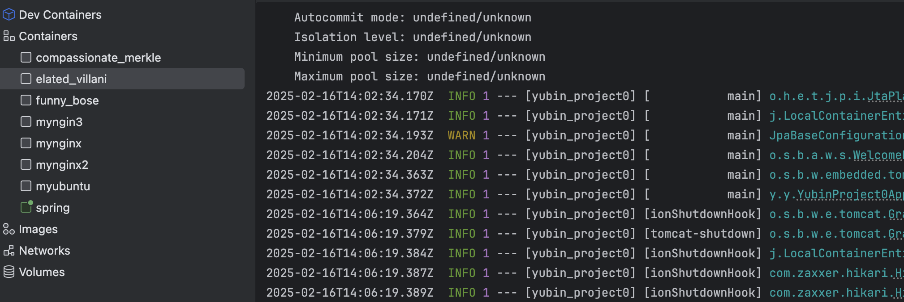
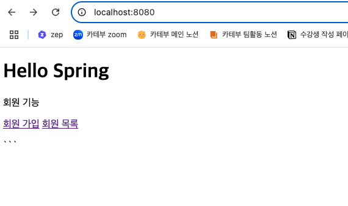

## 날짜: 2025-02-16

### 스크럼
- Dockerfile 공부
  
### 새로 배운 내용
#### Dockerfile 응용
    
    이전에 테스트용으로 만들었던 스프링부트 프로젝트에 dockerfile을 넣어서 구성해보았다.
    
    참고한 글 : https://adjh54.tistory.com/420
    
    ```yaml
    # Build stage
    FROM openjdk:17-jdk-slim AS builder
    
    # 작업 디렉토리 설정
    WORKDIR /app
    
    # Gradle 빌드 파일 복사
    COPY . .
    
    # 실행 권한 부여
    RUN chmod +x gradlew
    
    # Gradle을 통해 빌드 (테스트 제외)
    RUN ./gradlew clean build -x test
    
    # Run stage
    FROM openjdk:17-jdk-slim
    
    WORKDIR /app
    
    # 첫 번째 스테이지에서 빌드된 JAR 파일을 복사
    COPY --from=builder /app/build/libs/*.jar app.jar
    
    EXPOSE 8080
    
    # 애플리케이션 실행
    ENTRYPOINT ["java", "-jar", "app.jar"]
    
    ```
    






간편하게 추가할 수 있었다. 다만 h2 database가 동작하지 않는 모습을 보여 추후 추가 확인이 필요할 것 같다.


### 오늘의 회고
- 토요일, 일요일은 리프레시와 함께 정보처리기사 공부를 진행해서 도커 공부를 많이 하지 못했다. 다음주 쿠버네티스를 다루면서 좀더 공부할 예정이다. 

### 참고 자료 및 링크
- [[Docker] Dockerfile을 이용한 Spring Boot App 환경 구성 및 실행방법](https://adjh54.tistory.com/420)