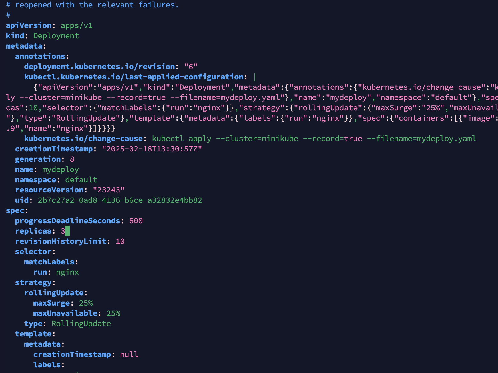

## 날짜: 2025-02-18

### 스크럼
- 쿠버네티스 실습하며 복습하기

### 새로 배운 내용
### Kubernets 실습 

#### (1) pod의 생성 방법
    
    ```bash
    #첫번째 생성법 - kubectl run을 활용한 생성
    kubectl run mynginx1 --image nginx #pod를 만들고
    pod/mynginx1 created
    kubectl get pods #조회한다
    NAME       READY   STATUS              RESTARTS   AGE
    mynginx1   0/1     ContainerCreating   0          8s
    kubectl delete pod mynginx1 #pod를 지운다
    pod "mynginx1" deleted
    
    ```
    
    ```bash
    #두번째 생성법 - manifest를 이용한 포드 생성
    cat mynginx.yaml
    apiVersion: v1 #쿠버네티스 api의 버전을 나타냄
    kind: Pod #어떤 종류의 쿠버네티스 리소스를 정의할지
    metadata: #name,label,annotations 등의 메타데이터 정의
      labels: #라벨 추가
        run: mynginx #run: mynginx라는 라벨을 추가한다.
      name: mynginx #파드의 이름은 mynginx
    spec:#리소스 사양을 정의
      containers: #파드에 포함될 컨테이너 정의
        - image: nginx #nginx 이미지를 가진 컨테이너
          name: mynginx #컨테이너의 이름은 mynginx
     
     **kubectl apply -f mynginx.yaml**
    pod/mynginx created
     kubectl get pods
    NAME      READY   STATUS    RESTARTS   AGE
    mynginx   1/1     Running   0          8s
    **kubectl describe pod mynginx** #상세 정보를 볼 수도 있다. 
          
    ```
    
    ```bash
    #세번째 생성법 - manifest 자동 생성
    kubectl run mynginx3 --image=nginx --dry-run=client -o yaml > mynginx3.yaml
    #--dry-run=client: 명령어가 실행할 결과가 어떻게 출력될지 확인하게 해주는 옵션
    #-o yaml: 출력 형식을 YAML로 지정
    
    #다음과 같은 매니페스트 파일이 자동으로 생성된다!
    cat mynginx3.yaml 
    apiVersion: v1
    kind: Pod
    metadata:
      creationTimestamp: null
      labels:
        run: mynginx3
      name: mynginx3
    spec:
      containers:
      - image: nginx
        name: mynginx3
        resources: {}
      dnsPolicy: ClusterFirst
      restartPolicy: Always
    status: {}
    
     **kubectl get pods -A #모든 네임스페이스를 대상으로 pod 정보 조회**
    NAMESPACE     NAME                               READY   STATUS              RESTARTS      AGE
    default       mynginx3                           0/1     ContainerCreating   0             3s
    kube-system   coredns-668d6bf9bc-gd6f6           1/1     Running             1 (26h ago)   26h
    kube-system   etcd-minikube                      1/1     Running             1 (26h ago)   26h
    kube-system   kube-apiserver-minikube            1/1     Running             1 (29m ago)   26h
    kube-system   kube-controller-manager-minikube   1/1     Running             1 (26h ago)   26h
    kube-system   kube-proxy-jhf9x                   1/1     Running             1 (26h ago)   26h
    kube-system   kube-scheduler-minikube            1/1     Running             1 (26h ago)   26h
    kube-system   storage-provisioner                1/1     Running             3 (27m ago)   26h
    ```
    
#### (2) 포드 관리
    
     `kubectl logs -f mynginx3` 를 사용해 로그를 확인 가능하다.
    
    `-f` : 로그 내용을 스트림(지속적으로)으로 출력 
    
    `--previous` : 컨테이너 이전 인스턴스의 로그를 출력(재시작되기 전의 로그를 확인하는 것으로, 계속 재시작 하는 경우에 유용함)
    
    `kubectl delete -f mynginx3.yaml` 이런 식으로 yaml 파일 명시로 삭제도 가능하다.
    
#### (3) 쿠버네티스 서비스
    
    ```bash
    **#hello-world를 실행시켜보자
    kubectl cluster-info #현재 cluter의 info를 출력**
    #api 서버(모든쿠버네티스 리소스와 상호작용을 처리하는, 핵심관리서버) url
    #kubectl 명령어를 통해 간접 접속 가능하며, 이 url을 통해 리소스 제어&관리가 이루어짐
    Kubernetes control plane is running at https://ip:port
    
    # 파드 간 통신시 사용되는 dns 서비스를 제공
    # 파드나 서비스 이름을 ip 주소로 변환
    CoreDNS is running at https://ip:port/api/v1/namespaces/kube-system/services/kube-dns:dns/proxy
    
    **kubectl get node #클러스터의 노드 목록 출력**
    NAME       STATUS   ROLES           AGE   VERSION
    minikube   Ready    control-plane   27h   v1.32.0
    
    # hello-world를 사용해 pod를 실행하는 명령
    **kubectl run hello-world --image=hello-world -it --restart=Never**
    # -it: 인터랙티브(상호작용 가능) 모드로 실행한다. -i는 표준 입력을 활성화하고, -t는 터미널을 할당한다.
    # --restart=Never: 파드가 종료된 후 자동으로 재시작하지 않도록 설정한다. 
    
    ```
    
#### (4) 디플로이먼트, 레플리카셋
    
    ```bash
    **kubectl run hello-world --image=hello-world --restart=Never**
    pod/hello-world created
    **kubectl logs hello-world #백그라운드에서 실행시키고 로그를 남겼다.** 
    
    **kubectl create deployment --image hello-world hello-world
    # "hello-world"라는 deployment를 생성한다.
    # Deployment: 애플리케이션을 배포하고 관리하는 Kubernetes 리소스
    # 레플리카셋과 함께 파드를 관리한다. 이미지 버전, 파드의 개수 등을 목표 상태가 되도록 관리하는 역할**
    deployment.apps/hello-world created
    **kubectl get all #현재 Kubernetes 클러스터 내에 있는 모든 리소스를 조회**
    NAME                               READY   STATUS      RESTARTS   AGE
    pod/hello-world                    0/1     Completed   0          2m33s
    **#레플리카셋 오브젝트 이름 뒤에 추가적 해시 문자열이 추가, 유일한 이름을 부여 받음**
    pod/hello-world-7f9cf8cc4d-lx64g   0/1     Completed   0          7s
    
    # pod/hello-world-7f9cf8cc4d-lx64g는 실패한 경우 자동으로 다시 생성될 수 있으며, 
    #Deployment와 ReplicaSet의 관리 하에 있음
    #반면 pod/hello-world는 종료 후 자동으로 재시작되지 않음
    
    NAME                 TYPE        CLUSTER-IP   EXTERNAL-IP   PORT(S)   AGE
    service/kubernetes   ClusterIP   10.96.0.1    <none>        443/TCP   27h
    
    NAME                          READY   UP-TO-DATE   AVAILABLE   AGE
    deployment.apps/hello-world   0/1     1            0           7s
    
    **#디플로이먼트 오브젝트 이름 뒤에 해시 문자열이 붙은 모양새
    #디플로이먼트와 함께 파드 수가 지정한 개수가 되도록 제어**
    NAME                                     DESIRED   CURRENT   READY   AGE
    replicaset.apps/hello-world-7f9cf8cc4d   1         1         0       7s
    
    #파드 상태 확인
    **kubectl get deploy,po #Deployment와 Pod에 대한 상태를 확인**
    NAME                          READY   UP-TO-DATE   AVAILABLE   AGE
    deployment.apps/hello-world   **0/1**     1            0           11m
    
    #레플리카셋의 파드가 계속 재시작중
    NAME                               READY   STATUS             RESTARTS       AGE
    pod/hello-world                    0/1     Completed          0              13m
    pod/hello-world-7f9cf8cc4d-lx64g   0/1     **CrashLoopBackOff**   6 (5m2s ago)   11m
    ```
    
#### (5) 디플로이먼트 확장
    
    ```bash
    **kubectl create deployment webserver --image=nginx**
    deployment.apps/webserver created
    **kubectl get deploy,po**
    NAME                        READY   UP-TO-DATE   AVAILABLE   AGE
    deployment.apps/webserver   0/1     1            0           2s
    
    NAME                             READY   STATUS              RESTARTS   AGE
    pod/hello-world                  0/1     Completed           0          27m
    pod/webserver-765f5759d4-tzpbs   0/1     ContainerCreating   0          2s
    
    #확장하면 확장한 만큼 늘어난걸 볼 수 있다.
    **kubectl scale deployment webserver --replicas=5**
    deployment.apps/webserver scaled
    **kubectl get deploy,po**
    NAME                        READY   UP-TO-DATE   AVAILABLE   AGE
    deployment.apps/webserver   1/5     5            1           9s
    
    NAME                             READY   STATUS              RESTARTS   AGE
    pod/hello-world                  0/1     Completed           0          27m
    pod/webserver-765f5759d4-9w7lv   0/1     ContainerCreating   0          2s
    pod/webserver-765f5759d4-k6d6t   0/1     ContainerCreating   0          2s
    pod/webserver-765f5759d4-n46l9   0/1     ContainerCreating   0          2s
    pod/webserver-765f5759d4-tzpbs   1/1     Running             0          9s
    pod/webserver-765f5759d4-xdbr4   0/1     ContainerCreating   0          2s
    
    #두개만 지워본다면 어떻게 될까?
    kubectl delete pod webserver-765f5759d4-9w7lv webserver-765f5759d4-k6d6t
    #당연히 새로운 파드가 다시 생기고, 자리를 채운다. deployment가 관리중이기 때문
    kubectl get deploy,po
    NAME                        READY   UP-TO-DATE   AVAILABLE   AGE
    deployment.apps/webserver   5/5     5            5           3m34s
    
    NAME                             READY   STATUS      RESTARTS   AGE
    pod/hello-world                  0/1     Completed   0          30m
    pod/webserver-765f5759d4-n46l9   1/1     Running     0          3m27s
    pod/webserver-765f5759d4-n4h54   1/1     Running     0          6s
    pod/webserver-765f5759d4-tzpbs   1/1     Running     0          3m34s
    pod/webserver-765f5759d4-v6dvl   1/1     Running     0          6s
    pod/webserver-765f5759d4-xdbr4   1/1     Running     0          3m27s
    ```
    
#### (6) job controller
    
    job :  특정 작업을 완료하는데 필요한 pod를 관리하는 리소스. 대개 배치 작업 등. 
    
    pod를 생성해 명시적 작업을 수행하고, 완료되면 pod를 종료시킨다. Kubernetes Job은 실패한 작업을 재시도하여 **최종적으로 작업이 성공하도록 보장하므로, job2는 한 번 더 실행되었다.**
    
    **`onFailure`** 옵션은 Job이나 CronJob에서 **Pod의 실행이 실패했을 때 특정 작업을 지정하는 옵션이다.** 
    
    ```bash
    **kubectl create job job-1 --image=ubuntu -- /bin/bash -c "exit 0"
    kubectl create job job-2 --image=ubuntu -- /bin/bash -c "exit 1"
    #각각 exit0(정상종료) / exit1(오류 발생) 명령어를 실행하는 job을 생성함**
    
    **kubectl get jobs** 
    NAME    STATUS     COMPLETIONS   DURATION   AGE
    job-1   Complete   1/1           12s        21s
    job-2   Running    0/1           9s         9s
    **kubectl get pod**
    NAME          READY   STATUS      RESTARTS   AGE
    hello-world   0/1     Completed   0          36m
    job-1-7lc7h   0/1     Completed   0          30s
    job-2-8bk2z   0/1     Error       0          18s
    job-2-f2xx4   0/1     Error       0          5s
    
    kubectl delete jobs job-1 job-2
    
    #관련한 옵션
    spec:
      restartPolicy: OnFailure  # 실패한 경우에만 재시도
    Backoff Limit:    6 #6번까지만 시도
    ```
    
#### (7) 매니페스트와 파드, 클러스터 네트워크
    
    ```bash
    kubectl get pod hello-world -o wide
    NAME          READY   STATUS      RESTARTS   AGE   IP            NODE       NOMINATED NODE   READINESS GATES
    hello-world   0/1     Completed   0          56m   10.244.0.12   minikube   <none>           <none>
    
    #url을 사용하여 http://10.244.0.12 주소로 HTTP 요청
    #-m 3: 요청을 최대 3초간 기다리도록 설정
    #pod의 내부 ip로 요청을 보냈지만, 응답은 없다. 외부에서 접근 안되기 때문.
    curl -m 3 http://10.244.0.12
    curl: (28) Connection timed out after 3002 milliseconds
    
    #nginx pod를 올려서, busybox pod(컨테이너)으로 접근해보자
    #클러스터 네트워크를 접속하기 위해 대화형 파드를 기동한 것이다.
    **kubectl run busybox --image=busybox --restart=Never --rm -it sh**
    
    #지정된 url로 부터 콘텐츠를 다운로드
    / # wget -q -O - http://10.244.0.33/
    <!DOCTYPE html>
    <html>
    <head>
    <title>Welcome to nginx!</title>
    <style>
    html { color-scheme: light dark; }
    body { width: 35em; margin: 0 auto;
    font-family: Tahoma, Verdana, Arial, sans-serif; }
    </style>
    </head>
    <body>
    <h1>Welcome to nginx!</h1>
    <p>If you see this page, the nginx web server is successfully installed and
    working. Further configuration is required.</p>
    
    <p>For online documentation and support please refer to
    <a href="http://nginx.org/">nginx.org</a>.<br/>
    Commercial support is available at
    <a href="http://nginx.com/">nginx.com</a>.</p>
    
    <p><em>Thank you for using nginx.</em></p>
    </body>
    </html>
    ```
    
#### (8) 파드의 헬스체크 기능 🤯
    
    **파드의 상태**를 모니터링하고, 파드가 정상적으로 작동하는지 확인하는 기능
    
    - **Liveness Probe**:
        - 파드 내 컨테이너가 **살아있는지**(즉, 정상적으로 실행되고 있는지)를 확인하는 헬스체크
        - 만약 `liveness probe`가 실패하면, 쿠버네티스는 해당 컨테이너를 **재시작**한다.
        - 애플리케이션이 응답하지 않거나 무한 루프에 빠진 경우, `liveness probe`가 실패하고, 컨테이너가 재시작되어 애플리케이션을 복구할 수 있다.
    - **Readiness Probe**:
        - 파드 내 컨테이너가 **트래픽을 받을 준비가 되었는지**(즉, 서비스를 정상적으로 제공할 준비가 되었는지)를 확인하는 헬스체크
        - `readiness probe`가 실패하면, 파드는 **서비스에 트래픽을 전달하지 않도록** 설정된다. 이로 인해 아직 애플리케이션이 준비되지 않았을 때 서비스의 트래픽을 받지 않게 된다.
        - 애플리케이션이 시작 중일 때는 트래픽을 받지 않도록 할 수 있다.
    
    파드에서 헬스체크를 설정하려면 `livenessProbe`와 `readinessProbe`를 정의를 해줘야한다.
    
    ```yaml
    #/hc-probe/webapi-pod.yml 
    apiVersion: v1
    kind: Pod
    metadata:
      name: webapl
    spec:
      containers:
        - name: webapl
          image: maho/webapl:0.1 
          livenessProbe:
            httpGet:
              path: /healthz #/healthz 경로로 HTTP 요청을 보내서 애플리케이션이 정상인지 확인
              #요청 실패시 컨테이너는 재시작됨
              port: 3000
            initialDelaySeconds: 3 #컨테이너 시작 후 처음으로 헬스체크 시도하는 시간
            periodSeconds: 5 # 5초마다 주기적으로 헬스체크 실행
          readinessProbe:
            httpGet:
              path: /ready #/ready 경로로 HTTP 요청을 보내서 애플리케이션이 트래픽을 받을 준비가 되었는지 확인
              #준비가 되지 않으면 서비스로 트래픽을 받지 않도록 설정
              port: 3000
            initialDelaySeconds: 15
            periodSeconds: 6
    ```
    
    ```json
    // /hc-probe/webapl/web.js
    
    // 모의 애플리케이션
    const express = require('express')
    const app = express()
    var start = Date.now()
    
    // Liveness 프로브 핸들러
    // 기능 후 40초가 되면 500 에러를 반환한다.
    // 그 전까지는 HTTP 200 OK를 반환한다.
    // 즉, 40초가 되면 Liveness 프로브가 실패하여 컨테이너가 재기동한다.
    app.get('/healthz', function(request, response) {
        var msec = Date.now() - start
        var code = 200
        if (msec > 40000) {
            code = 500
        }
        console.log('GET /healthz ' + code)
        response.status(code).send('OK')
    })
    
    // Rediness 프로브 핸들러
    // 애플리케이션의 초기화 시간으로
    // 기능 후 20초 지나고 나서부터 HTTP 200을 반환한다.
    // 그 전까지는 HTTPS 200 OK를 반환한다.
    app.get('/ready', function(request, response) {
        var msec = Date.now() - start
        var code = 500
        if (msec > 20000) {
            code = 200
        }
        console.log('GET /ready ' + code)
        response.status(code).send('OK')
    })
    
    // 첫 화면
    app.get('/', function(request, response) {
        console.log('GET /')
        response.send('Hello from Node.js')
    })
    
    // 서버 포트 번호
    app.listen(3000);
    ```
    
    ```docker
    #/hc-probe/webapl/Dockerfile 
    #alpine linux
    FROM alpine:latest
    #node.js
    RUN apk update && apk add --no-cache nodejs npm
    
    #의존 모듈
    WORKDIR /
    ADD ./package.json /
    RUN npm install
    ADD ./webapl.js /
    
    #애플리케이션 기동
    CMD node /webapl.js
    ```
    
    ```json
    #hc-probe/webapl/package.json 
    {
      "name": "webapl",
      "version": "1.0.0",
      "description": "",
      "main": "webapl.js",
      "scripts": {
        "test": "echo \"Error: no test specified\" && exit 1"
      },
      "author": "",
      "license": "ISC",
      "dependencies": {
        "express": "^4.16.3"
      }
    }
    ```
    
    우선 위와 같이 필요한 파일을 모두 만들었다.
    
    이후 이미지를 만들면 푸쉬를 해야한다. 왜? >
    
    `docker push`를 **하지 않으면** **쿠버네티스 클러스터에서 사용할 수 없다!**
    
    - 쿠버네티스에서 파드를 실행하려면, 해당 파드가 사용할 **Docker 이미지**가 **레지스트리**에 존재해야함
    - 로컬에서 만든 이미지를 **`docker push`** 명령어를 사용해 **레지스트리에 푸시**하지 않으면, **로컬 머신에서만 존재하는 이미지**는 **클러스터 내에서 접근할 수 없기 때문에** 실행할 수 없음
    - 쿠버네티스는 파드를 생성할 때 **레지스트리에서 이미지를 pull**하여 해당 이미지를 기반으로 컨테이너를 실행하기 때문!
    
    ```bash
    
    #Dockerfile로 이미지를 빌드하고
    docker build --tag maho/webapl:0.1 .
    #내 도커 레포지토리에 push했다.
    docker tag maho/webapl:0.1 mushr00mandu/webapl:0.1
    docker push mushr00mandu/webapl:0.1
    #로그인한다
    docker login
    
    **kubectl apply -f webapi-pod.yml #yml 파일로 pod를 만든다**
    
    **kubectl get pods #아직 트래픽을 받을 준비를 하고 있는 webapl**
    NAME          READY   STATUS             RESTARTS   AGE
    hello-world   0/1     Completed          0          128m
    webapl        0/1     Running            0          18s
    
    **kubectl logs webapl**
    GET /healthz 200 #상태가 정상(200ok)
    GET /healthz 200
    GET /healthz 200
    GET /ready 500 #아직 서버가 준비되지 않음(500 Internal Server Error) 
    GET /healthz 200
    GET /ready 500
    GET /healthz 200
    GET /ready 200  #서버가 준비되었다.
    
    **kubectl describe pod webapl**
    #헬스체크 관련 상태 확인
        Liveness:       http-get http://:3000/healthz delay=3s timeout=1s period=5s #success=1 #failure=3
        Readiness:      http-get http://:3000/ready delay=15s timeout=1s period=6s #success=1 #failure=3
    #헬스체크 실패로 인한 상태들도 확인 가능하다.
    Events:
      Type     Reason     Age                From               Message
      ----     ------     ----               ----               -------
      Normal   Scheduled  66s                default-scheduler  Successfully assigned default/webapl to minikube
      Normal   Pulling    65s                kubelet            Pulling image "maho/webapl:0.1"
      Normal   Pulled     58s                kubelet            Successfully pulled image "maho/webapl:0.1" in 6.892s (6.892s including waiting). Image size: 51079110 bytes.
      Normal   Created    58s                kubelet            Created container: webapl
      Normal   Started    57s                kubelet            Started container webapl
      Warning  Unhealthy  37s (x2 over 43s)  kubelet            **Readiness probe failed: HTTP probe failed with statuscode: 500**
      Warning  Unhealthy  5s (x3 over 15s)   kubelet            **Liveness probe failed: HTTP probe failed with statuscode: 500**
      Normal   Killing    5s                 kubelet            **Container webapl failed liveness probe, will be restarted**
      
    **kubectl get pods**
    NAME          READY   STATUS      RESTARTS   AGE
    hello-world   0/1     Completed   0          129m
    webapl        1/1     Running     0          88s **#트래픽 받을 준비가 되었다!**
    ```
    
    프로브는 쿠버네티스 기능 아닌가? 왜 `Node.js`로 따로 구현한 것일까?
    
    - **Liveness**와 **Readiness** 프로브는 **특정 경로**(예: `/healthz`, `/ready`)에 대해 **HTTP GET 요청**을 보내게 된다. 따라서, 애플리케이션은 이러한 경로를 처리할 수 있는 **HTTP 서버**가 필요하다.
    - **Node.js**는 빠르고 간단하게 HTTP 서버를 구현할 수 있는 **웹 프레임워크인 Express.js**를 제공하기 때문에, **헬스체크**를 위한 경로를 구현하는 데 적합하다.
#### (9) initContainer
    
    ### **`initContainer`란?**
    
    - `initContainer`는 파드 내에서 **주요 작업을 시작하기 전에 초기화**를 담당하는 **특별한 컨테이너**야. 이 컨테이너는 **메인 컨테이너**가 실행되기 전에 먼저 실행된다.
    - `initContainer`는 주로 **파일을 준비하거나 디렉토리를 생성**하는 등의 **초기 설정**을 수행한다.
    
    ### `initContainer`의 동작 방식:
    
    1. `initContainer`는 파드가 시작될 때 **첫 번째로 실행된다.**
    2. 초기화 작업이 모두 끝나면 `initContainer`는 종료되고, **메인 컨테이너**가 그 이후에 실행된다.
    3. `initContainer`는 **한 번만 실행**되며, 메인 컨테이너가 정상적으로 실행될 수 있도록 필요한 설정(예: 파일 준비, 디렉토리 생성 등)을 마친 후 종료된다.
    
    ```bash
    #init-sample.yml
    apiVersion: v1
    kind: Pod
    metadata:
      name: init-sample
    spec:
      containers:
        - name: main # 메인 컨테이너
          image: ubuntu
          command: ["/bin/sh"]
          args: ["-c", "tail -f /dev/null"]
          volumeMounts:
            - mountPath: /docs # 공유 볼륨 마운트 경로
              name: data-vol
              readOnly: false
    
      initContainers: # 메인 컨테이너 실행 전에 초기화 전용 컨테이너를 기동
        - name: init
          image: alpine
          # 공유 볼륨에 디렉터리를 작성하고, 소유를 변경
          command: ["/bin/sh"]
          args: ["-c", "mkdir /mnt/html; chown 33:33 /mnt/html"]
          volumeMounts:
            - mountPath: /mnt # 공유 볼륨 마운트 경로
              name: data-vol
              readOnly: false
    
      volumes: # 파드의 공유 볼륨
        - name: data-vol
          emptyDir: {}
    ```
    
    ```bash
    kubectl apply -f init-sample.yml
    **kubectl exec -it init-sample -c main -- sh**
    # ls -al /docs/
    total 12
    drwxrwxrwx 3 root     root     4096 Feb 18 11:33 .
    drwxr-xr-x 1 root     root     4096 Feb 18 11:33 ..
    drwxr-xr-x 2 www-data www-data 4096 Feb 18 11:33 html
    ```
    
#### (10) 사이드카 패턴
    - 하나의 파드 안에 여러 개의 컨테이너를 담아, 동시에 실행하는 패턴
    - 웹 서버 컨테이너(예:nginx) + 최신 콘텐츠를 깃헙에서 다운받는 컨테이너(정기적으로 pull해서 콘텐츠를 최신으로 유지한다.) → 사이드카 패턴이라고 할 수 있다.
    - 어플리케이션 변경 없이 사이드카를 붙였다 떼거나 교체하기 쉬운 구성 방식이다.
    - 둘다 같은 노드에서 실행되므로 리소스를 적절히 설정해야한다.
    - 의존성 관리가 필요하며, 사이드카는 메인 컨테이너보다 나중에 시작하고 나중에 종료해야함.
    
    ```bash
    #nginx-sidecar.yml
    
    apiVersion: v1
    kind: Pod
    metadata:
      name: nginx-busybox-pod
    spec:
      containers:
        - name: nginx # 메인 컨테이너
          image: nginx:latest
          volumeMounts:
            - mountPath: /var/log/nginx
              name: log-volume
    
        - name: busybox # nginx에 10초 간격으로 wget 요청을 보냄
          image: busybox:latest
          command: ["/bin/sh", "-c", "while true; do wget -qO- http://localhost:80; sleep 10; done"]
          volumeMounts:
            - mountPath: /var/log/nginx
              name: log-volume
    
        - name: log-checker # log-volume을 공유하며 지속적으로 로그를 확인함
          image: busybox:latest
          command: ["/bin/sh", "-c", "tail -f /var/log/nginx/access.log"]
          volumeMounts:
            - mountPath: /var/log/nginx
              name: log-volume
    
      volumes:
        - name: log-volume
          emptyDir: {}
    
    ```
    
    ```bash
    kubectl apply -f nginx-sidecar.yml
    kubectl get pods
    NAME                READY   STATUS      RESTARTS   AGE
    nginx-busybox-pod   3/3     Running     0          16s
    kubectl delete pods init-sample
    
    **kubectl logs -f nginx-busybox-pod -c log-checker #-c 뒤는 컨테이너 이름임
    #열심히 wget 요청을 보내고 있는 로그를 볼 수 있다.**
    127.0.0.1 - - [18/Feb/2025:12:27:25 +0000] "GET / HTTP/1.1" 200 615 "-" "Wget" "-"
    127.0.0.1 - - [18/Feb/2025:12:27:36 +0000] "GET / HTTP/1.1" 200 615 "-" "Wget" "-"
    127.0.0.1 - - [18/Feb/2025:12:27:46 +0000] "GET / HTTP/1.1" 200 615 "-" "Wget" "-"
    127.0.0.1 - - [18/Feb/2025:12:27:56 +0000] "GET / HTTP/1.1" 200 615 "-" "Wget" "-"
    127.0.0.1 - - [18/Feb/2025:12:28:06 +0000] "GET / HTTP/1.1" 200 615 "-" "Wget" "-"
    127.0.0.1 - - [18/Feb/2025:12:28:16 +0000] "GET / HTTP/1.1" 200 615 "-" "Wget" "-"
    127.0.0.1 - - [18/Feb/2025:12:28:26 +0000] "GET / HTTP/1.1" 200 615 "-" "Wget" "-"
    127.0.0.1 - - [18/Feb/2025:12:28:36 +0000] "GET / HTTP/1.1" 200 615 "-" "Wget" "-"
    127.0.0.1 - - [18/Feb/2025:12:28:46 +0000] "GET / HTTP/1.1" 200 615 "-" "Wget" "-"
    127.0.0.1 - - [18/Feb/2025:12:28:56 +0000] "GET / HTTP/1.1" 200 615 "-" "Wget" "-"
    ```
    
#### (11) 리플리카셋
    
    ```bash
    # myreplicaset.yaml
    apiVersion: apps/v1
    kind: ReplicaSet
    metadata:
      name: myreplicaset
    spec:
      replicas: 2
      selector:#ReplicaSet이 관리할 Pod들을 선택하는 조건을 설정
        matchLabels: #pod의 특정 labels가 특정 값을 갖는지를 확인함
          run: nginx-rs
      template:
        metadata:
          labels:
            run: nginx-rs #이렇게하면 레플리카셋에 의해 생성된 pod들은 모두 이 라벨을 갖게됨(=관리가능)
        spec:
          containers:
            - name: nginx
              image: nginx
    ```
    
    ```bash
    kubectl apply -f myreplicaset.yaml
    
    #replicaset의 현재 상태를 볼 수 있다.
    **kubectl get replicaset**
    NAME           DESIRED   CURRENT   READY   AGE
    myreplicaset   2         2         2       17s
    
    kubectl get pod
    NAME                 READY   STATUS      RESTARTS   AGE
    hello-world          0/1     Completed   0          7h31m
    myreplicaset-9tcmt   1/1     Running     0          23s
    myreplicaset-qmtw2   1/1     Running     0          23s
    
    #복제본 개수를 확장(replica scaling)해보자
    **kubectl scale rs --replicas 4 myreplicaset**
    replicaset.apps/myreplicaset scaled
    
    #4개로 늘어났다!
    **kubectl get rs**
    NAME           DESIRED   CURRENT   READY   AGE
    myreplicaset   4         4         4       62s
    
    **kubectl get pod**
    NAME                 READY   STATUS      RESTARTS   AGE
    hello-world          0/1     Completed   0          7h32m
    myreplicaset-9tcmt   1/1     Running     0          65s
    myreplicaset-qmtw2   1/1     Running     0          65s
    myreplicaset-wxmmf   1/1     Running     0          14s
    myreplicaset-xwfc4   1/1     Running     0          14s
    
    #레플리카셋이 네개가 되도록 관리중이기 때문에, 하나를 지워도 그 자리에 새 pod이 올라온다.
    kubectl delete pod myreplicaset-9tcmt
    kubectl get pod
    NAME                 READY   STATUS              RESTARTS   AGE
    hello-world          0/1     Completed           0          7h34m
    myreplicaset-qmtw2   1/1     Running             0          3m28s
    **myreplicaset-vn7km   0/1     ContainerCreating   0          2s**
    myreplicaset-wxmmf   1/1     Running             0          2m37s
    myreplicaset-xwfc4   1/1     Running             0          2m37s
    
    #모두 지우는 명령어
    **kubectl delete rs --all**
    ```
    
#### (12) 디플로이먼트
    - 애플리케이션 업데이트 및 배포를 위한 컨트롤러로, 리플리카셋을 관리한다.
    - label과 selector를 통해 pod 객체를 확인한다.
    
    ```bash
    # mydeploy.yaml
    apiVersion: apps/v1
    kind: Deployment
    metadata:
      name: mydeploy
    spec:
      replicas: 10
      selector:
        matchLabels:
          run: nginx
      strategy:
      #만약 재생성 전략이라면 type: Recreate를 쓰면 된다.
        type: RollingUpdate
        rollingUpdate:
          maxUnavailable: 25%
          maxSurge: 25%
      template:
        metadata:
          labels:
            run: nginx
        spec:
          containers:
            - name: nginx
              image: nginx:1.7.9
    ```
    
    ```bash
    kubectl apply --record -f mydeploy.yaml
    #record를 사용하면 kubectl 명령어를 통해 Kubernetes 리소스를 업데이트할 때마다 
    #명령어의 이력이 Kubernetes의 annotation에 기록됨
    #변경기록을 추적하고, kubectl rollout history를 통해 롤백을 할 수 있음.
    
    **kubectl get deployment**
    NAME       READY   UP-TO-DATE   AVAILABLE   AGE
    mydeploy   0/10    10           0           12s #nginx 버전이 1.7.9였는데 어째서인지 pull이 안됨.
    kubectl get rs
    NAME                  DESIRED   CURRENT   READY   AGE
    mydeploy-7f75dd868b   10        10        0       19s
    
    #당연히 pod들도 제대로 만들어지지 않는다
    kubectl get pod
    NAME                        READY   STATUS              RESTARTS   AGE
    hello-world                 0/1     Completed           0          7h55m
    mydeploy-7f75dd868b-7784f   0/1     ErrImagePull        0          28s
    mydeploy-7f75dd868b-fj6fz   0/1     ErrImagePull        0          28s
    mydeploy-7f75dd868b-hdvzq   0/1     ErrImagePull        0          28s
    mydeploy-7f75dd868b-jt9gh   0/1     ImagePullBackOff    0          28s
    mydeploy-7f75dd868b-pgj65   0/1     ContainerCreating   0          28s
    mydeploy-7f75dd868b-qddd4   0/1     ErrImagePull        0          28s
    mydeploy-7f75dd868b-r728q   0/1     ImagePullBackOff    0          28s
    mydeploy-7f75dd868b-sckxc   0/1     ErrImagePull        0          28s
    mydeploy-7f75dd868b-wv72r   0/1     ImagePullBackOff    0          28s
    mydeploy-7f75dd868b-zc4f6   0/1     ErrImagePull        0          28s
    
    #버전을 바꿔주니 잘 돌아간다.
    **kubectl set image deployment mydeploy nginx=nginx:latest --**
    kubectl get pod
    
    NAME                        READY   STATUS      RESTARTS   AGE
    hello-world                 0/1     Completed   0          7h56m
    mydeploy-5446bfdff6-d66bl   1/1     Running     0          20s
    mydeploy-5446bfdff6-gjkh8   1/1     Running     0          15s
    mydeploy-5446bfdff6-nfzvl   1/1     Running     0          16s
    mydeploy-5446bfdff6-qzpqh   1/1     Running     0          27s
    mydeploy-5446bfdff6-s7b28   1/1     Running     0          27s
    mydeploy-5446bfdff6-svnhd   1/1     Running     0          26s
    mydeploy-5446bfdff6-txm64   1/1     Running     0          27s
    mydeploy-5446bfdff6-w4nd4   1/1     Running     0          17s
    mydeploy-5446bfdff6-wq6dp   1/1     Running     0          17s
    mydeploy-5446bfdff6-zl9bk   1/1     Running     0          27s
    
    #변경 이력도 볼 수 있다. 
    kubectl rollout status deployment mydeploy
    deployment "mydeploy" successfully rolled out
    
    #pod 하나를 살펴보면, image 버전이 잘 바뀐 걸 확인할 수 있다.
    **kubectl get pod mydeploy-5446bfdff6-d66bl -o yaml | grep "image: nginx"**
      - image: nginx:latest
        image: nginx:latest
    
    #존재하지 않는 버전의 이미지로 세팅하면 천천히 에러나는 것으로 rollout된다.
    **kubectl set image deployment mydeploy nginx=nginx:1.9.21 --record
    kubectl rollout status deployment mydeploy**
    Waiting for deployment "mydeploy" rollout to finish: 5 out of 10 new replicas have been updated...
    ^C(멈춤)
    kubectl get pod
    NAME                        READY   STATUS              RESTARTS   AGE
    hello-world                 0/1     Completed           0          7h58m
    mydeploy-5446bfdff6-gjkh8   1/1     Running             0          2m13s
    mydeploy-5446bfdff6-nfzvl   1/1     Running             0          2m14s
    mydeploy-5446bfdff6-qzpqh   1/1     Running             0          2m25s
    mydeploy-5446bfdff6-s7b28   1/1     Running             0          2m25s
    mydeploy-5446bfdff6-svnhd   1/1     Running             0          2m24s
    mydeploy-5446bfdff6-txm64   1/1     Running             0          2m25s
    mydeploy-5446bfdff6-wq6dp   1/1     Running             0          2m15s
    mydeploy-5446bfdff6-zl9bk   1/1     Running             0          2m25s
    mydeploy-6c488cb88b-f8qg9   0/1     ErrImagePull        0          13s
    mydeploy-6c488cb88b-msslr   0/1     ErrImagePull        0          13s
    mydeploy-6c488cb88b-n5xcz   0/1     ErrImagePull        0          13s
    mydeploy-6c488cb88b-v7m7l   0/1     ErrImagePull        0          13s
    mydeploy-6c488cb88b-zfzb9   0/1     ContainerCreating   0          13s
    
    #히스토리를 확인해 rollout을 제거할 수 있다. 
    **kubectl rollout history deployment mydeploy**
    deployment.apps/mydeploy 
    REVISION  CHANGE-CAUSE
    1         kubectl apply --cluster=minikube --record=true --filename=mydeploy.yaml
    2         kubectl apply --cluster=minikube --record=true --filename=mydeploy.yaml
    3         kubectl set image deployment mydeploy nginx=nginx:1.9.21 --cluster=minikube --record=true
    **kubectl rollout undo deployment mydeploy**
    
    #다시 확인해보면 아까전으로 돌아왔다.
    **kubectl get deployment mydeploy -o yaml | grep image**
     {"apiVersion":"apps/v1","kind":"Deployment","metadata":{"annotations":{"kubernetes.io/change-cause":"kubectl apply --cluster=minikube --record=true --filename=mydeploy.yaml"},"name":"mydeploy","namespace":"default"},"spec":{"replicas":10,"selector":{"matchLabels":{"run":"nginx"}},"strategy":{"rollingUpdate":{"maxSurge":"25%","maxUnavailable":"25%"},"type":"RollingUpdate"},"template":{"metadata":{"labels":{"run":"nginx"}},"spec":{"containers":[{"image":"nginx:1.7.9","name":"nginx"}]}}}}
          - image: nginx:latest
            imagePullPolicy: IfNotPresent
            
    #버전을 지정해서 되돌리는 것도 가능하다.
    **kubectl rollout undo deploy mydeploy --to-revision=1 
    
    #스케일 조정도 가능하다.
    #천천히 줄고 있는 모습을 확인 가능하다.**
    **kubectl scale deployment --replicas 5 mydeploy**
    kubectl get pod
    NAME                        READY   STATUS             RESTARTS   AGE
    hello-world                 0/1     Completed          0          8h
    mydeploy-5446bfdff6-gjkh8   1/1     Running            0          9m49s
    mydeploy-5446bfdff6-nfzvl   1/1     Running            0          9m50s
    mydeploy-5446bfdff6-qzpqh   1/1     Running            0          10m
    mydeploy-5446bfdff6-svnhd   1/1     Running            0          10m
    mydeploy-7f75dd868b-9kpb4   0/1     ErrImagePull       0          69s
    mydeploy-7f75dd868b-dzmcp   0/1     ErrImagePull       0          69s
    mydeploy-7f75dd868b-pjthb   0/1     ImagePullBackOff   0          69s
    
    #다시 되돌린다! (이미지 오류로 인해 rollout과 scaling이 안되는 것 같아 **latest로 교체함)
    kubectl scale deployment mydeploy --replicas=10**
    kubectl get pod
    NAME                        READY   STATUS              RESTARTS   AGE
    hello-world                 0/1     Completed           0          8h
    mydeploy-5446bfdff6-gjkh8   1/1     Running             0          15m
    mydeploy-5446bfdff6-lntsz   1/1     Running             0          43s
    mydeploy-5446bfdff6-nfzvl   1/1     Running             0          15m
    mydeploy-5446bfdff6-pscbg   0/1     ContainerCreating   0          5s
    mydeploy-5446bfdff6-qqv4t   0/1     ContainerCreating   0          5s
    mydeploy-5446bfdff6-qzpqh   1/1     Running             0          15m
    mydeploy-5446bfdff6-rcjvq   0/1     ContainerCreating   0          5s
    mydeploy-5446bfdff6-rx4f8   0/1     ContainerCreating   0          5ss
    mydeploy-5446bfdff6-svnhd   1/1     Running             0          15m
    mydeploy-5446bfdff6-zm79j   0/1     ContainerCreating   0          5s
    
    #위의 명령어를 통해 replicas 항목을 3으로 수정해본다(하단 사진)
    **kubectl edit deploy mydeploy**
    
    #3개로 줄어있는 모습을 볼 수 있다.
    kubectl get pod
    NAME                        READY   STATUS      RESTARTS   AGE
    hello-world                 0/1     Completed   0          8h
    mydeploy-5446bfdff6-gjkh8   1/1     Running     0          23m
    mydeploy-5446bfdff6-nfzvl   1/1     Running     0          23m
    mydeploy-5446bfdff6-qzpqh   1/1     Running     0          24m
    
    #정리하기
    **kubectl delete deploy --all**
    ```
    

 


### 오늘의 회고
- 쿠버네티스 개념을 복습하며 천천히 실습을 진행했다. 역시 직접 진행해보니 이해가 훨씬 잘되는 것 같다. 특히 health check에서 이론을 잘 이해하지 못하고 실습을 시작하니 어려움을 많이 겪어서 그만큼 많이 찾아봤는데, 프로브를 만드는 이유가 가장 헷갈렸던 것 같다. 개념을 공부하니 구조도 조금 이해할 수 있게 되었다.
  
### 참고 자료 및 링크
- x