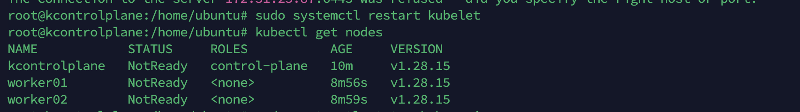
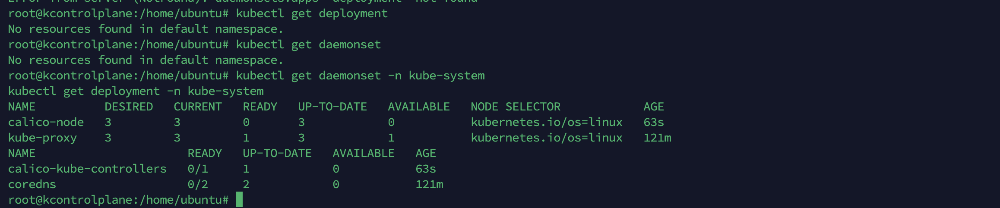
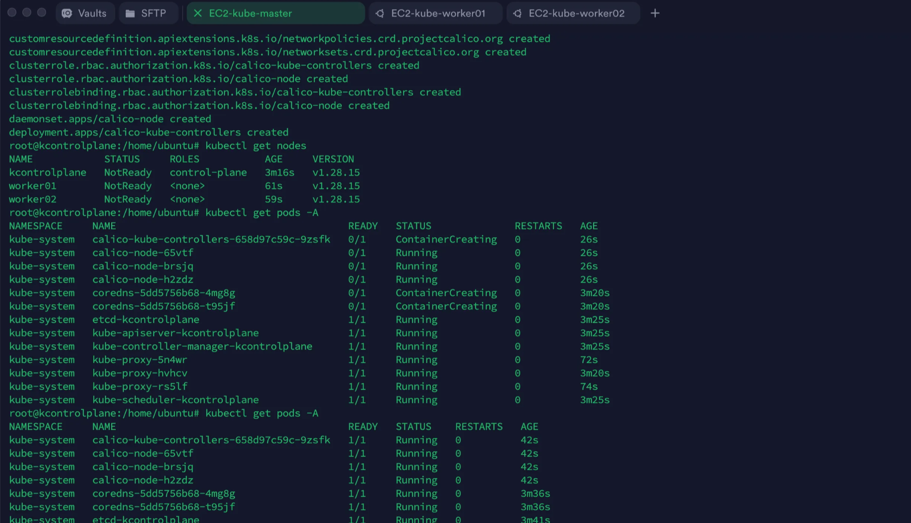
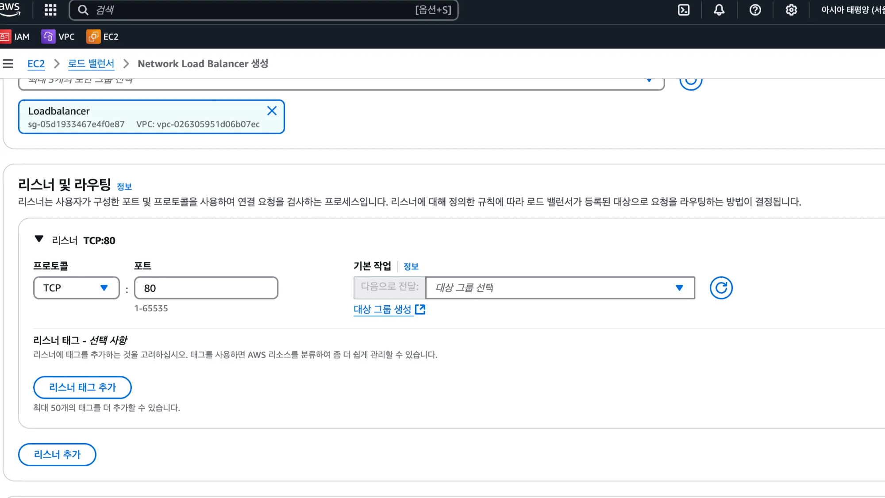
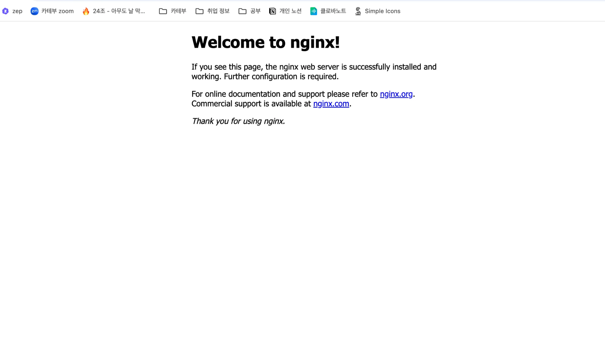
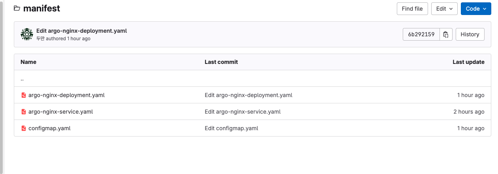
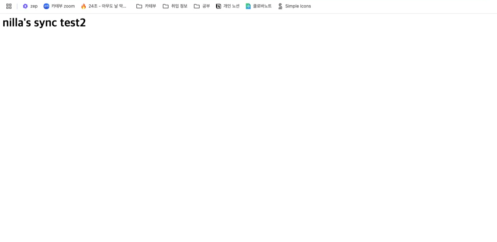
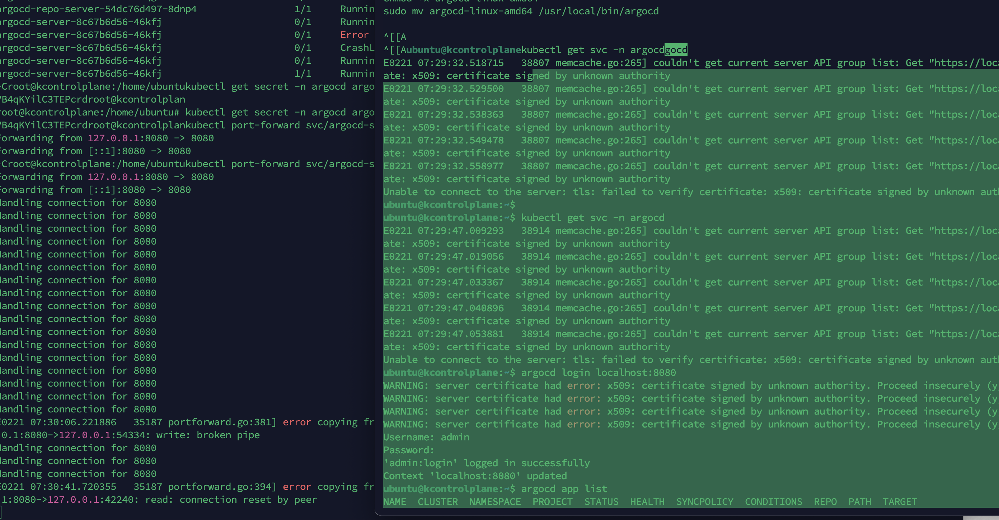
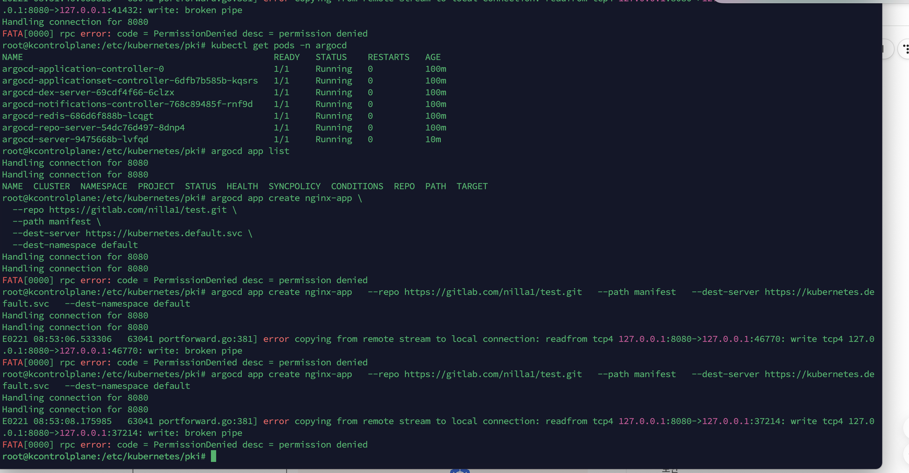

## 날짜: 2025-02-21

### 스크럼
- 시나리오를 활용한 gitops 구성해보기

### 새로 배운 내용

시나리오: 당신은 OO 스타트업의 DevOps 엔지니어로, 기존 레거시 환경에서 쿠버네티스를 활용한 운영 자동화를 도입하는 미션을 맡았습니다. 회사의 목표는 GitOps 기반 CI/CD, 서비스 메시를 통한 트래픽 관리, 자동 확장 및 부하 테스트 수행을 통해 고가용성(HA) 웹 애플리케이션을 안정적으로 운영하는 것입니다.

#### 1단계: 쿠버네티스 클러스터 구축 및 애플리케이션 배포
- 쿠버네티스를 활용하여 멀티노드 클러스터를 구축하고, 회사의 웹 애플리케이션을 컨테이너 기반으로 배포합니다. 애플리케이션을 여러 개의 파드로 배포하고, 외부에서 접근할 수 있도록 서비스(Service)를 설정하여 정상적으로 동작하는지 확인합니다.
1. 쿠버네티스 기반 멀티노드 클러스터 구축

```bash
##멀티노드 환경 설정을 해보자

#1)hostname변경
#하나만 하고, 나중에 워커노드에서 추가 변경하면 된다.
sudo su
sudo hostnamectl set-hostname kcontrolplane
sudo hostnamectl set-hostname worker01
sudo hostnamectl set-hostname worker02
```

```bash
#2) swap 메모리 주석처리하기
swapoff -a
vi /etc/fsta #여기서 swap이라 표시된 걸 주석처리하면 되는데, ec2라 그런지 없었다.
free -h
reboot
```

```bash
#3) docker 설치  - docker 설치는 이미 설치가 되었으면 건너 뛰어도 됨
#https://docs.docker.com/engine/install/ubuntu/

# Add Docker's official GPG key:

sudo apt-get update
sudo apt-get install ca-certificates curl
sudo install -m 0755 -d /etc/apt/keyrings
sudo curl -fsSL https://download.docker.com/linux/ubuntu/gpg -o /etc/apt/keyrings/docker.asc
sudo chmod a+r /etc/apt/keyrings/docker.asc

# Add the repository to Apt sources:

echo \
"deb [arch=$(dpkg --print-architecture) signed-by=/etc/apt/keyrings/docker.asc] https://download.docker.com/linux/ubuntu \
$(. /etc/os-release && echo "$VERSION_CODENAME") stable" | \
sudo tee /etc/apt/sources.list.d/docker.list > /dev/null
sudo apt-get update

sudo apt-get install docker-ce docker-ce-cli containerd.io docker-buildx-plugin docker-compose-plugin
sudo docker run hello-world

```

```bash
#4) containerd  cgroup관련 설치
#containerd는 Kubernetes에서 컨테이너를 실행하는 데 필요한 컨테이너 런타임
#cgroup 설정은 리소스 관리(CPU, 메모리 등)를 위해 필요

cat <<EOF | sudo tee /etc/modules-load.d/containerd.conf
overlay
br_netfilter
EOF

sudo modprobe overlay
sudo modprobe br_netfilter

# 필요한 sysctl 파라미터를 설정하면 재부팅 후에도 유지된다.

cat <<EOF | sudo tee /etc/sysctl.d/99-kubernetes-cri.conf
net.bridge.bridge-nf-call-iptables=1
net.ipv4.ip_forward=1
net.bridge.bridge-nf-call-ip6tables=1
EOF

service containerd restart

# 재부팅하지 않고 sysctl 파라미터 적용
sudo sysctl --system

#/etc/containerd/config.toml 수정하기
#systemdcgroup=true로 수정 > 이런게 없었음
#disabled_plugins = ["cri"]를 주석처리하기
# > 이상하게 주석처리하면 안되고, disabled_plugins = [] 로 바꾸니 잘 되었음.

vi /etc/containerd/config.toml

containerd config default | tee /etc/containerd/config.toml

sudo sed -i 's/SystemdCgroup = false/SystemdCgroup = true/g' /etc/containerd/config.toml

sudo service containerd restart
```

```bash
#5) kubernetes 1.28설치
#https://v1-28.docs.kubernetes.io/docs/setup/production-environment/tools/kubeadm/install-kubeadm/
sudo apt-get update

# apt-transport-https may be a dummy package; if so, you can skip that package

sudo apt-get install -y apt-transport-https ca-certificates curl gpg

curl -fsSL https://pkgs.k8s.io/core:/stable:/v1.28/deb/Release.key | sudo gpg --dearmor -o /etc/apt/keyrings/kubernetes-apt-keyring.gpg

echo 'deb [signed-by=/etc/apt/keyrings/kubernetes-apt-keyring.gpg] https://pkgs.k8s.io/core:/stable:/v1.28/deb/ /' | sudo tee /etc/apt/sources.list.d/kubernetes.list

sudo apt-get update

sudo apt-get install -y kubelet kubeadm kubectl

kubectl version --short # 버전 확인

sudo apt-mark hold kubelet kubeadm kubectl # 버전 고정

#==============여기까지 master, worker 공통===============#

#==========master =================================
kubeadm init
#이 이후에 join 토큰이 나온다.
kubeadm join 172.31.25.87:6443 --token (해시값) \
        --discovery-token-ca-cert-hash sha256:(해시값)
#모든 terminal window마다해야함
export KUBECONFIG=/etc/kubernetes/admin.conf

#다음과 같이 자동화 할 수도 있다.
#echo 'export KUBECONFIG=/etc/kubernetes/admin.conf' >> ~/.bashrc
#source ~/.bashrc

#join message cp 해서 worker로 갈것

#==========worker =================================
sudo kubeadm join 192.168.35.50:6443 --token hm6os1.qoi3qn1hecpqx6pl --discovery-token-ca-cert-hash sha256:efe798a7234e5e3b6
#token 24 시간

#==========master =================================
#network 설치

#user
mkdir -p $HOME/.kube #홈 디렉토리에 .kube 디렉토리 (config파일 위치) 생성
#/etc/kubernetes/admin.conf: 이 파일은 Kubernetes 마스터 노드의 설정 파일임
#admin.conf를 config로 복사해서 사용자가 kubectl 사용할 수 있게 한다
sudo cp -i /etc/kubernetes/admin.conf $HOME/.kube/config 
#현재 사용자가 congif파일을 읽고 쓸 수 있게 한다.
sudo chown $(id -u):$(id -g) $HOME/.kube/config

#root
#쿠버네티스 클러스터의 api 서버에 접근할 때 사용할 설정 파일을 지정
#즉 kubectl은 아까 설정한 admin.conf 파일을 사용해 클러스터와 소통하게 됨
export KUBECONFIG=/etc/kubernetes/admin.conf

#Calico CNI (Container Network Interface) 플러그인을 Kubernetes 클러스터에 설치하는 명령
#Calico는 Kubernetes 클러스터에서 **Pod 간 네트워크 통신**을 관리하는 **네트워크 플러그인임.**
**kubectl apply -f https://docs.projectcalico.org/v3.25/manifests/calico.yaml**

```

 

 

계속해서 문제가 생겼는데, 다음은 트러블 슈팅이다. : 

a. config 파일이 제대로 안들어갔을 때 일어난 오류
    
    ```bash
    #config 파일 안들어갔을 때 일어난 오류
    root@ip-172-31-25-87:/home/ubuntu# kubectl get pods -n kube-system
    E0221 04:24:05.436319    7974 memcache.go:265] couldn't get current server API group list: Get "http://localhost:8080/api?timeout=32s": dial tcp 127.0.0.1:8080: connect: connection refused
    E0221 04:24:05.436692    7974 memcache.go:265] couldn't get current server API group list: Get "http://localhost:8080/api?timeout=32s": dial tcp 127.0.0.1:8080: connect: connection refused
    E0221 04:24:05.439188    7974 memcache.go:265] couldn't get current server API group list: Get "http://localhost:8080/api?timeout=32s": dial tcp 127.0.0.1:8080: connect: connection refused
    E0221 04:24:05.439746    7974 memcache.go:265] couldn't get current server API group list: Get "http://localhost:8080/api?timeout=32s": dial tcp 127.0.0.1:8080: connect: connection refused
    E0221 04:24:05.440781    7974 memcache.go:265] couldn't get current server API group list: Get "http://localhost:8080/api?timeout=32s": dial tcp 127.0.0.1:8080: connect: connection refused
    
    export KUBECONFIG=/home/ubuntu/.kube/config #해당 명령어 사용하면 된다.
    ```
    
b. Calico: calico/node is not ready: BIRD is not ready: BGP not established 오류가 있었는데, BIRD는 kubernetes의 모든 노드에서 실행되는 BGP 데몬이다. BGP 피어링을 위해 보안그룹에서 179번 포트를 열어주어야 정상 실행이 가능했다. 이외로도 열어야 하는 포트는 다음과 같다. 
    
| 분류 | 포트 |
| --- | --- |
| TCP | 179, 6443, 10250 |
| SSH | 22 |
| 이외 | 해당하는 노드포트 |
    
이후 적용을 위해 칼리코를 재설치했었는데…
c. 이후로 계속 꺼지는 오류가 있었는데, 칼리코를 제대로 삭제하지 않고 다시 한 중복 설치가 문제가 되어 계속 워커노드1이 리스타트 되는 문제로 추정했다. 재 삭제를 하면서 문제가 더 생긴 것으로 추정되어 ec2를 아예 새로 인스턴스를 만들어 구성했고, 똑같은 설치 과정을 통해 해결할 수 있었다.

 

해결된 모습

2. 웹 애플리케이션 컨테이너 이미지(Nginx 또는 Node.js 기반)를 배포. 이를 위해 Deployment를 생성하고, 각 파드가 일정한 로드 밸런싱을 통해 트래픽을 처리할 수 있도록 서비스(Service)를 설정
- 우선 오브젝트들을 구성한 후 확인한다.

```bash
**#nginx-deployment.yaml** 
apiVersion: apps/v1
kind: Deployment
metadata:
  name: nginx-deployment
spec:
  replicas: 3  # Pod 3개로 복제하여 실행
  selector:
    matchLabels:
      app: nginx
  template:
    metadata:
      labels:
        app: nginx
    spec:
      containers:
      - name: nginx
        image: nginx:latest  # 사용할 이미지
        ports:
        - containerPort: 80  # Nginx가 서비스할 포트

**# nginx-svc.yaml**
apiVersion: v1
kind: Service
metadata:
  name: nginx-service
spec:
  selector:
    app: nginx  # 위 Deployment에서 사용한 app 라벨을 기반으로 선택
  ports:
    - protocol: TCP
      port: 80      # 외부에서 접근할 포트
      targetPort: 80  # Pod에서 실행되는 컨테이너 포트
      nodePort: 30080
  type: NodePort
```

```bash

**kubectl apply -f nginx-deployment.yaml
kubectl apply -f nginx-svc.yaml** 

**kubectl get nodes**
NAME            STATUS   ROLES           AGE   VERSION
kcontrolplane   Ready    control-plane   62m   v1.28.15
worker01        Ready    <none>          60m   v1.28.15
worker02        Ready    <none>          60m   v1.28.15

**kubectl get svc,deploy**
NAME                    TYPE        CLUSTER-IP      EXTERNAL-IP   PORT(S)        AGE
service/kubernetes      ClusterIP   10.96.0.1       <none>        443/TCP        62m
service/nginx-service   NodePort    10.105.251.35   <none>        80:30080/TCP   12m

NAME                               READY   UP-TO-DATE   AVAILABLE   AGE
deployment.apps/nginx-deployment   3/3     3            3           39m

#세개의 파드가 두개의 워커노드에 분배되어 서비스되고 있음을 볼 수 있다. 
**kubectl get pods -o wide**
NAME                                READY   STATUS    RESTARTS   AGE   IP              NODE       NOMINATED NODE   READINESS GATES
nginx-deployment-7c79c4bf97-9vcd8   1/1     Running   0          39m   192.168.5.4     worker01   <none>           <none>
nginx-deployment-7c79c4bf97-k9dr6   1/1     Running   0          39m   192.168.5.3     worker01   <none>           <none>
nginx-deployment-7c79c4bf97-nj64f   1/1     Running   0          39m   192.168.30.68   worker02   <none>           <none>
```

- 이후 AWS에서 NLB를 구성한다.
    - TCP 80포트를 열고, 보안그룹에서 아웃바운드가 모두 가능하도록 해주어야 한다.
    - 서브넷존은 ec2들과 같은 것으로 설정한다.
    - 대상 그룹에 인스턴스들을 포함하고, 노드포트에서 연 포트(나의 경우 30080)을 열어준다.

 

- 이후 로드밸런서의 DNS 이름으로 접속하면 정상 배포된 모습을 볼 수 있다.

 

#### 2단계: GitOps 기반의 배포 자동화 (ArgoCD 또는 Flux)
- 과제 목표
GitOps 방식을 적용하여 배포 자동화를 구현하고, Git 저장소에서 변경 사항이 발생할 때 자동으로 쿠버네티스 클러스터에 반영되도록 설정합니다.

1. ArgoCD 또는 Flux를 설치하고, Git 저장소를 통한 애플리케이션 배포를 자동화합니다. 이를 위해 Git 저장소를 설정하고, 배포할 애플리케이션의 매니페스트 파일을 버전 관리합니다. (GitOps 방식을 도입)
- argocd 설치

```bash
**#설치 후 파드들이 제대로 생성되어 있는지 확인한다.
kubectl create namespace argocd
kubectl apply -n argocd -f https://raw.githubusercontent.com/argoproj/argo-cd/stable/manifests/install.yaml**
**kubectl get po -n argocd  -w**

#이후 초기 비밀번호를 받아온다.
kubectl get secret -n argocd argocd-initial-admin-secret -o jsonpath="{.data.password}" | base64 -d

#argocd 서버에 포트포워딩을 통해 백그라운드로 접속 상태를 유지한다
kubectl port-forward svc/argocd-server -n argocd 8080:443 &

#CLI 명령어를 위해 argocd서버를 다운로드 및 설치
curl -sSL -o argocd-linux-amd64 https://github.com/argoproj/argo-cd/releases/download/v2.6.1/argocd-linux-amd64
chmod +x argocd-linux-amd64
sudo mv argocd-linux-amd64 /usr/local/bin/argocd

#위에서 알아낸 비밀번호 + 아이디(admin)으로 접속해준다.
argocd login localhost:8080
Username: admin
Password: 
'admin:login' logged in successfully
Context 'localhost:8080' updated

#배포 앱 리스트 확인으로 제대로 접속되었는지 확인
argocd app list
NAME  CLUSTER  NAMESPACE  PROJECT  STATUS  HEALTH  SYNCPOLICY  CONDITIONS  REPO  PATH  TARGET

#깃랩에 연결

argocd repo add https://gitlab.com/nilla1/test.git --username <username> --password <password>
argocd repo add git@gitlab.com:nilla1/test.git --ssh-private-key-path ~/.ssh/경로
```

- 앱 만든 후 배포

 
- 깃랩에 1단계에서 사용했던 nginx yaml 파일 + sync 변화를 알 수 있도록 html 파일을 추가했다.

```yaml
#argo-app.yaml 
apiVersion: argoproj.io/v1alpha1
kind: Application
metadata:
  name: nginx-app
  namespace: argocd
spec:
  project: default
  source:
    repoURL: https://gitlab.com/nilla1/test.git
    targetRevision: main
    path: manifest
  destination:
    server: https://kubernetes.default.svc
    namespace: default
  syncPolicy:
    automated:
      selfHeal: true
      prune: true
```

2. GitOps 파이프라인이 구축되면, Git에서 Deployment 파일을 변경하면 자동으로 새로운 버전이 배포되는지 검증

```bash
#앱이 만들어진다.
kubectl apply -f argo-app.yaml
#수동 싱크 및 싱크 현황 확인이 가능한 명령어
argocd app sync nginx-app

#로컬에서 변경해서 올리는 명령어
#물론 깃랩에서 변경하여도 정상 반영된다.
kubectl edit configmap nginx-html
```

 

 

- 상태 확인도 가능하다.

```bash
**argocd app get nginx-app**
Name:               argocd/nginx-app
Project:            default
Server:             https://kubernetes.default.svc
Namespace:          default
URL:                https://localhost:8080/applications/nginx-app
Repo:               https://gitlab.com/nilla1/test.git
Target:             main
Path:               manifest
SyncWindow:         Sync Allowed
Sync Policy:        Automated (Prune)
Sync Status:        Synced to main (d014b42)
Health Status:      Healthy

Operation:          Sync
Sync Revision:      d014b429f2f269d7d03d0e5af4ed3e121e91d09f
Phase:              Succeeded
Start:              2025-02-21 12:08:56 +0000 UTC
Finished:           2025-02-21 12:08:59 +0000 UTC
Duration:           3s
Message:            successfully synced (all tasks run)

GROUP  KIND        NAMESPACE  NAME                   STATUS  HEALTH   HOOK  MESSAGE
       ConfigMap   default    nginx-html             Synced                 configmap/nginx-html configured
       Service     default    nginx-service          Synced  Healthy        service/nginx-service unchanged
apps   Deployment  default    argo-nginx-deployment  Synced  Healthy        deployment.apps/argo-nginx-deployment unchanged

```

- 트러블 슈팅
a. 연결 불가 오류
    
     
    
    같은 노드더라도 다른 터미널에서 열면 문제가 생기므로, 백그라운드에 포트포워딩을 열어두고 같은 터미널로 접속하는 방식을 사용해 해결했다.
    
b. permission denied 에러
    
     
    

c. the object has been modified; please apply your changes to the latest version and try again 

```bash
# argocd app get nginx-app
Name:               argocd/nginx-app
Project:            default
Server:             https://kubernetes.default.svc
Namespace:          default
URL:                https://localhost:8080/applications/nginx-app
Repo:               https://gitlab.com/nilla1/test.git
Target:             main
Path:               manifest
SyncWindow:         Sync Allowed
Sync Policy:        Automated (Prune)
Sync Status:        OutOfSync from main (49b1a46)
Health Status:      Healthy

GROUP  KIND        NAMESPACE  NAME                   STATUS     HEALTH   HOOK  MESSAGE
       ConfigMap   default    nginx-html             OutOfSync                 error when patching "/dev/shm/1612755436": Operation cannot be fulfilled on configmaps "nginx-html": the object has been modified; please apply your changes to the latest version and try again
       Service     default    nginx-service          Synced     Healthy        
apps   Deployment  default    argo-nginx-deployment  Synced     Healthy        
E0221 11:51:23.973504    3697 portforward.go:394] error copying from local connection to remote stream: writeto tcp4 127.0.0.1:8080->127.0.0.1:42184: read tcp4 127.0.0.1:8080->127.0.0.1:42184: read: connection reset by peer
root@kcontrolplane:/home/ubuntu# 
```

config 파일이 sync가 안되는 오류. 불필요한 메타데이터가 추가된 상태에서 파일을 변경하면 이런 오류가 생긴다. https://stackoverflow.com/questions/51297136/kubectl-error-the-object-has-been-modified-please-apply-your-changes-to-the-la 해당 게시글을 참고해 불필요한 메타데이터를 제거했다.

3. 자동 롤백 기능을 테스트하여 만약 잘못된 배포가 이루어졌을 때, 이전 버전으로 복구되는지 확인

```bash

#존재하지 않는 이미지를 할당해 크래시를 유도해보려고 했다.
**kubectl set image deployment/argo-nginx-deployment nginx=nginx:wrong-version**

#그러나 너무 똑똑한 탓에 크래시가 나지 않았다...
**kubectl rollout status deployment/argo-nginx-deployment**
deployment "argo-nginx-deployment" successfully rolled out

#그래도 수동 롤백은 정상 적용되는 것을 확인하였다.
**kubectl rollout undo deployment/argo-nginx-deployment**
deployment.apps/argo-nginx-deployment rolled back

#히스토리 확인도 가능하다.
argocd app history nginx-app
ID  DATE                           REVISION
0   2025-02-21 11:09:53 +0000 UTC  main (d2ac2e2)
1   2025-02-21 11:09:59 +0000 UTC  main (d2ac2e2)
2   2025-02-21 11:13:35 +0000 UTC  main (4c20a37)
3   2025-02-21 11:34:37 +0000 UTC  main (4ca2daa)
4   2025-02-21 11:42:49 +0000 UTC  main (49b1a46)
5   2025-02-21 12:02:26 +0000 UTC  main (7c209e2)
6   2025-02-21 12:02:28 +0000 UTC  main (260ae48)
7   2025-02-21 12:06:14 +0000 UTC  main (b6525d8)
8   2025-02-21 12:08:59 +0000 UTC  main (d014b42)
9   2025-02-21 12:24:56 +0000 UTC  main (6b29215)

```

### 오늘의 도전 과제와 해결 방법
- 수많은 트러블 슈팅이 있었다. 오류 로그를 보고 대부분 해결하였는데, 
위쪽에 #트러블슈팅으로 따로 서술하였다. 

### 오늘의 회고
- eks가 아닌 ec2를 사용해 실제로 쿠버네티스 환경을 배포하고, 웹사이트를 배포해보는 경험을 했다. 정말 많은 트러블 슈팅이 있었다. 도움도 받고 스스로 검색해보면서 해결했는데, 특히 초반 멀티노드 구성에서 예상치 못한 오류를 많이 겪었다. 결국에는 중복 설치가 문제였으나 그 과정에서 그냥 따라치기만 했던 설정 파일 및 설치 명령어를 이해하고, 네트워크 구조를 이해하고 넘어갈 수 있었다. argo cd도 오류를 겪으며 좀더 친해질 수 있던 것 같아 다행이다. 

### 참고 자료 및 링크
- [[Kubernetes] Calico: calico/node is not ready: BIRD is not ready: BGP not established](https://velog.io/@koo8624/Kubernetes-Calico-Error-caliconode-is-not-ready-BIRD-is-not-ready-BGP-not-established)
- [https://stackoverflow.com/questions/51297136/kubectl-error-the-object-has-been-modified-please-apply-your-changes-to-the-la ](https://stackoverflow.com/questions/51297136/kubectl-error-the-object-has-been-modified-please-apply-your-changes-to-the-la )
