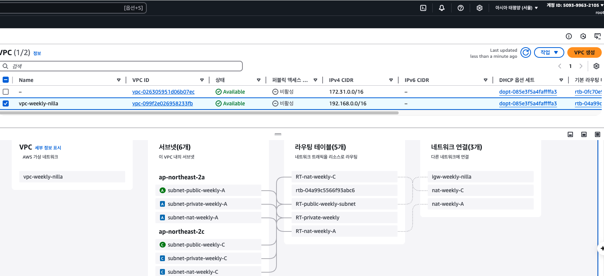
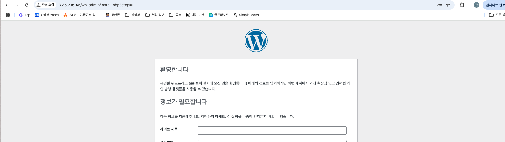
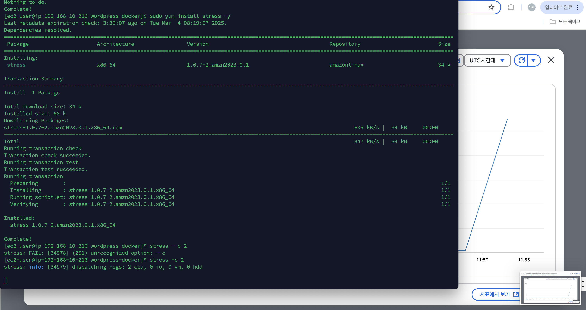

## 날짜: 2025-03-04

### 스크럼
- 학습 목표 1 : AWS 실습

### 새로 배운 내용
#### AWS - VPC 실습
public / private / nat 망으로 나누어 로드밸런서와 nat 게이트웨이, 인터넷 게이트웨이를 연결하고 그 위에 워드프레스 + mysql을 올려 배포하는 실습을 진행했다.

기본 실습을 진행한 것으로, 모두 삭제 후 내일 다시 시도해볼 예정이다.

#### AWS - Auto Scaling
stress 툴을 깔아 cpu 사용량이 올라갈 때에 비례해 자동 확장이 제대로 동작하는지 확인헀다. 인스턴스 개수가 늘어난 모습을 볼 수 있다.

이후 스트레스 툴을 해제하고 확인시 다시 축소되어 있는 모습을 확인할 수 있었다.

#### Code deploy
내일 실습할 code deploy에 대해 먼저 개념을 정리했다.

Code Deploy는 AWS의 배포서비스로, 소스코드를 운영환경에 자동 배포하는 역할을 수행한다. 순서는 다음과 같이 정리된다.

1. 소스코드와 appspec(배포 관련 스크립트)를 S3 혹은 github에 업로드한다.
2. 배포 대상 서버(예:EC2)에 소스코드가 다운로드 된다.
3. appspec 스크립트를 실행해 배포를 진행한다.

즉 코드 디플로이는 github action, gitlab runner의 역할을 수행하는 aws 서비스라고 할 수 있다. 

### 오늘의 회고
- 일단 여러번 해보며 익숙해지는 것이 중요하다고 하셔서, 진행할 수 있는 선에서 한 번 쭉 실습을 진행헀다. 내일은 다시 심화 내용을 더하면서 똑같은 부분을 실습하고, 부족했던 부분들을 정리하면서 진행해볼 생각이다. 

### 참고 자료 및 링크
- [CICD - Codedeploy란? (Codedeploy를 이용한 자동배포(CD) 환경 구축하기)](https://galid1.tistory.com/745)

