## 날짜: 2025-03-06

### 스크럼
- 3tier 구성 실습 다시 진행

### 새로 배운 내용
#### 3tier 구성 

- VPC 구성
    1. VPC에 특정 대역을 부여하고 추가한다.
    2. 이후 생성할 서브넷도 각각 가용영역(리전의 구역)과 VPC CIDR(Classless Inter Domain Routing) 블록을 설정한다. 다음과 같이 설정했다. 
    
    ```
    VPC :  192.168.0.0/16
    
    **Azone**
    subnet-pubilc-weekly-A: 192.168.10.0/24
    subnet-nat-weekly-A: 192.168.110.0/24
    subnet-private-weekly-A: 192.168.210.0/24
    
    **Czone**
    subnet-pubilc-weekly-C: 192.168.20.0/24
    subnet-nat-weekly-C: 192.168.120.0/24
    subnet-private-weekly-C: 192.168.220.0/24
   ```
    
    3. Internet Gateway와 NAT Gateway를 생성한다.
        
        인터넷 게이트웨이는 생성 후 VPC에 연결하면 되고, NAT Gateway는 위치할 서브넷을 지정하여 생성하면 된다. 
        
        ⭐️ NAT Gateway가 pubilc 서브넷에 있어야 인터넷 게이트웨이와의 연결이 가능하다. private인 nat subnet에 둘 경우 nat가 제대로 동작하지 않는다! 또한 nat에는 각각 탄력적 ip를 할당해야한다. 
        
    4. 라우팅 테이블을 생성한다. 위에서 생성한 VPC를 선택해 등록하고, 라우팅을 진행한다. 
        - public은 모든 트래픽(0.0.0.0/0)이 IGW를 향해 나가야한다.
        - private-nat은 모든 트래픽이 각 가용 영역에 놓인 nat gateway를 향해 나가야한다.
        - private은 기본적으로 내부망에서만 통신이 가능하므로 따로 설정하지 않는다. (기본적으로 라우팅 테이블을 생성하면 로컬간의 라우팅은 설정되어 있다.)
        
        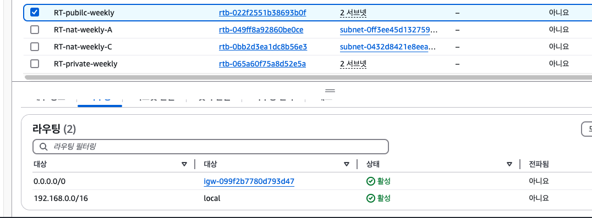
        
        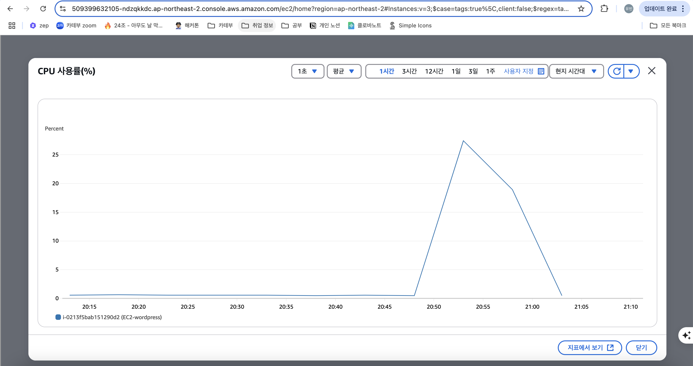
        
    
    최종 리소스 맵은 다음과 같다. 
    
    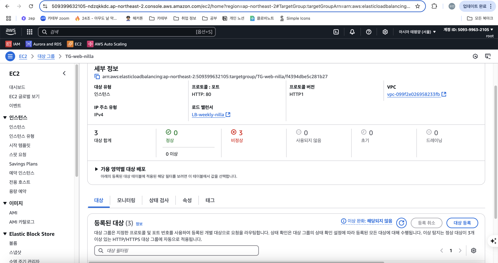
    
- OPENVPN (vpn 사용시에만)
    1. EC2 서비스로 이동하여 AWS Marketplace AMI 에서 open vpn을 구독하고, public subnet에 위치하도록 한다. 
        
         ⭐️ marketplace 구독도 따로 권한 부여가 필요하므로 iam 사용자라면 부여를 해줘야한다. 
        
    2. 만들어진 EC2 인스턴스에 연결한다.
        
        ⭐️ 이때 ssh를 통하지 않고 콘솔에서 바로 연결하는 것도 따로 권한 부여가 필요하다!
        
    3. 부팅시 open vpn 관련 설정이 나오는데, should client traffic be routed by default through the VPN? 부분에만 no를 작성하고, 나머지는 모두 엔터(기본값) 또는 yes를 입력해 설정한다.
        - should client traffic be routed by default through the VPN 에 yes로 설정이 되면 모든 트래픽이 vpn을 타고 나가기 때문에 요금이 많이 발생하게 된다.
    4. 이후 설정, 설치를 완료하고 나오는 클라이언트 링크로 접속, openvpn connect를 다운받고 프로필을 추가, vpn을 킨다. 
        
        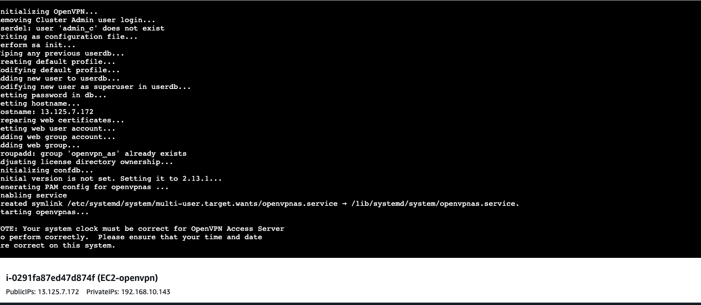
        
        - 또한 라우팅 쪽에 가보면 ip가 설정되어 있는 걸 확인할 수 있다.
        
        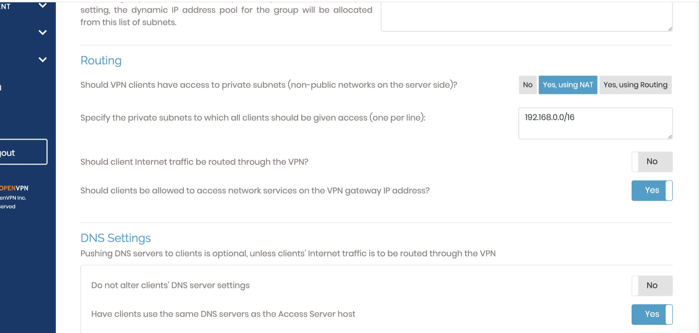
        
    5. 이후로는 private ip로 vpn 접속이 가능해진다. ping을 사용하거나, private nat subnet 쪽에 ec2를 생성해 접속하면 확인 가능하다. 
    
    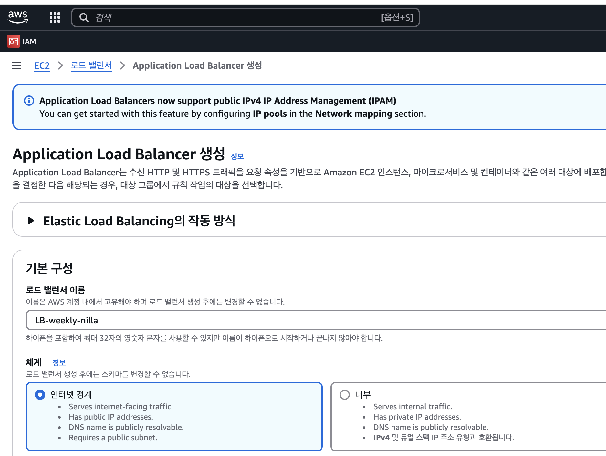
    
- 로드밸런서
    1. EC2를 생성한다. NAT 서브넷에 위치하도록 하고, 접속이 가능해야 하므로 HTTP 포트를 열어둔다.
        
        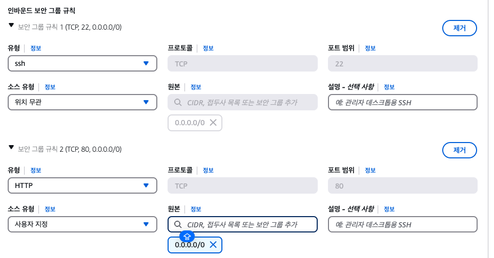
    2. 생성한 EC2를 포함하는 대상 그룹을 생성한다.
    3. application 로드 밸런서를 생성하고, vpc와 대상 그룹을 위에서 생성했던 것으로 설정한다. 보안그룹에서는 인바운드 http 80포트를 열어주었다.
    
    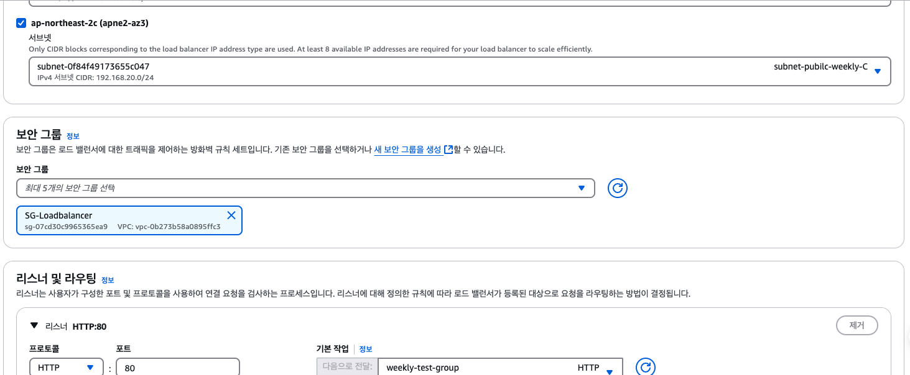
    
    서브넷은 퍼블릭 혹은 인터넷 게이트웨이가 연결된 서브넷으로 설정해야한다. 퍼블릭이 아닌 경우 
    
    `선택한 서브넷에서 인터넷 게이트웨이로 연결된 경로가 없습니다. 즉, 로드 밸런서가 인터넷 트래픽을 수신하지 못합니다. 이 선택 사항을 계속 진행할 수 있지만 인터넷 트래픽이 로드 밸런서에 도달하려면`
    
    [`VPC 콘솔](https://509399632105-ndzqkkdc.ap-northeast-2.console.aws.amazon.com/vpc/home?region=ap-northeast-2)에서 서브넷의 라우팅 테이블을 업데이트해야 합니다.`
    
    와 같은 경고를 볼 수 있다.
    
- RDS
    1. RDS를 위치할 서브넷에 서브넷 그룹 생성
        
        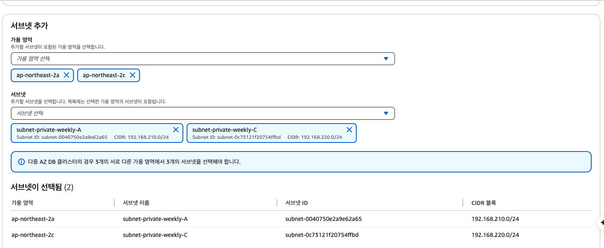
        
    2. db의 보안그룹 설정
    
    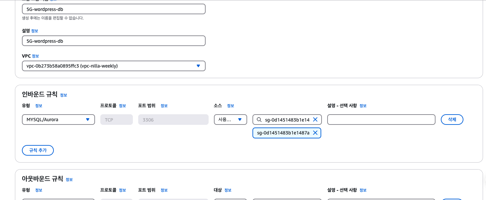
    
    해당 보안 그룹을 가진 ec2 인스턴스에서 접근을 허용하겠다는 의미다.
    
    1. 데이터베이스 생성
    - 위에서 설정한 vpc, 보안 그룹, 서브넷 그룹을 넣어 생성한다.
        
        
        
    - 생성 후 나타나는 엔드포인트가 RDS 접속 주소다.
    1. wordpress에 연결하기
        
        docker & docker compose를 사용하여 연결했다.
        
        ```bash
        version: '3.7'
        
        services:
          wordpress:
            image: wordpress:latest
            container_name: wordpress-container
            ports:
              - "80:80"
            environment:
              WORDPRESS_DB_HOST: 엔드포인트 주소:3306  # RDS MySQL 엔드포인트
              WORDPRESS_DB_NAME: wordpress              # RDS에서 설정한 데이터베이스 이름
              WORDPRESS_DB_USER: wordpress              # RDS에서 설정한 사용자
              WORDPRESS_DB_PASSWORD: wordpress          # RDS에서 설정한 비밀번호
            volumes:
              - wordpress-data:/var/www/html
            restart: always
        
        volumes:
          wordpress-data:
        ```
        
        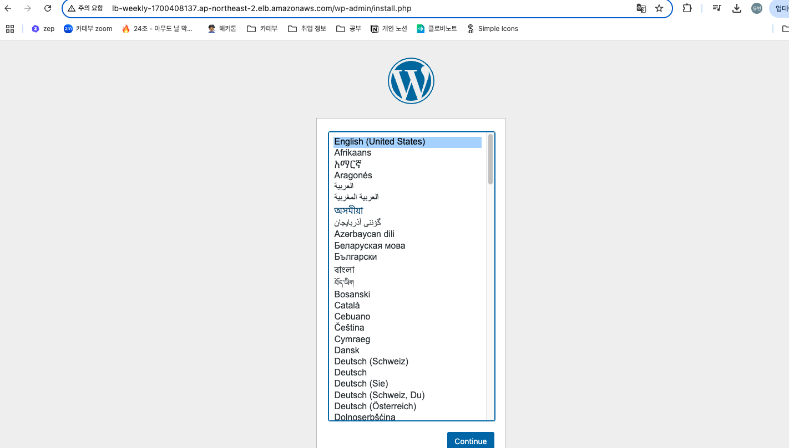
        
        아까 로드밸런서를 연결시켜 두었기 때문에, DNS이름으로 접속하면 정상 접속되는 모습을 확인할 수 있다.
        
- 글로벌 서비스 생성
    1. ACM(SSL 인증서) 생성
        
        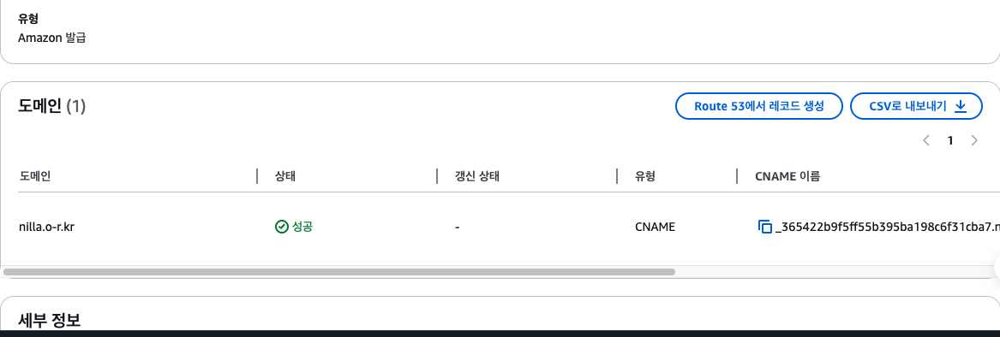
        
    2. 레코드 편집 (내도메인.한국에서 무료 도메인을 받아서 사용했다.)
        
        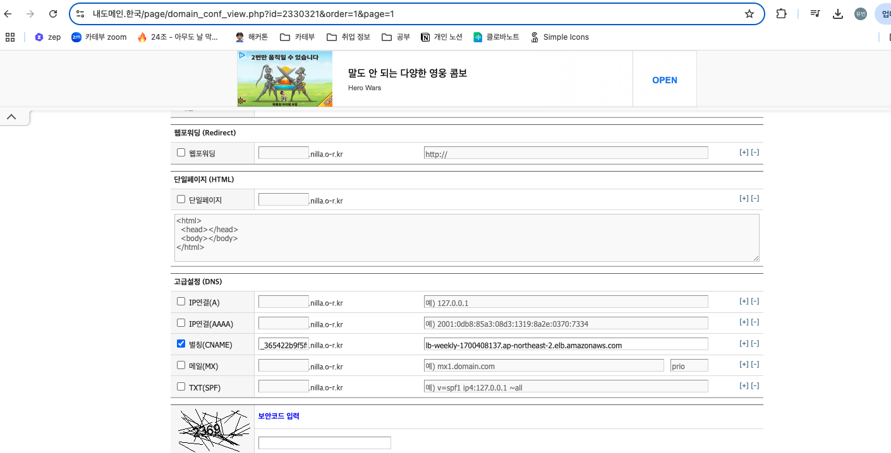
        
    3.  접속해보면 원하는 도메인으로 잘 접속되고 있는 걸 확인 가능하다. 
        
        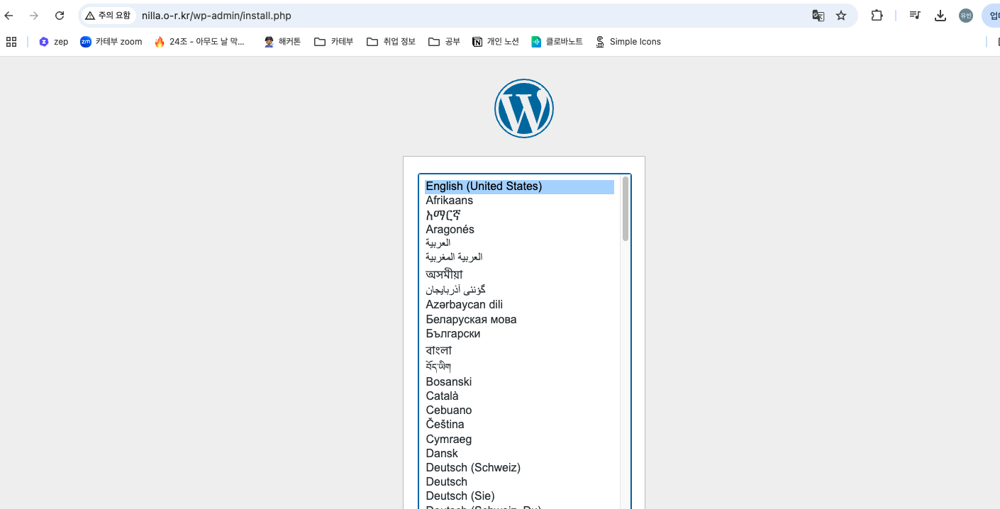
        
    4. 리소스와 룰셋을 선택하여 방화벽 (waf) 등록도 가능하다.
        
        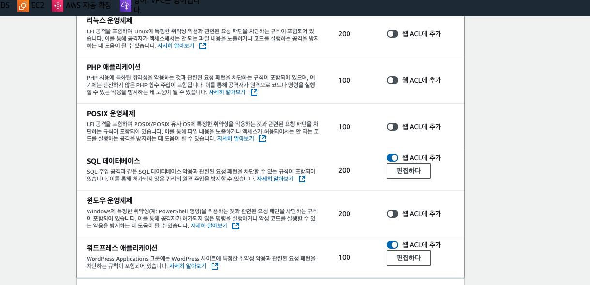
        
- 자동 확장 실습
    1. EC2 관리 콘솔에서 EC2 인스턴스 확장시 생성할 시작 템플릿을 만든다.
    2. 확장 그룹을 생성한다.(휴지 기간은 짧게 두고, cpu 임계값을 설정한다.)
    3. 스트레스 툴을 활용해 cpu 사용량을 늘리고, 이에 따라 인스턴스가 늘어나는 것을 확인한다.
        
        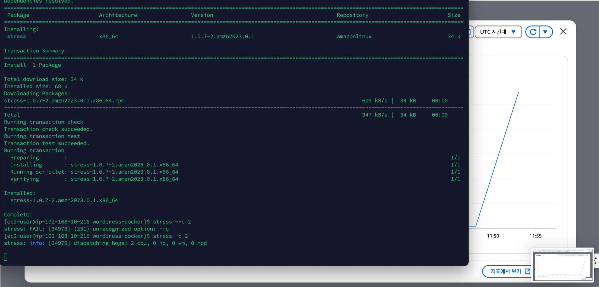
        
         
        
        
        
        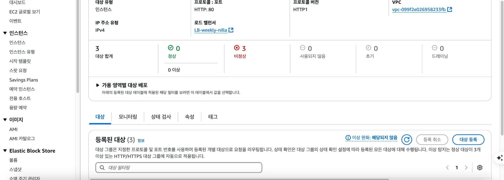
        
        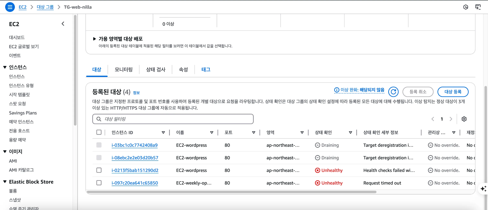
- Code deploy
    1. EC2에 service 태그를 등록한다(예:Front-end) 
    2. iam 코드 디플로이 롤을 생성한다.
    3. 코드 디플로이 애플리케이션을 생성한다.
        
        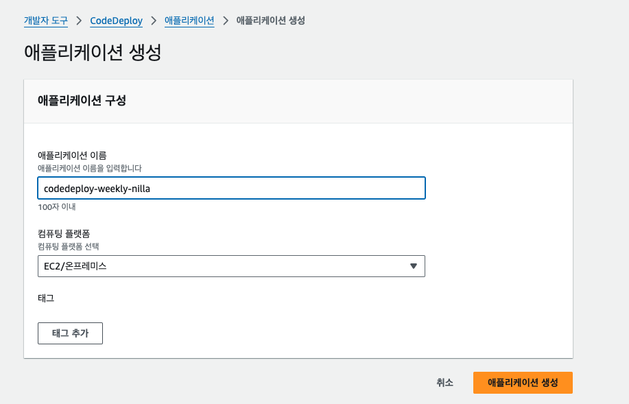
        
    4. 배포 그룹 설정에 들어가서 위에서 작성한 롤을 배정해주고, 위에서 설정했던 태그를 설정해준다.
        
        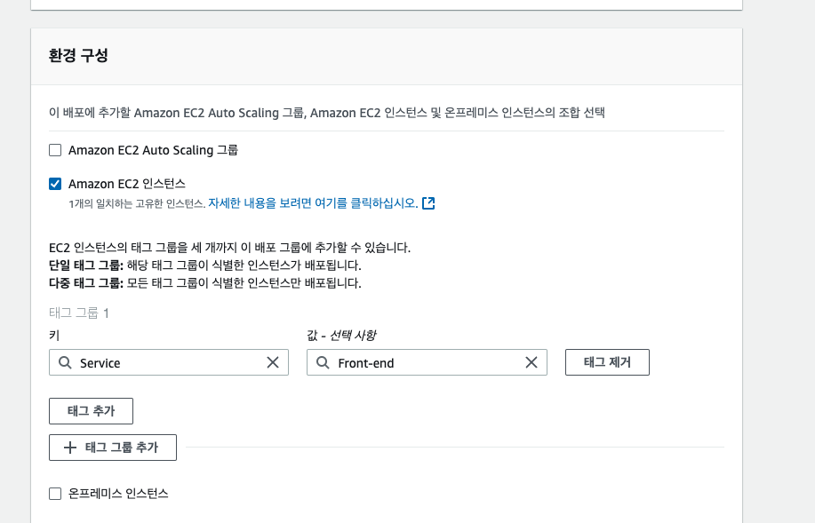
    5. S3를 생성한다.
        
        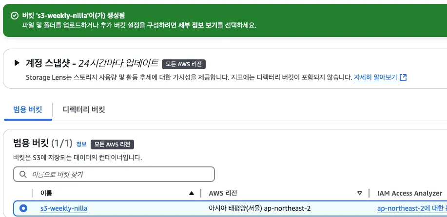
        
    6. CI/CD 설정을 위해 EC2 Instance 역할을 생성한다. 이 역할은 ec2의 보안 - 역할 변경에서 설정한다.
        
        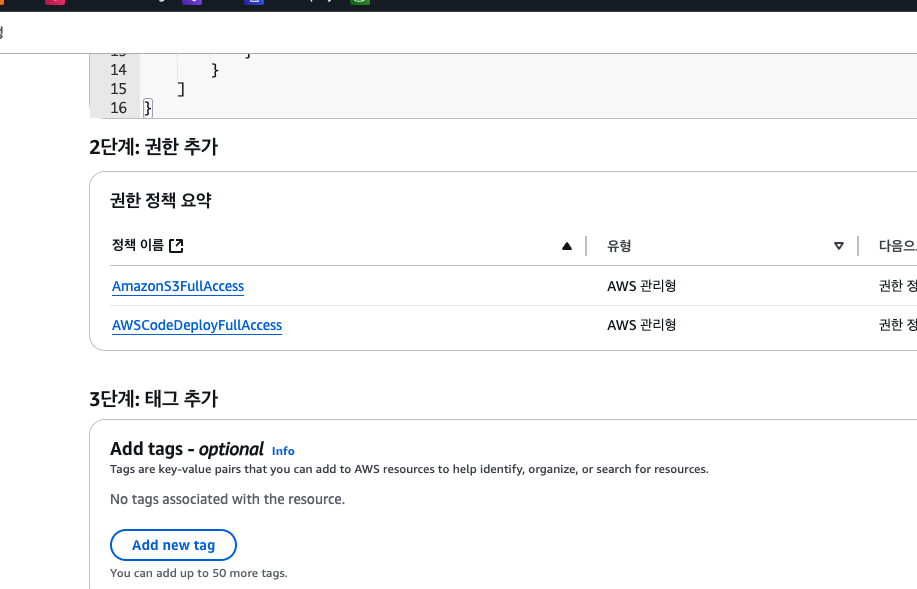
        
        1. codedeploy agent 설치
            
            ```bash
            sudo apt-get update
            sudo apt-get install ruby wget
            
            cd /home/ubuntu
            **wget https://aws-codedeploy-ap-northeast-2.s3.amazonaws.com/latest/install**
            
            chmod +x ./install
            sudo ./install auto
            
            **sudo service codedeploy-agent start**
            **sudo service codedeploy-agent status**
            ● codedeploy-agent.service - LSB: AWS CodeDeploy Host Agent
                 Loaded: loaded (/etc/init.d/codedeploy-agent; generated)
                 Active: active (running) since Wed 2025-03-05 13:02:33 UTC; 17s ago
                   Docs: man:systemd-sysv-generator(8)
                Process: 17124 ExecStart=/etc/init.d/codedeploy-agent start (code=exited, status=0/SUCCESS)
                  Tasks: 3 (limit: 1130)
                 Memory: 67.9M (peak: 68.1M)
                    CPU: 1.074s
                 CGroup: /system.slice/codedeploy-agent.service
                         ├─17135 "codedeploy-agent: master 17135"
                         └─17138 "codedeploy-agent: InstanceAgent::Plugins::CodeDeployPlugin::CommandPoller of master 17135"
            
            Mar 05 13:02:32 ip-192-168-110-239 systemd[1]: Starting codedeploy-agent.service - LSB: AWS CodeDeploy Host Agent...
            Mar 05 13:02:33 ip-192-168-110-239 codedeploy-agent[17124]: Starting codedeploy-agent:
            Mar 05 13:02:33 ip-192-168-110-239 systemd[1]: Started codedeploy-agent.service - LSB: AWS CodeDeploy Host Agent.
            ubuntu@ip-192-168-110-239:~$ 
            ```
            
        2. 깃헙에 github action 설정 & appspec 설정
            
            ```yaml
            #main.yml
            name: Deploy to EC2 with CodeDeploy
            
            on:
              push:
                branches:
                  - main
            
            jobs:
              deploy:
                runs-on: ubuntu-latest
                steps:
                - name: Checkout code
                  uses: actions/checkout@v2
            
                - name: Set up AWS CLI
                  uses: aws-actions/configure-aws-credentials@v1
                  with:
                    aws-access-key-id: ${{ secrets.AWS_ACCESS_KEY_ID }}
                    aws-secret-access-key: ${{ secrets.AWS_SECRET_ACCESS_KEY }}
                    aws-region: 'ap-northeast-2'  
            
                - name: Create deployment zip
                  run: |
                    zip -qq -r ./deployment.zip .
                  shell: bash
            
                - name: Upload deployment.zip to S3
                  run: |
                    aws s3 cp ./deployment.zip s3://s3버키/deployment.zip
            
                - name: Deploy to EC2 with CodeDeploy
                  run: |
                    aws deploy create-deployment \
                      --application-name 코드 디플로이 애플리케이션명 \
                      --deployment-config-name CodeDeployDefault.AllAtOnce \
                      --deployment-group-name 코드 디플로이 그룹명 \
                      --s3-location bucket=s3-weekly-nilla,key=deployment.zip,bundleType=zip
            ```
            
            ```yaml
            #appspec.yml
            version: 0.0
            os: linux
            files:
              - source: /index.html
                destination: /var/www/html/
            hooks:
              AfterInstall:
                - location: scripts/start_web_server.sh  
                  timeout: 18
            ```
            
        3. s3 권한 설정 & iam 사용자 권한 설정
            
            위의 설정만 할 경우, 권한 오류가 뜨게 된다. 
            
            `Run aws deploy create-deployment \`
            
            `An error occurred (AccessDeniedException) when calling the CreateDeployment operation: User: arn:aws:iam::***:user/nilla is not authorized to perform: codedeploy:CreateDeployment on resource: arn:aws:codedeploy:ap-northeast-2:***:deploymentgroup:codedeploy-weekly-nilla/codedeploy-weekly-nilla-group because no identity-based policy allows the codedeploy:CreateDeployment action`
            
            s3 정책을 추가하고, iam 사용자에게 s3와 codedeploy 사용 권한을 부여해야한다. 
            
            s3에는 퍼블릭 액세스 차단을 비활성화 후, 아래와 같은 정책을 추가했다.
            
            ```yaml
            {
                "Version": "2012-10-17",
                "Statement": [
                    {
                        "Effect": "Allow",
                        "Principal": "*",
                        "Action": [
                            "s3:ListBucket",
                            "s3:GetObject",
                            "s3:PutObject"
                        ],
                        "Resource": [
                            "arn:aws:s3:::s3 버킷명",
                            "arn:aws:s3:::s3 버킷명/*"
                        ]
                    }
                ]
            }
            ```
            
        4. 배포 완료!
            
            간단한 html을 s3를 통해 배포하고, apache 서버를 실행시켜 띄웠다.
            
            ```html
            
            <!DOCTYPE html>
            <html lang="en">
            <head>
                <meta charset="UTF-8">
                <meta name="viewport" content="width=device-width, initial-scale=1.0">
                <title>CodeDeploy Test</title>
            </head>
            <body>
                <h1>CodeDeploy Deployment Test</h1>
                <p>Welcome to the AWS EC2 instance deployed via GitHub Actions and CodeDeploy.</p>
            </body>
            </html>
            
            ```
            
            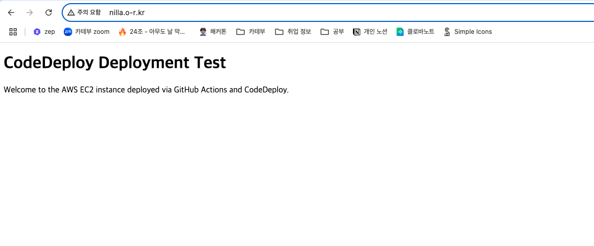
            
            다음과 같은 파일 구조를 가진다.
            
            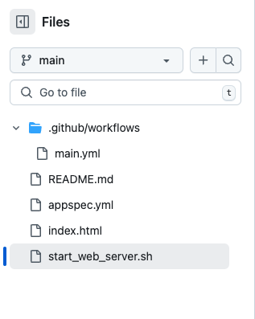
            
        
        aws의 s3 관리 콘솔에서도 올라온 파일들의 정보를 확인할 수 있었다.
        
        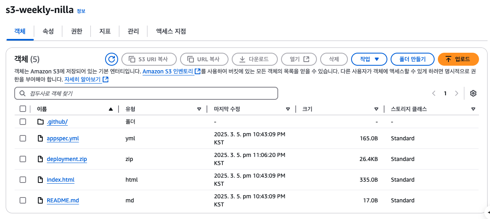

### 오늘의 회고
- 어제 한 번 해본 vpc + 해커톤 당시 사용한 깃헙 액션이라 어렵지 않게 진행했지만 권한 문제로 많은 오류를 겪었다. iam 사용자에게 사용하는 서비스들의 full access를 주는 것으로 해결했는데, 좀더 효율적으로 권한을 확인하고 부여하는 연습을 하고 싶다.
- 해커톤 당시 그냥 0.0.0.0/0으로 연결이 되도록 설정해두었어서 꽤 불안했는데, vpc 설정을 하면서 네트워크 보안 설정을 할 수 있게 되어 뿌듯했다! 파이널 프로젝트 때 하나하나 적용해나가고 싶다.


### 참고 자료 및 링크
- [[배포 자동화] Github Actions & S3 & CodeDeploy](https://cookiee.tistory.com/688)
- [[AWS] 프로젝트 자동 배포하기(CICD) EC2 & S3 & CodeDeploy](https://ymkmoon.github.io/Aws-12-Cicd/#google_vignette)