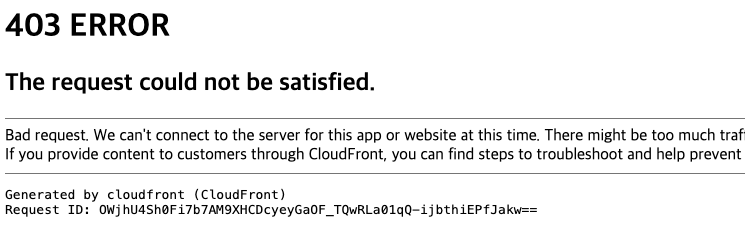
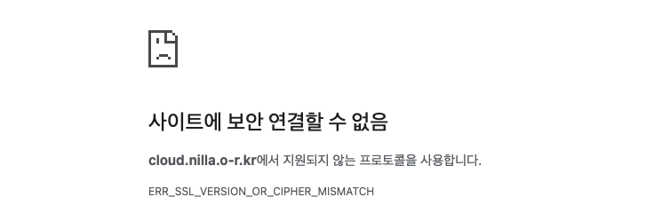

## 날짜: 2025-03-06

### 스크럼
- 쿠버네티스 멀티노드 HPA 확장 테스트
- S3, cloud front 연결하여 https 연결 활성화 하기

### 새로 배운 내용
#### 쿠버네티스 멀티노드 HPA 확장 테스트
과제 목표: 애플리케이션이 높은 트래픽을 처리할 수 있도록 자동 확장(HPA)을 설정하고, 부하 테스트를 통해 확장 동작을 검증.

```bash
kubectl apply -f nginx-svc.yml
kubectl apply -f nginx-deploy.yaml

kubectl get deployments  # 배포 확인
kubectl get pods         # 파드 상태 확인
kubectl get svc          # 서비스 확인

NAME               READY   UP-TO-DATE   AVAILABLE   AGE
nginx-deployment   3/3     3            3           56s

NAME                                READY   STATUS    RESTARTS   AGE
nginx-deployment-7c79c4bf97-rklxk   1/1     Running   0          57s
nginx-deployment-7c79c4bf97-tq8jm   1/1     Running   0          57s
nginx-deployment-7c79c4bf97-tqp6w   1/1     Running   0          57s

NAME            TYPE        CLUSTER-IP       EXTERNAL-IP   PORT(S)        AGE
kubernetes      ClusterIP   10.96.0.1        <none>        443/TCP        13m
nginx-service   NodePort    10.111.103.173   <none>        80:30080/TCP   37s

kubectl get pods -o wide
NAME                                READY   STATUS    RESTARTS   AGE   IP               NODE               NOMINATED NODE   READINESS GATES
nginx-deployment-7c79c4bf97-rklxk   1/1     Running   0          72s   192.168.20.135   ip-172-31-6-229    <none>           <none>
nginx-deployment-7c79c4bf97-tq8jm   1/1     Running   0          72s   192.168.15.70    ip-172-31-11-176   <none>           <none>
nginx-deployment-7c79c4bf97-tqp6w   1/1     Running   0          72s   192.168.15.71    ip-172-31-11-176   <none>           <none>

kubectl autoscale deployment nginx-deployment --cpu-percent=50 --min=3 --max=10
kubectl get hpa
#unknown으로 뜨는건 메트릭 서버 설정이 되지 않아서 그렇다.
NAME               REFERENCE                     TARGETS         MINPODS   MAXPODS   REPLICAS   AGE
nginx-deployment   Deployment/nginx-deployment   <unknown>/50%   3         10        0          5s

```

```bash
#메트릭 서버를 다운받아준다. 
wget https://hey-release.s3.us-east-2.amazonaws.com/hey_linux_amd64

chmod +x hey_linux_amd64
sudo mv hey_linux_amd64 /usr/local/bin/hey
hey -help
```

```bash
#이대로 작동시키면 메트릭 서버가 master node에 위치하지 않아 작동하지 않으므로 아래 설정을 변경한다.
kubectl edit deployments.apps -n kube-system metrics-server

--kubelet-insecure-tls
nodeName: <your master node name> 
```

```bash
kubectl top pods
NAME                                CPU(cores)   MEMORY(bytes)   
nginx-deployment-6496544495-mjjjm   0m           2Mi             
nginx-deployment-6496544495-vccwl   0m           2Mi             
nginx-deployment-6496544495-zc9hk   0m           2Mi         
```

```bash
kubectl top hpa
NAME               REFERENCE                     TARGETS   MINPODS   MAXPODS   REPLICAS   AGE
nginx-deployment   Deployment/nginx-deployment   0%/50%    3         10        3          49m

#확장 모습을 볼 수 있다.
kubectl get pods
NAME                                READY   STATUS        RESTARTS   AGE
nginx-deployment-6496544495-cc9nk   1/1     Terminating   0          35m
nginx-deployment-6496544495-mjjjm   1/1     Running       0          35m
nginx-deployment-6496544495-vccwl   1/1     Running       0          11m
nginx-deployment-6496544495-wffw9   1/1     Terminating   0          35m
nginx-deployment-6496544495-zc9hk   1/1     Running       0          11m
```

#### S3, cloud front 연결하여 https 연결 활성화 하기
1. 버지니아 북부 리전에서 새로 ACM을 발급받는다.
2. S3 버킷을 새로 생성한다. 
    - 버킷명은 도메인 명과 똑같이 설정해야한다.
    - 정적 호스팅으로 테스트 할 예정이라, 속성 → 정적 호스팅 설정을 해주고 index.html을 업로드했다.
    - 또한 퍼블릭 액세스가 가능하도록 권한을 열어주고, acl에서 퍼블릭 액세스 읽기 권한을 열어주어야 하며, 다음과 같은 버킷 정책을 등록해야한다.
        
        ```bash
        {
            "Version": "2012-10-17",
            "Statement": [
                {
                    "Effect": "Allow",
                    "Principal": "*",
                    "Action": "s3:GetObject",
                    "Resource": "arn:aws:s3:::<버킷 이름>/*"
                }
            ]
        }
        ```
        
    
3. 버킷 웹사이트 엔드포인트를 복사해 cname 값에 적어준다.
4. Cloud front를 생성한다.
    - Origin domain에 s3의 도메인을 연결한다.
    - Custom SSL certificate 에서 발급받은 인증서를 등록한다.
    - OAI 를 이용해 S3의 권한을 업데이트한다.
5. 배포 도메인을 CNAME 값에 입력하면 배포 완료
    
    
    
    
    그러나 배포가 되지 않았다.

    원인 분석 : https로 강제 접근시 다음과 같이 지원되지 않는 프로토콜이라고 나오며, 클라우드 프론트 도메인 네임으로 접근시 xml 파일로 access denied가 떴다.
    
    그냥 S3 버킷 주소로 접근했을 경우 제대로 접속이 되는 것으로 보아 1. 클라우드 프론트의 권한 문제 2. 클라우드 프론트 -> s3 간의 권한 문제 정도로 추정된다. 

### 오늘의 회고
- 저번에 완성하지 못했던 쿠버네티스 HPA 확장 테스트를 진행했다. EC2의 HPA와 다른 점이 궁금해 해당 부분도 찾아보았으며 쿠버네티스의 파드 확장 후 -> 기준 이상 확장시 ec2 확장으로 이어진다는 것으로 이해했다. 부하를 개선하는 구조들을 많이 찾아보고 학습해야 할 것 같다.
- 클라우드 프론트로 배포만 하면 끝나는 문제였는데 버지니아 리전에서 인증서를 받았음에도 권한 오류가 계속 생겼고 + https로 접근 자체가 불가했다. 다시 한 번 구성해보아야 할 것 같다. 

### 참고 자료 및 링크
- [쿠버네티스14-error-Metrics-API-not-available](https://velog.io/@nhj7804/%EC%BF%A0%EB%B2%84%EB%84%A4%ED%8B%B0%EC%8A%A414-error-Metrics-API-not-available)

- [[Test] HTTP 부하 테스트 도구 'hey'를 사용한 성능 측정](https://curiousjinan.tistory.com/entry/test-http-load-performance-with-hey)
