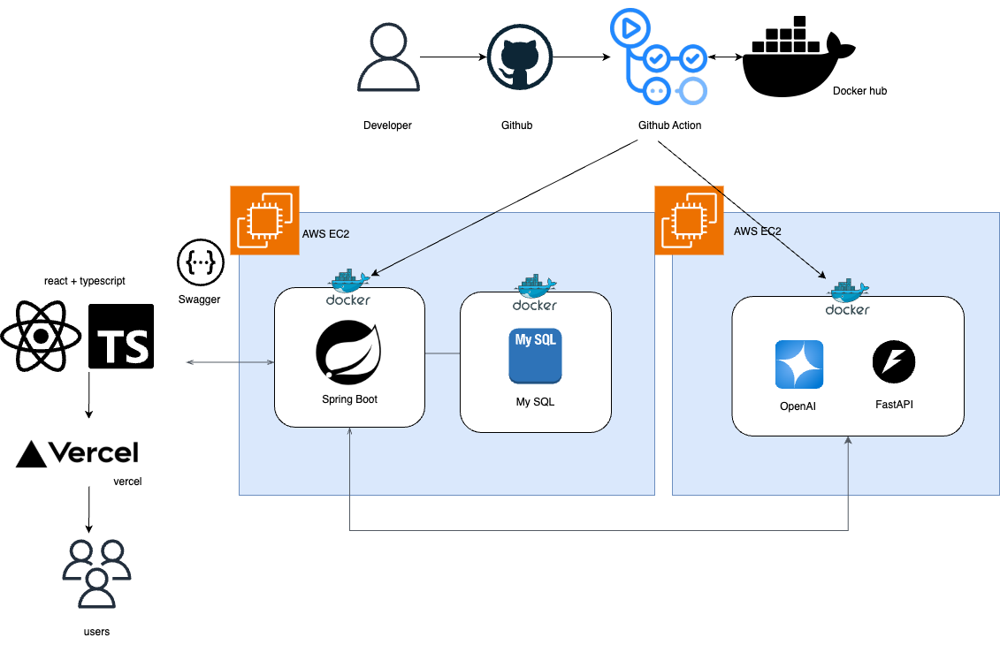

# 카카오테크 부트캠프 해커톤 2회 회고
## 날짜: 2025-02-25 ~ 2025-02-28

### LINK2TRIP
 

[LINK2TRIP - 깃허브 링크](https://github.com/KTB-post2trip)

### 참가 전 마음가짐
카테부 교육과정 중 열리는 해커톤에 참여하게 되었다. 사실 클라우드를 열심히 학습중이긴 하지만 웹+서버 프로젝트 자체가 이번이 처음이었고, 해커톤 참가도 처음인데다가 클라우드를 다뤄본지도 얼마 되지 않아 걱정이 많았었다. 그래서 마음가짐은 최선을 다해 소통하고, 부딪히고, 부족한 점이 있다면 많이 배우자!!! 였다. 디자인이나 기획 측면 등 개발 외 부분을 도와드릴 수 있으므로 해당 부분도 최대한 돕고자 했다. 그렇게 팀빌딩이 시작되었다.

### 0일차 (팀빌딩, 기획 구체화)
1분씩 자기 PR을 마치고 아이디어 발표자 분들에게 컨택하여 팀을 짜게 되었다. 내가 들어간 팀의 아이디어는 "유튜브 링크를 입력하면, 해당 유튜브의 장소 데이터를 AI를 활용해 추출한 뒤, 장소에 대한 데이터와 맞춤형 여행 계획을 제공하는 서비스" 였다. 

당일 팀이 결성된 후 3일 내에 구성할 수 있도록 팀 그라운드룰 + 역할 분배 + 기획 구체화 회의를 진행했다. 

1. 팀 그라운드 룰 : 노션 템플릿을 활용하여 각 업무별 코드를 부여하고, 코드를 브랜치 이름으로 사용해 진행 상황을 한 눈에 볼 수 있도록 만들었다. 또한 소통을 위해 하루를 한 스프린트로 잡아 전원 회의를 진행하고, 중간중간 소회의 또한 진행하도록 했다. 
2. 역할 분배 : 총 인원 6명, FE 2명 / BE 1명 / AI 2명 / 클라우드 1명으로 분배하였다. 
3. 기획 구체화 : 3일 안에 개발하는 프로젝트인 만큼 국내 여행 한정으로 정했으며, 최소 경로 알고리즘 + 경로 안내는 후순위로 미루었다. 여행 장소 별 일자 수도 제한을 두었다. 

또한 회의 후 간단하게 피그마를 활용한 프로토타입 디자인을 했다. 프론트 담당 한 분과 함께 진행했으며, 신뢰감을 주는 파란색을 활용해 최대한 깔끔하고 직관적으로 사용할 수 있는 UI를 설계하고자 했다. 

### 1일차 (아키텍처 설정, Github action)
 
아키텍처를 설정하고, 먼저 BE 레포지토리에 깃헙 액션을 이용해 CI/CD를 설정하기로 했다. 

도커 파일로 DB + 백엔드 서버를 통합해 만들어서 자꾸 BE 서버가 만들어질 때마다 DB가 내려가버리는 오류가 있었다. 도커파일을 분리해 docker compose를 사용함으로써 해결할 수 있었다.

로컬에서 오류를 확인하고 다시 깃헙 액션에 적용해 다시 서버에서 돌리는 식으로 해결 방안을 찾았어야 했는데, 잘못된 자동화 문제를 해결해야한다고 생각해 서버에서만 해결하려고 했던 부분이 2일차까지 ci/cd 관련으로 오랜 시간을 쏟게 된 이유였던 것 같다. 

```shell
name: CI/CD Pipeline

on:
  push:
    branches: [ "develop" ]

jobs:
  build-and-push:
    runs-on: ubuntu-latest
    steps:
      - name: Check out code
        uses: actions/checkout@v2

      - name: Set up QEMU
        uses: docker/setup-qemu-action@v2

      - name: Set up Docker Buildx
        uses: docker/setup-buildx-action@v2

      - name: Log in to DockerHub
        run: echo "${{ secrets.DOCKERHUB_PASSWORD }}" | docker login -u "${{ secrets.DOCKERHUB_USERNAME }}" --password-stdin

      - name: Build and push Docker image
        run: |
          docker buildx build \
            --cache-from=type=registry,ref=${{ secrets.DOCKERHUB_USERNAME }}/link2trip:cache \
            --cache-to=type=registry,ref=${{ secrets.DOCKERHUB_USERNAME }}/link2trip:cache,mode=max \
            --build-arg DB_URL=${{ secrets.DB_URL }} \
            --build-arg DB_USERNAME=${{ secrets.DB_USERNAME }} \
            --build-arg DB_PASSWORD=${{ secrets.DB_PASSWORD }} \
            --build-arg KAKAO_API_KEY=${{ secrets.KAKAO_API_KEY }} \
            --build-arg KAKAO_REDIRECT_URL=${{ secrets.KAKAO_REDIRECT_URL }} \
            --build-arg AI_SERVER_URL=${{ secrets.AI_SERVER_URL }} \
            --build-arg SWAGGER_URL=${{ secrets.SWAGGER_URL }} \
            -t ${{ secrets.DOCKERHUB_USERNAME }}/link2trip:${{ github.sha }} . --push

  deploy:
    needs: build-and-push
    runs-on: ubuntu-latest
    steps:
      - name: Connect to EC2 and Deploy
        uses: appleboy/ssh-action@master
        with:
          host: ${{ secrets.EC2_HOST }}
          username: ubuntu
          key: ${{ secrets.EC2_SSH_KEY }}
          script: |
            export DOCKERHUB_USERNAME=${{ secrets.DOCKERHUB_USERNAME }}
            export TAG=${{ github.sha }}
            cd /home/ubuntu/link2trip/BE
            docker-compose down
            docker-compose pull
            docker-compose up -d
            docker image prune -af
```

### 2일차 (Flask server)
인공지능 서버를 배포하기 위해 flask 서버를 이용해 api를 호출하는 서버의 CI/CD를 설정하였다. 중간에 문제가 생겼는데, 처음부터 AI 팀과 관련 모듈 버전 및 개발 환경을 협의하고 서버를 올려야 했는데 해당 부분에서 소통 미스가 있어 버전을 변경하는데에 많은 시간이 걸렸다. 또한 리눅스 환경에서 구글 드라이버를 사용하는 환경이 상이해 드라이버가 아예 설치되지 않거나, 버전 경로를 따로 설정해야만 설정이 되는 등의 문제가 있었다. 

이외로 깃헙 액션에서 설치 명령어 (wget) 자체가 실행이 안되는 문제가 있었는데, -v 옵션을 통해 자세한 로그를 출력 후 해결할 수 있었다. 

```shell
name: Build and Deploy Docker Image to EC2

on:
  push:
    branches:
      - main
  pull_request:
    branches:
      - main

jobs:
  build:
    runs-on: ubuntu-latest

    steps:
      - name: Checkout code
        uses: actions/checkout@v2

      - name: Set up Python
        uses: actions/setup-python@v2
        with:
          python-version: '3.9'

      - name: Install dependencies
        run: |
          python -m pip install --upgrade pip
          pip install -r requirements.txt

      - name: Set up Docker Buildx
        uses: docker/setup-buildx-action@v2

      - name: Log in to DockerHub
        run: echo "${{ secrets.DOCKERHUB_PASSWORD }}" | docker login -u "${{ secrets.DOCKERHUB_USERNAME }}" --password-stdin

      - name: Build Docker image
        run: |
          docker build --no-cache -t flask-app .

      - name: Push Docker image to DockerHub
        run: |
          docker tag flask-app:latest ${{ secrets.DOCKERHUB_USERNAME }}/flask-app:latest
          docker push ${{ secrets.DOCKERHUB_USERNAME }}/flask-app:latest

  deploy:
    runs-on: ubuntu-latest
    needs: build  # "build" 작업이 성공적으로 끝난 후에 "deploy" 작업이 실행되도록 설정

    steps:
      - name: SSH into EC2 and deploy
        uses: appleboy/ssh-action@v0.1.7
        with:
          host: ${{ secrets.EC2_PUBLIC_IP }}
          username: ubuntu
          key: ${{ secrets.EC2_SSH_KEY }}
          port: 22
          script: |
            # Stop and remove any existing container with the name 'flask-app'
            docker stop flask-app || true
            docker rm flask-app || true

            # Pull the latest image from DockerHub
            docker pull ${{ secrets.DOCKERHUB_USERNAME }}/flask-app:latest

            # Run the container on EC2 with the name 'flask-app'
            docker run -d -p 8000:8000 \
              --name flask-app \
              -e GEMINI_API_KEY=${{ secrets.GEMINI_API_KEY }} \
              ${{ secrets.DOCKERHUB_USERNAME }}/flask-app:latest
```

### 3일차 (마무리, 발표 준비)
밤새 서버 api 이슈를 해결했으며, 발표 준비를 마치고 예선에 참가하였다. 아쉽게 본선까지 가지는 못했다. 다만 결국 협업하여 배포까지 성공할 수 있었기에 완성만으로도 매우 뿌듯했다.  

### 회고
- 클라우드 인프라 환경에서 사전에 서버 환경 관련 소통을 하고, 해결이 안되는 경우 빠르게 로컬에서 확인해 본 후 다시 서버로 이동하는 방식이 중요하다는 것을 체감했다. 아키텍쳐 설계시 미리 인프라 관련 토의를 진행해야 할 것 같다.
  
- 또한, 발표시 기획안과 mvp 기능 어필도 좋지만 분야별 협업이나 어떤 기술을 사용했는지 등을 좀더 중점적으로 설명해주면 좋을 것 같다는 조언을 들어 다음 해커톤 참가시에 더 발전한 모습으로 나가고 싶다.
  
- 첫 웹 서버 프로젝트였는데, 서버 관련 지식을 좀더 쌓아야겠다는 생각이 들었다. 좀더 정진하여 


